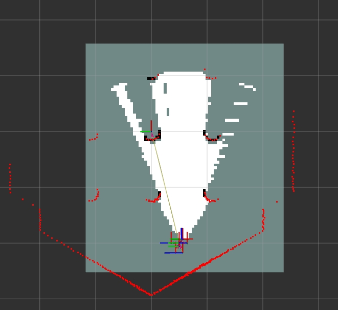
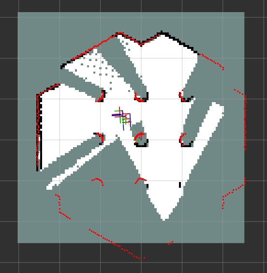
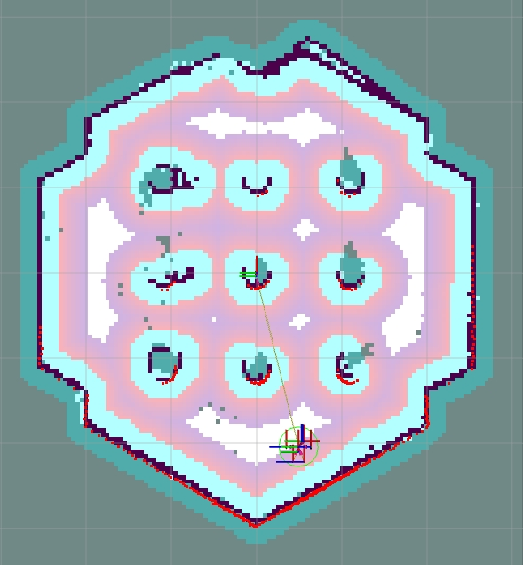
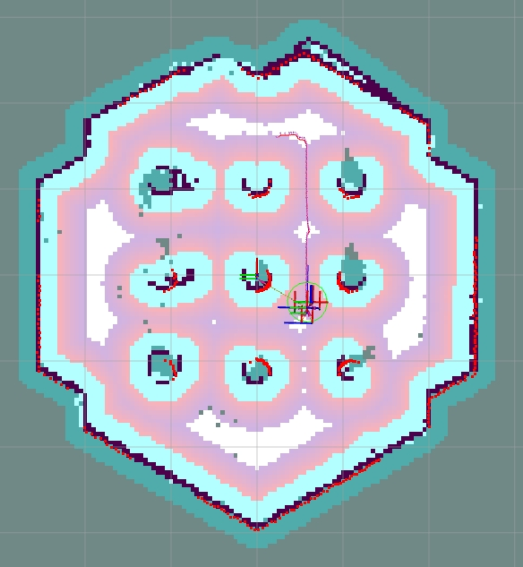

sidebar_position: 5

# VSLAM Based on RTAB-Map

## Introduction

RTAB-Map (real-time appearance-based mapping) is an appearance-based loop closure detection method with excellent memory management, meeting the requirements of large-scale scenarios and long-term online operation. RTAB-Map integrates visual and LiDAR SLAM solutions, providing a complete framework for constructing 3D maps and enabling real-time localization and navigation in unknown environments.

This section presents a VSLAM example in which RTAB-Map runs on the K1 board, while the Gazebo simulation environment runs on a PC connected to the same network.

## Preparation
1. Flash the ROS2_LXQT system image to the SpacemiT board.
2. Install ros-humble and RDK on the PC.

## Usage Guide

### PC Side

**Install the Gazebo Simulation Environment**

Open a terminal on the PC and run the following commands to install Gazebo.

```shell
sudo apt install ros-humble-gazebo*
sudo apt install ros-humble-turtlebot3
sudo apt install ros-humble-turtlebot3-gazebo
sudo apt install ros-humble-turtlebot3-bringup
sudo apt install ros-humble-turtlebot3-simulations
```

**Set up the RTAB‐Map Environment**

Open the file `/opt/ros/humble/share/turtlebot3_gazebo/models/turtlebot3_waffle/model.sdf` and modify it according to the following steps to add a depth camera.

1. Add the following content:
   ```xml
   <joint name="camera_rgb_optical_joint" type="fixed">
   <parent>camera_rgb_frame</parent>
   <child>camera_rgb_optical_frame</child>
   <pose>0 0 0 -1.57079632679 0 -1.57079632679</pose>
   <axis>
      <xyz>0 0 1</xyz>
   </axis>
   </joint>
   ```
2. Modify `<link name="camera_rgb_frame">` to `<link name="camera_rgb_optical_frame">`.
3. Add `<link name="camera_rgb_frame"/>`.
4. Modify `<sensor name="camera" type="camera">` to `<sensor name="camera" type="depth">`.
5. Modify the resolution from `1920x1080` to `640x480`.
   ```xml
   <width>640</width>
   <height>480</height>
   ```

### K1 Side

**Install RTAB‐Map**

Open a terminal on the K1 board and run the following commands to install `RTAB-Map` and `nav2`.

```shell
sudo apt install ros-humble-rtabmap*
sudo apt install ros-humble-navigation2
sudo apt install ros-humble-nav2-bringup
```

Open the file `/opt/ros/humble/share/rtabmap_demos/launch/turtlebot3/turtlebot3_rgbd.launch.py` and comment out the visualization code.
```python
#        Node(
#            package='rtabmap_viz', executable='rtabmap_viz', output='screen',
#            parameters=[parameters],
#            remappings=remappings),
```

### Run VSLAM

1. Open a terminal on the PC and run the following commands to launch Gazebo.

   ```shell
   source /opt/ros/humble/setup.bash
   source /usr/share/gazebo/setup.sh
   export TURTLEBOT3_MODEL=waffle
   ros2 launch turtlebot3_gazebo turtlebot3_world.launch.py
   ```

2. Open a terminal on the K1 board and run the following commands to launch `RTAB-Map`.

   ```shell
   source /opt/ros/humble/setup.bash
   ros2 launch rtabmap_demos turtlebot3_rgbd.launch.py
   ```

3. Open a new terminal on the PC and run the following commands to open RViz and visualize the RTAB-Map results.

   ```shell
   source /opt/ros/humble/setup.bash
   ros2 launch nav2_bringup rviz_launch.py
   ```

   

4. Open the keyboard control node to control the robot's movement and perform visual mapping.

   ```shell
   source /opt/ros/humble/setup.bash
   ros2 run teleop_twist_keyboard teleop_twist_keyboard
   ```

   

### Run nav2 Visual Navigation

After completing VSLAM and building a complete environmental map, follow the steps below to run Nav2 visual navigation based on RTAB-Map.

1. Open a terminal on the PC and run the following commands to launch Gazebo.

   ```shell
   source /opt/ros/humble/setup.bash
   source /usr/share/gazebo/setup.sh
   export TURTLEBOT3_MODEL=waffle
   ros2 launch turtlebot3_gazebo turtlebot3_world.launch.py
   ```

2. Open a terminal on the K1 board, and enter the following commands to launch RTAB-Map in pure localization mode.

   ```shell
   source /opt/ros/humble/setup.bash
   ros2 launch rtabmap_demos turtlebot3_rgbd.launch.py localization:=true
   ```

3. Open a new terminal on the K1 board and run the following commands to launch Nav2.

   ```shell
   source /opt/ros/humble/setup.bash
   ros2 launch nav2_bringup navigation_launch.py params_file:=/opt/ros/humble/share/rtabmap_demos/params/turtlebot3_rgbd_nav2_params.yaml use_sime_time:=true
   ```

4. Open a new terminal on the PC and run the following commands to open RViz. Click the `2D Pose Estimate` button to initialize the robot's position according to the Gazebo environment.

   ```shell
   source /opt/ros/humble/setup.bash
   ros2 launch nav2_bringup rviz_launch.py
   ```

   

5. Click the `Nav2 Goal` button to send a navigation target and perform visual navigation.

   