# Realsense D4xx 系列深度相机使用

## 硬件环境

SpaceMIT RISCV64 开发板，已在 MUSE PI PRO 开发板上验证

## 已验证的相机型号

Realsense D415

## 建议的操作系统

ROS2_LXQT（推荐），[镜像链接](https://archive.spacemit.com/ros2/bianbu-ros-images/v1.5/ROS2_LXQT-v1.5-20251216.zip)

Bianbu 2.2 Desktop，[镜像链接](https://archive.spacemit.com/image/k1/version/bianbu/v2.2/bianbu-24.04-desktop-k1-v2.2-release-20250430190125.zip)

## SDK 版本说明

建议下载 v2.56.4 版本 SDK

我们发布的 SDK 基于官方发布版本修改并构建，官方 SDK 源码发布参考：https://github.com/realsenseai/librealsense/releases

查看不同相机需要的 SDK 版本：https://dev.intelrealsense.com/docs/firmware-updates


## 下载并使用 SDK

下载前请不要连接任何 Realsense 设备到板子上。

这里以 2.56.4 版本的 SDK 为例，如果你使用其它版本的 SDK ，请替换 2.56.4 字段。

### 获取下载脚本

```
wget https://archive.spacemit.com/ros2/prebuilt_libs/install_scripts_common/install_librealsense.sh
```


### 指定版本下载

```
bash install_librealsense.sh 2.56.4
```

终端输出：

```
bianbu@bianbu:~$ bash install_librealsense.sh 2.56.4
准备安装 librealsense 2.56.4
版本说明: 高版本，支持 D4xx系列相机, 已经过测试。具体见: https://dev.intelrealsense.com/docs/firmware-updates
当前系统 Python 版本: 3.12 (使用目录: bianbu24)
更新 apt 源并安装依赖...
[sudo] bianbu 的密码：
```

输入密码，默认是 bianbu

等待依赖安装完成，终端提示：

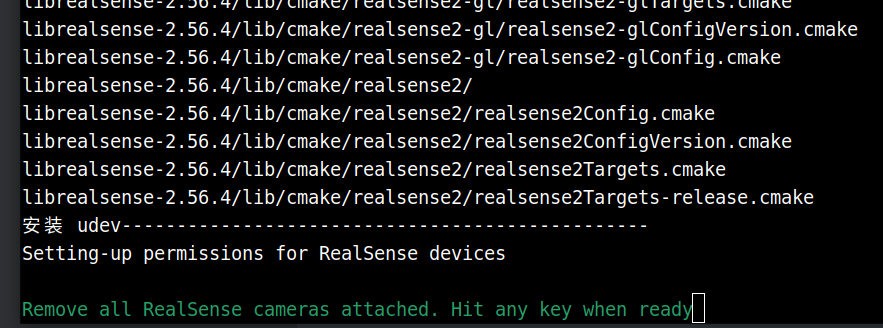

注意，确认当前板子没有连接 Realsense 相机后，按下回车键继续。

安装成功后，终端输出如下：

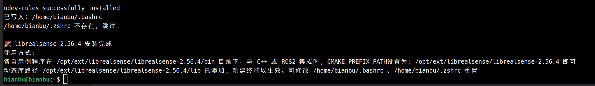

新建终端让 LD_LIBRARY_PATH 环境变量生效。

注意不要在一台机器上安装多个版本 SDK ，以免互相干扰。


### 硬件连接

安装完 SDK 后即可以接入 Realsense 相机，如下：

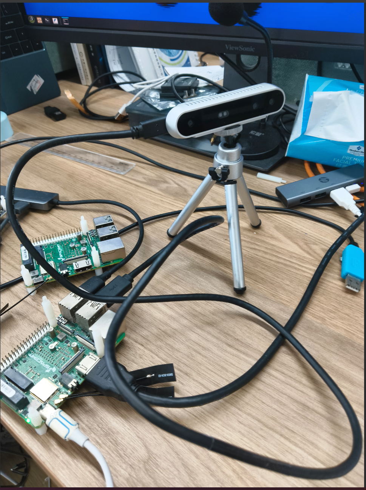

这里使用的是 D415 相机

终端输入 lsusb 查看设备:

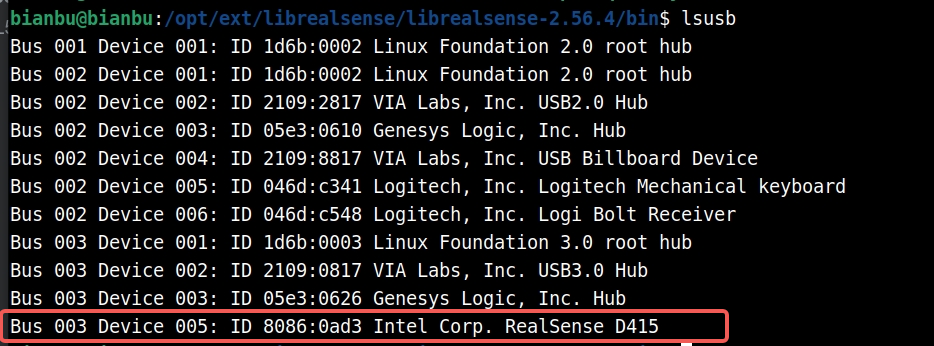

设备识别正常

### 运行示例

进入 `/opt/ext/librealsense/librealsense-2.56.4/bin` 目录

有一些可以运行的示例程序，如下：

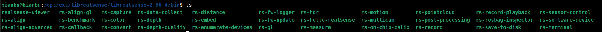

#### rs-hello-realsense

简单的程序，获取相机图像中心的深度值，输出如下：

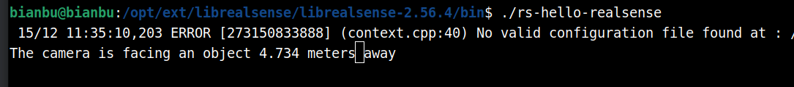

#### rs-capture

含界面显示，你应该在本地执行该命令，而非 ssh 终端

显示如下：

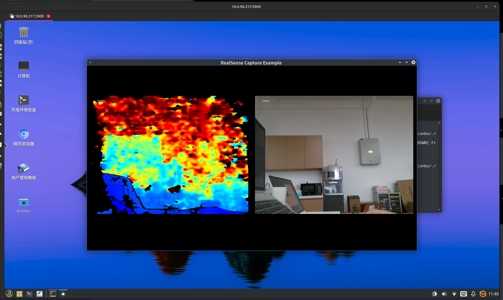

由于本地的计算资源有限，因此可视化工具只建议用于硬件通信的验证。


## 与 ROS2 结合

Realsense ROS2 封装依赖 Realsense SDK，请确保已完成 **下载并使用 SDK** 章节的操作。

### 软硬件环境

- 硬件环境：MUSE PI PRO
- 操作系统：ROS2_LXQT
- Realsense SDK 版本：2.56.4
- Realsense 相机型号：D415
- ROS2 版本：Humble

对于非  ROS2_LXQT 固件，请先按照官方教程安装 ROS2 Humble，[安装教程](https://bianbu.spacemit.com/robot/ros2)


### 安装依赖

```
sudo apt install ros-humble-cv-bridge \
ros-humble-image-transport \
ros-humble-diagnostic-updater \
ros-humble-rqt-image-view \
ros-dev-tools
```


### 下载 ROS2 源码

```
mkdir -p ~/realsense_ws/src
cd ~/realsense_ws/src
git clone https://github.com/IntelRealSense/realsense-ros.git
cd realsense-ros && git checkout 5ef0858501a94d769381417aaafe6e0f56515292
```

请注意 `realsense2_camera/CMakeLists.txt` 文件中的 `find_package(realsense2` 的版本对应，提交点 5ef0858501a94d769381417aaafe6e0f56515292 对应版本 2.56


### 编译 ROS2 源码

```
cd ~/realsense_ws
source /opt/ros/humble/setup.bash
colcon build \
--cmake-args \
-DCMAKE_PREFIX_PATH=/opt/ext/librealsense/librealsense-2.56.4
```


### 运行示例

```
source ~/realsense_ws/install/setup.bash
```

```
ros2 launch realsense2_camera rs_launch.py depth_module.depth_profile:=640x480x30 depth_module.infra_profile:=640x480x30 rgb_camera.color_profile:=640x480x30 pointcloud.enable:=true
```

终端打印如下：

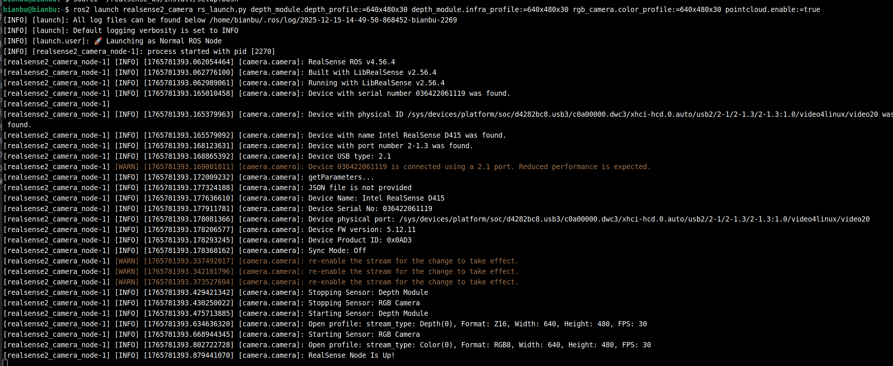

运行 `ros2 topic list`

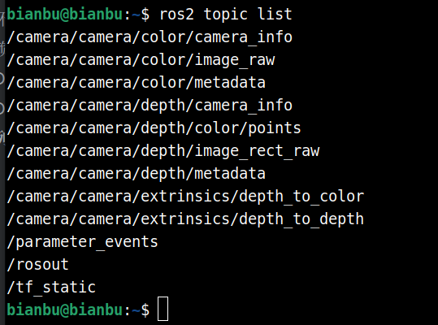

可以看到消息在正常发布

**查看深度图的发布频率**

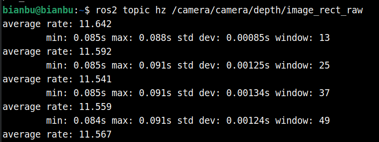

**查看深度图**

`ros2 run rqt_image_view rqt_image_view`

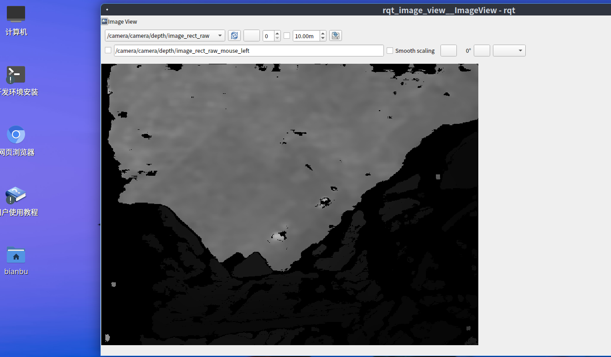


更多信息参考：https://github.com/realsenseai/realsense-ros


## 从 Python 使用

### 软硬件环境

- 硬件环境：MUSE PI PRO
- 操作系统：ROS2_LXQT
- Realsense 相机型号：D415
- Python Realsense SDK 版本：2.56.5
- Python 版本：3.12

### 安装依赖

```
sudo apt install python3-venv python3-pip
```

### 安装包

```
python3 -m venv rs2
source rs2/bin/activate
pip install pyrealsense2 --index-url https://git.spacemit.com/api/v4/projects/33/packages/pypi/simple
```

### 示例程序

```
import pyrealsense2 as rs

pipeline = rs.pipeline() # Create a pipeline
pipeline.start() # Start streaming

try:
    while True:
        frames = pipeline.wait_for_frames()
        depth_frame = frames.get_depth_frame()
        if not depth_frame:
            continue

        width, height = depth_frame.get_width(), depth_frame.get_height()
        dist = depth_frame.get_distance(width // 2, height // 2)
        print(f"The camera is facing an object {dist:.3f} meters away", end="\r")

finally:
    pipeline.stop() # Stop streaming
```

保存为 demo.py

### 运行结果

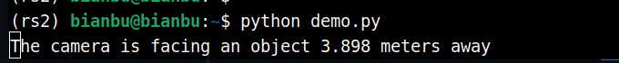
