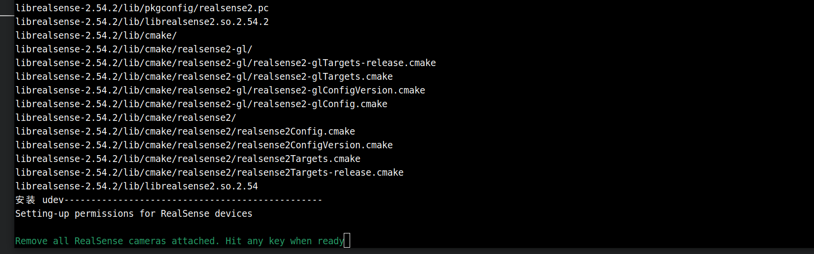
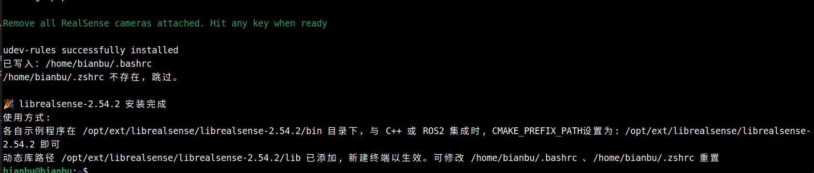
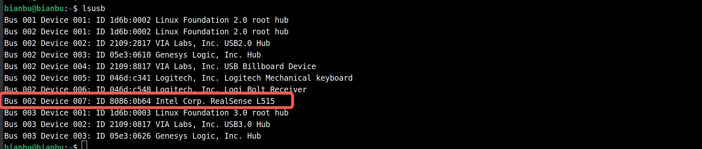
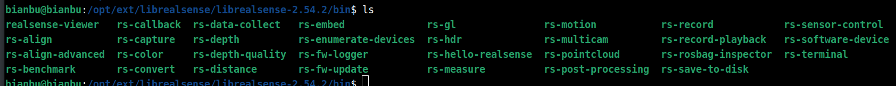
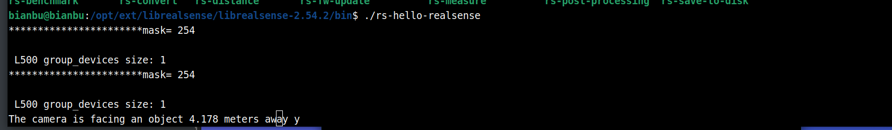
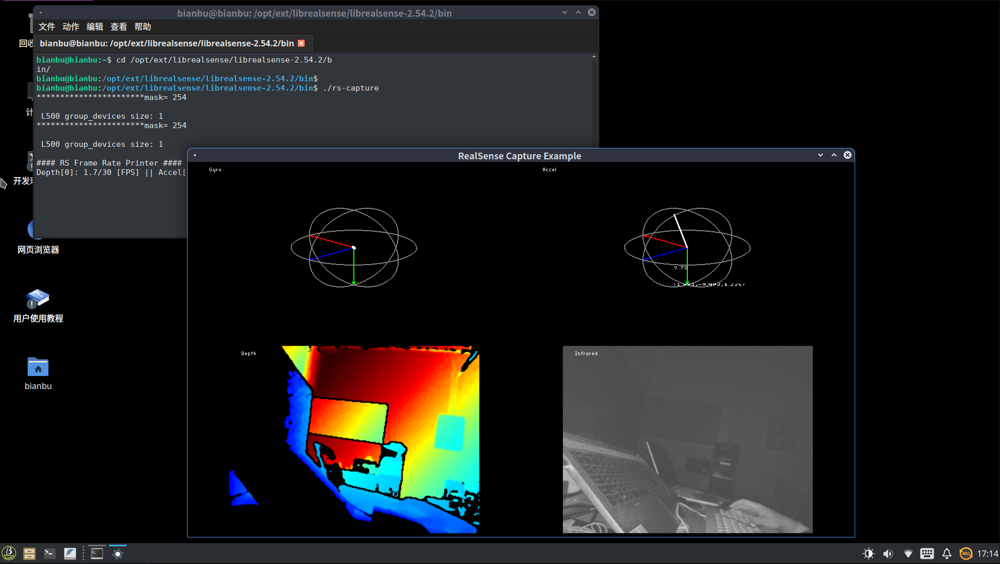

# Realsense L515 深度相机使用

## 硬件环境

SpaceMIT RISCV64 开发板，已在 MUSE PI PRO 开发板上验证

inter 官方已经停止对 L515 的支持，建议使用 D4xx 系列。 

## 建议的操作系统

ROS2_LXQT（推荐），[镜像链接](https://archive.spacemit.com/ros2/bianbu-ros-images/v1.5/ROS2_LXQT-v1.5-20251216.zip)

Bianbu 2.2 Desktop，[镜像链接](https://archive.spacemit.com/image/k1/version/bianbu/v2.2/bianbu-24.04-desktop-k1-v2.2-release-20250430190125.zip)

## SDK 版本说明

只可使用 v2.54.2 版本 SDK

我们发布的 SDK 基于官方发布版本修改并构建，官方 SDK 源码发布参考：https://github.com/realsenseai/librealsense/releases

## 更换内核

**下载内核包：**

```
wget https://archive.spacemit.com/ros2/prebuilt_libs/bianbu24/kernel_image/linux-image-6.6.63_6.6.63-20251217101945_riscv64.deb
```

**安装内核包**

```
sudo apt update
sudo apt install ./linux-image-6.6.63_6.6.63-20251217101945_riscv64.deb
```

等待安装完成，执行：

```
sudo reboot
```


## 下载并使用 SDK

下载前请不要连接任何 Realsense 设备到板子上。

### 获取下载脚本

```
wget https://archive.spacemit.com/ros2/prebuilt_libs/install_scripts_common/install_librealsense.sh
```


### 指定版本下载

```
bash install_librealsense.sh 2.54.2
```

终端输出：

```
bianbu@bianbu:~$ bash install_librealsense.sh 2.54.2
准备安装 librealsense 2.54.2
版本说明: 高版本，支持 D4xx系列相机, 已经过测试。具体见: https://dev.intelrealsense.com/docs/firmware-updates
当前系统 Python 版本: 3.12 (使用目录: bianbu24)
更新 apt 源并安装依赖...
[sudo] bianbu 的密码：
```

输入密码，默认是 bianbu

等待依赖安装完成，终端提示：



注意，确认当前板子没有连接 Realsense 相机后，按下回车键继续。

安装成功后，终端输出如下：



新建终端让 LD_LIBRARY_PATH 环境变量生效。

注意不要在一台机器上安装多个版本 SDK ，以免互相干扰。


### 硬件连接

安装完 SDK 后即可以接入 Realsense  L515 相机，如下：


这里使用的是 L515 相机

终端输入 lsusb 查看设备:



设备识别正常

### 运行示例

进入 `/opt/ext/librealsense/librealsense-2.54.2/bin` 目录

有一些可以运行的示例程序，如下：



#### rs-hello-realsense

简单的程序，获取相机图像中心的深度值，输出如下：



#### rs-capture

含界面显示，你应该在本地执行该命令，而非 ssh 终端

显示如下：



由于本地的计算资源有限，因此可视化工具只建议用于硬件通信的验证。
