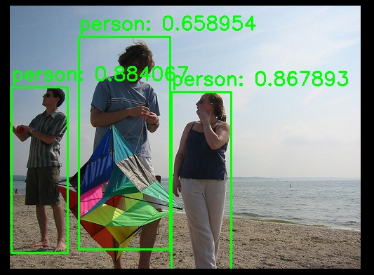

# 4.3 C++ 推理示例

本文以 **目标检测** 任务为例，介绍如何在 C++ 环境中完成模型推理。目标检测是一项关键的计算机视觉任务，旨在识别图像或视频中各类目标的具体位置和类别。

示例使用 **YOLOv5** 模型，基于 **ONNX** 推理框架和 SpacemiT 提供的硬件加速库进行部署与推理。

## 克隆代码

```
git clone https://gitee.com/bianbu/spacemit-demo.git ~
```

## 构建与运行

```bash
cd spacemit_demo/examples/CV/yolov5/cpp
mkdir build
cd build
cmake ..
make -j8
./yolov5_demo --model ../../model/yolov5_n.q.onnx --image ../../data/test.jpg
```

推理结果默认保存为 `result.jpg`，如下图所示：



## 推理流程与代码解析

### 头文件导入

```c++
#include <opencv2/opencv.hpp>
#include <onnxruntime_cxx_api.h>
#include "spacemit_ort_env.h"
```

### 打开摄像头

```cpp
// 设备号默认为1
cv::VideoCapture cap(1);
if (!cap.isOpened()) {
    std::cerr << "Failed to open camera!" << std::endl;
    return -1;
}
```

### 图像预处理

```cpp
// 图像预处理函数
std::vector<float> preprocess(const cv::Mat& image, int inputWidth = 320, int inputHeight = 320) {
    cv::Mat resizedImage;
    
    // 图像resize到固定尺寸
    cv::resize(image, resizedImage, cv::Size(inputWidth, inputHeight));
    
    // 图像通道转换，BGR->RGB
    cv::cvtColor(resizedImage, resizedImage, cv::COLOR_BGR2RGB);
    
    // 图像归一化
    resizedImage.convertTo(resizedImage, CV_32F, 1.0 / 255.0);

    std::vector<float> inputTensor;
    
    // 图像通道顺序转换为[C,H,W]
    for (int c = 0; c < 3; ++c) {
        for (int h = 0; h < inputHeight; ++h) {
            for (int w = 0; w < inputWidth; ++w) {
                inputTensor.push_back(resizedImage.at<cv::Vec3f>(h, w)[c]);
            }
        }
    }
    return inputTensor;
}
```

### Session 初始化与预设置

```cpp
// 初始化 ONNX Runtime 环境
Ort::Env env(ORT_LOGGING_LEVEL_WARNING, "YOLOv5Inference");
Ort::SessionOptions session_options;

// 设置运行时线程数，最大为4
session_options.SetIntraOpNumThreads(4)
session_options.SetGraphOptimizationLevel(GraphOptimizationLevel::ORT_ENABLE_ALL);

// SpaceMIT EP加载
SessionOptionsSpaceMITEnvInit(session_options);

// 加载 ONNX 模型
Ort::Session session_(env, modelPath.c_str(), session_options);

// 输入节点name的获取
Ort::AllocatorWithDefaultOptions allocator;
std::vector<const char*> input_node_names_;
std::vector<std::string> input_names_;
size_t num_inputs_;
num_inputs_ = session_.GetInputCount();
input_node_names_.resize(num_inputs_);
input_names_.resize(num_inputs_, "");
for (size_t i = 0; i < num_inputs_; ++i) {
    auto input_name = session_.GetInputNameAllocated(i, allocator);
    input_names_[i].append(input_name.get());
    input_node_names_[i] = input_names_[i].c_str();
}
// 获取输入的宽高
Ort::TypeInfo input_type_info = session_.GetInputTypeInfo(0);
auto input_tensor_info = input_type_info.GetTensorTypeAndShapeInfo();
std::vector<int64_t> input_dims = input_tensor_info.GetShape();
int inputWidth = input_dims[3];
int inputHeight = input_dims[2];

// 输出节点name的获取
std::vector<const char*> output_node_names_;
std::vector<std::string> output_names_;
size_t num_outputs_;
num_outputs_ = session_.GetOutputCount();
output_node_names_.resize(num_outputs_);
output_names_.resize(num_outputs_, "");
for (size_t i = 0; i < num_outputs_; ++i) {
    auto output_name = session_.GetOutputNameAllocated(i, allocator);
    output_names_[i].append(output_name.get());
    output_node_names_[i] = output_names_[i].c_str();
}

// 图像预处理
std::vector<float> inputTensor = preprocess(frame, inputWidth, inputHeight);

// 创建输入张量
auto memory_info = Ort::MemoryInfo::CreateCpu(OrtArenaAllocator, OrtMemTypeDefault);
Ort::Value input_tensor = Ort::Value::CreateTensor<float>(memory_info, inputTensor.data(), inputTensor.size(), input_shape.data(), input_shape.size());
```

### 执行推理

```cpp
std::vector<Ort::Value> outputs = session_.Run(Ort::RunOptions{nullptr}, input_node_names_.data(), &input_tensor, 1, output_node_names_.data(), output_node_names_.size());
```

### 获取输出与后处理

```cpp
// 获取输出数据
float* dets_data = outputs[0].GetTensorMutableData<float>();
float* labels_pred_data = outputs[1].GetTensorMutableData<float>();

// 获取检测到的目标数
auto dets_tensor_info = outputs[0].GetTensorTypeAndShapeInfo();
std::vector<int64_t> dets_dims = dets_tensor_info.GetShape();
size_t num_detections = dets_dims[1];

//分别获取坐标，得分，标签值
std::vector<std::vector<float>> dets(num_detections, std::vector<float>(4));
std::vector<float> scores(num_detections);
std::vector<int> labels_pred(num_detections);
for (size_t i = 0; i < num_detections; ++i) {
    for (int j = 0; j < 4; ++j) {
        dets[i][j] = dets_data[i * 5 + j];
    }

    scores[i] = dets_data[i * 5 + 4];
    labels_pred[i] = static_cast<int>(labels_pred_data[i]);
}
// 调整边界框到原始图像尺寸
float scale_x = static_cast<float>(image_shape.width) / inputWidth;
float scale_y = static_cast<float>(image_shape.height) / inputHeight;
for (auto& det : dets) {
    det[0] *= scale_x;
    det[1] *= scale_y;
    det[2] *= scale_x;
    det[3] *= scale_y;
}
```

### 可视化结果

```cpp
void visualizeResults(cv::Mat& image, const std::vector<std::vector<float>>& dets, const std::vector<float>& scores, const std::vector<int>& labels_pred, const std::vector<std::string>& labels, float conf_threshold = 0.4) {
    for (size_t i = 0; i < dets.size(); ++i) {
        const auto& det = dets[i];
        float score = scores[i];
        if (score > conf_threshold) {
            int class_id = labels_pred[i];
            int x1 = static_cast<int>(det[0]);
            int y1 = static_cast<int>(det[1]);
            int x2 = static_cast<int>(det[2]);
            int y2 = static_cast<int>(det[3]);
            std::string label = labels[class_id];
            cv::rectangle(image, cv::Point(x1, y1), cv::Point(x2, y2), cv::Scalar(0, 255, 0), 2);
            cv::putText(image, label + ": " + std::to_string(score), cv::Point(x1, y1 - 10), cv::FONT_HERSHEY_SIMPLEX, 0.9, cv::Scalar(0, 255, 0), 2);
        }
    }
}
```
