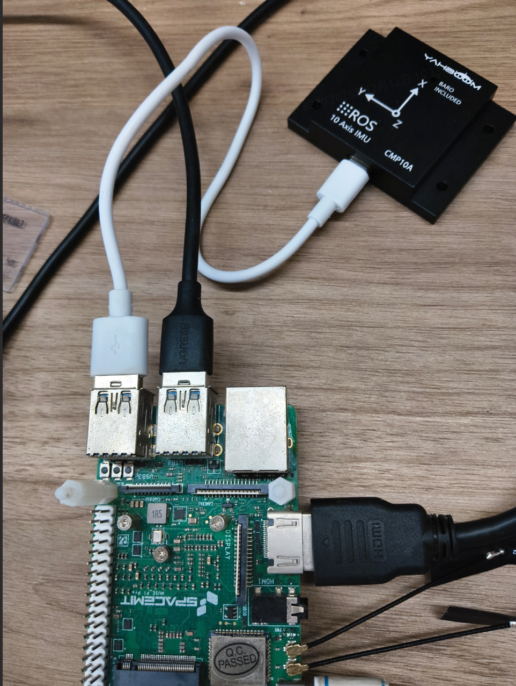
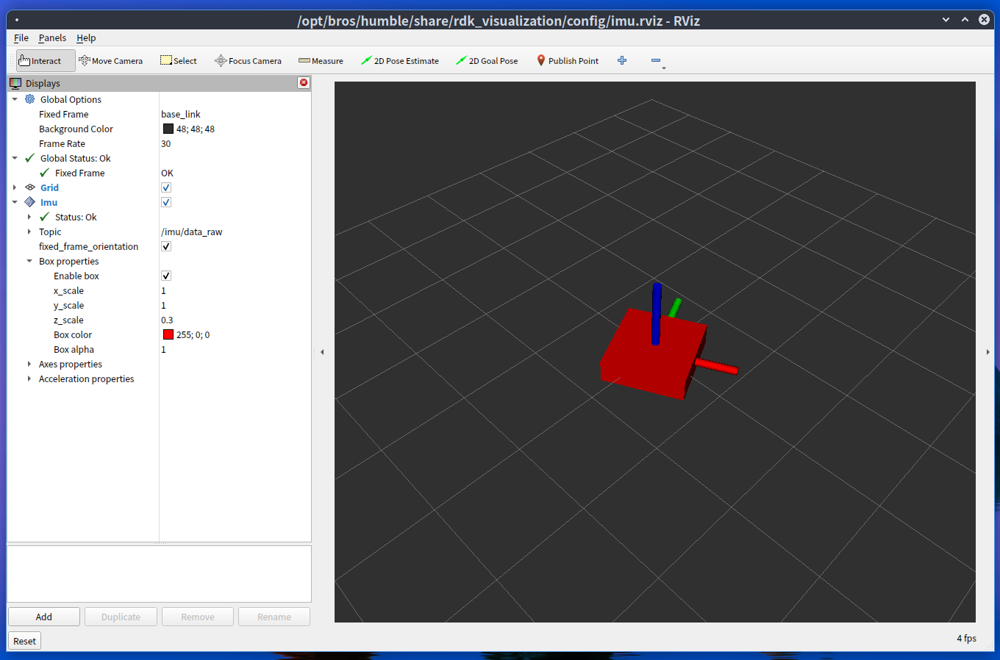

# CMP10A IMU 使用


## 硬件连接

硬件资料：(https://item.jd.com/10052180610725.html)、（https://www.yahboom.com/study/IMU）

**硬件连接示意：**



**查看设备节点：**

```
bianbu@bianbu:~$ ls /dev/ttyUSB*
/dev/ttyUSB0
```

**赋予设备节点权限**

```
sudo chmod 666 /dev/ttyUSB0
```


## 环境准备

### 安装依赖

确保开发环境依赖已安装：(https://bianbu.spacemit.com/brdk/system_configuration/2.3_System_Dependency_Installation)

```bash
sudo apt install python3-serial ros-humble-rviz2 ros-humble-rviz-imu-plugin
```


### 导入 ROS2 环境

之后的步骤默认已导入

```bash
source /opt/bros/humble/setup.bash
```


## 启动 IMU 节点

### 发布 TF 

```
ros2 launch rdk_sensors wit_imu_rviz.launch.py port:=/dev/ttyUSB0
```

这会发布imu的数据，同时发布一个 base_link 到 imu_link 的 TF 变换，方便使用 rviz2 进行可视化。

### 不发布 TF 

```
ros2 launch rdk_sensors wit_imu.launch.py port:=/dev/ttyUSB0
```

只发布 imu 的数据，适合与其他 ROS2 包集成时使用。


## 启动可视化

```
export QT_QPA_PLATFORM=xcb # Humble版本使用
ros2 launch rdk_visualization display_imu.launch.py
```



晃动 imu，红色小方块的位姿也会随之变化
