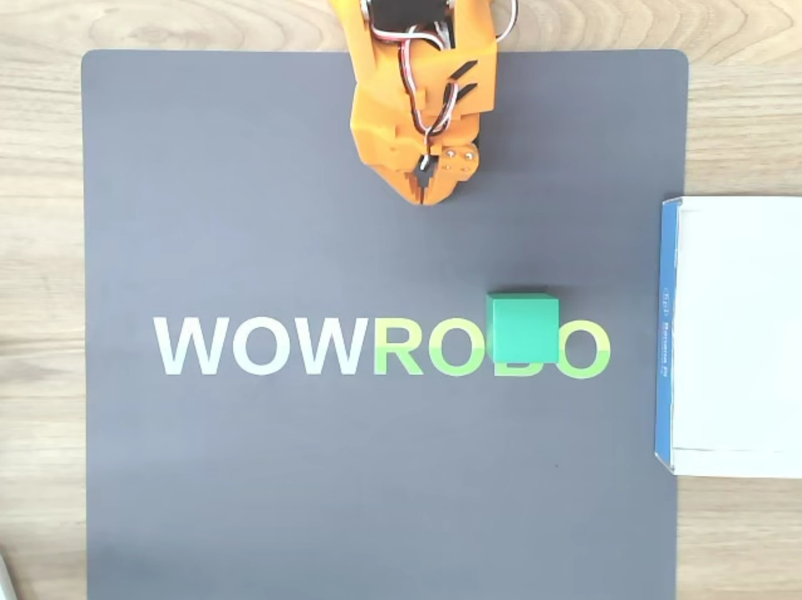

# LeRobot 使用指南

本文档介绍 K1/K3 上的 LeRobot 使用指南，提供 K1/K3 设备上运行端到端（e2e） 机械臂应用的完整流程，涵盖以下内容：

- SO-101 机械臂（包括主导臂和随从臂）的标定、遥控操作及数据采集流程；
- ACT 模型训练（服务器）并部署于 K1/K3 本地推理，实现机械臂的木块抓取任务；
- SmolVLA 模型微调（服务器）并进行分布式部署，完成机械臂的木块抓取任务。

## 物料准备

运行本项目所需的软硬件设备如下：

- **训练平台**：一台配置 RTX 系列及以上 GPU 的服务器
- **数采平台（可选）：**PC
- **本地环境**：K1/K3 开发板 + Bianbu 固件
- **机械臂**：SO-101 主从机械臂
- **视觉输入**：两个 USB 相机

## 软件环境安装

> [!NOTE]
>
> 本文档需要保持两份及以上环境，一份是训练环境，主要用于模型训练；一份是数采环境，这部分可以在开发板完成，但强烈建议在 PC 上进行数采来取得更加流畅的效果，尤其是可视化数采；另一份是开发板本地环境，主要用于模型部署和推理。在所有平台均须安装软件环境。其他如无特殊说明，均在开发板端操作。

### 下载源码

```
git clone -b v0.5.0 https://github.com/huggingface/lerobot.git
```

### 安装系统依赖

首先，更新系统并安装所需的依赖：

```
sudo apt update
sudo apt install python3-venv ffmpeg
```

- python3-venv：使用 python 虚拟环境来管理 LeRobot 项目依赖
- ffmpeg：视频帧处理需要

### pyenv 安装和使用

K1 使用 Bianbu v2+ 固件，系统使用 python3.12；K3 使用 Bianbu v3+ 固件，系统使用 python3.14。但由于目前 Spacemit pytorch 只支持 python3.12 和 python3.14，因此在 K3 上使用 LeRobot 时，建议使用 pyenv 来创建 python3.12/python3.13 的虚拟环境。下面以 python3.13 为例介绍 pyenv的安装和使用。

1. **安装 pyenv**

```
git clone https://github.com/pyenv/pyenv.git ~/.pyenv
```

2. **配置 shell 环境**

```
echo 'export PYENV_ROOT="$HOME/.pyenv"' >> ~/.bashrc
echo 'command -v pyenv >/dev/null || export PATH="$PYENV_ROOT/bin:$PATH"' >> ~/.bashrc
echo 'eval "$(pyenv init -)"' >> ~/.bashrc
source ~/.bashrc
```

3. **安装 Python 3.13**

```
pyenv install 3.13
```

安装完成后，输入 pyenv versions 查看是否出现您安装的 python 版本号：

```
➜  ~ pyenv versions
* system (set by /home/zq/.pyenv/version)
  3.13.12
```

4. **设置本地 Python 版本**

进入 LeRobot 项目目录，运行 `pyenv local`，pyenv 会在该目录下生成一个名为 .python-version 的文件，指定该目录使用的 Python 版本。

```
pyenv local 3.13.12
```

设置完之后执行 `python3 -V` 检查一下版本是否为 python3.13。

### 安装 python 依赖

```bash
cd ~/lerobot
python3 -m venv ~/.lerobot-venv
source ~/.lerobot-venv/bin/activate
pip install -e . && pip install "lerobot[feetech]"
```

## 前置准备

### 机械臂标定

1. 在机械臂完成 [组装](https://huggingface.co/docs/lerobot/so101#step-by-step-assembly-instructions) 和 [舵机标定](https://huggingface.co/docs/lerobot/so101#configure-the-motors) 的前提下，接上两个机械臂的电源和 usb 口，运行以下代码确认设备号：

```bash
lerobot-find-port
```

2. USB 设备在 K1 板卡中常以 `/dev/ttyACM0` 形式出现，运行以下代码获取权限：

```Bash
sudo chmod 666 /dev/ttyACM0
```

3. 确认串口后，分别对所有机械臂进行标定：

```Bash
# 从臂
lerobot-calibrate \
    --robot.type=so101_follower \
    --robot.port=/dev/ttyACM0 \
    --robot.id=my_awesome_follower_arm # 自定义

# 主臂
lerobot-calibrate \
    --teleop.type=so101_leader \
    --teleop.port=/dev/ttyACM1 \
    --teleop.id=my_awesome_leader_arm # 自定义
```

记得更换设备号与自己系统一致。具体过程参考 [Hugging Face 官方标定教程](https://huggingface.co/docs/lerobot/so101#calibration-video)。

### 遥控操作

1. **机械臂设备确认**

开始遥操作或数据采集之前运行以下命令以确认机械臂串口号：

```Bash
lerobot-find-port
```

2. **无相机遥操**

确定串口号正确配置后，运行以下命令进行无相机遥操作：

```Bash
lerobot-teleoperate \
    --robot.type=so101_follower \
    --robot.port=/dev/ttyACM0 \
    --robot.id=my_awesome_follower_arm \
    --teleop.type=so101_leader \
    --teleop.port=/dev/ttyACM1 \
    --teleop.id=my_awesome_leader_arm
```

3. **相机确认**

笔者使用了两个 USB 摄像头，其中一个固定在操作台面顶部（top），提供全局视角；另一个则固定在侧面（side），以获取更加细致的操作视角。相机布置第三方视角如下图所示。

摄像头的摆放原则是确保摄像头能够捕捉到任务执行过程中的关键细节，同时避免画面中出现其他无关物体，从而确保数据集的高质量和精度。top 视角和 side 视角分别如下图所示： 




在固定好摄像头视角后，将两个 USB 摄像头连接至开发板，并运行以下命令查看摄像头 ID：

```Bash
lerobot-find-cameras opencv
```

终端将打印出以下信息：

```Bash
--- Detected Cameras ---
Camera #0:
  Name: OpenCV Camera @ /dev/video2
  Type: OpenCV
  Id: /dev/video20
  Backend api: V4L2
  Default stream profile:
    Format: 0.0
    Width: 640
    Height: 480
    Fps: 30.0
--------------------
Camera #1:
  Name: OpenCV Camera @ /dev/video4
  Type: OpenCV
  Id: /dev/video22
  Backend api: V4L2
  Default stream profile:
    Format: 0.0
    Width: 640
    Height: 480
    Fps: 30.0
--------------------

Finalizing image saving...
Image capture finished. Images saved to outputs/captured_images
```

在 `outputs/capture_images` 目录中找到每个摄像头拍摄的图片，并确认不同位置摄像头对应的端口 ID。

4. **可视化遥操**

确定相机 ID 后，运行以下命令进行可视化遥操作，来确认视觉输入的质量是否符合要求：

```Bash
lerobot-teleoperate \
    --robot.type=so101_follower \
    --robot.port=/dev/ttyACM0 \
    --robot.id=my_awesome_follower_arm \
    --robot.cameras="{
        top:  {type: opencv, index_or_path: 2, width: 640, height: 480, fps: 30},
        side: {type: opencv, index_or_path: 4, width: 640, height: 480, fps: 30}
    }" \
    --teleop.type=so101_leader \
    --teleop.port=/dev/ttyACM1 \
    --teleop.id=my_awesome_leader_arm \
    --display_data=true
```

### 数据集采集

> [!TIP]
>
> 开发板本地也可以采集数据集，为取得更流畅的效果，建议在 PC 端进行数采。如果在 PC 数采，需要先在 PC 执行机械臂标定、遥控测试。

1. 在进行数据采集之前可以选择是否登录 `huggingface-cli`，登录后方便数据集模型上传至云端

```Bash
hf auth login
```

根据提示输入自己的 huggingface token。

2. 登陆后即可指定`<HF_USER>`:

```Bash
HF_USER=$(hf auth whoami | head -n 1 | awk '{print $3}')
echo $HF_USER
```

若不指定，需要对以下内容的 `<HF_USER>` 进行替换为随意名称。

3. 接下来开始进行数据采集

接下运行以下代码开始数据采集：

```Bash
lerobot-record \
    --robot.type=so101_follower \
    --robot.port=/dev/ttyACM0 \
    --robot.id=my_awesome_follower_arm \
    --robot.cameras="{
        top:  {type: opencv, index_or_path: 2, width: 640, height: 480, fps: 30},
        side: {type: opencv, index_or_path: 4, width: 640, height: 480, fps: 30}
    }" \
    --teleop.type=so101_leader \
    --teleop.port=/dev/ttyACM1 \
    --teleop.id=my_awesome_leader_arm \
    --dataset.num_episodes=60 \
    --dataset.episode_time_s=30 \
    --dataset.reset_time_s=30 \
    --dataset.repo_id=${HF_USER}/record-green-cube \
    --dataset.single_task="Place the green cube into the box" \
    --dataset.root=./datasets/record-green-cube \
    --dataset.push_to_hub=True \
    --play_sounds=false \
    --display_data=true # 开启此参数需要在X86端
```

- 参数说明

  - `dataset.num_episodes`: 表示预期收集多少组数据
  - `dataset.episode_time_s`: 表示每次收集数据的时间
  - `dataset.reset_time_s:` 是每次数据收集之间的准备时间
  - `dataset.repo_id`：`$HF_USER` 为当前用户，`record-green-cube` 为数据集名称
  - `dataset.single_task`：任务指令，可用于 VLA 模型输入
  - `dataset.root`：设置数据集存储的位置，默认在~/.cache/huggingface/lerobot/
  - `dataset.push_to_hub`: 决定是否将数据上传到 HuggingFace Hub
  - play_sounds：是否播放指令声音
  - display_data：是否显示图形化界面，**如果开启此参数，建议在 X86 服务器上进行数采**

  具体命令可以使用 --help 来获取。

- 检查点和恢复

  - 在录制期间会自动创建检查点。
  - 如果出现问题，可以通过使用 `--resume=true` 重新运行相同的命令来恢复。
  - 要从头开始录制， **请手动删除**数据集目录。

- 录制期间的键盘控制（X11模式下生效）

  - 按 **向右箭头 （**`→`**）：** 提前停止当前剧集或重置时间并移至下一集。
  - 按 **向左箭头 （**`←`**）：** 取消当前剧集并重新录制。
  - 按 **Esc （**`ESC`**）：** 立即停止会话，对视频进行编码，然后上传数据集。

- Tips of record

  - 一个好的开始任务是抓住不同位置的物体并将其放入垃圾箱中。
  - 建议至少录制 50 集，每个位置 10 集。
  - 在整个录制过程中保持摄像机固定并保持一致的抓取行为。
  - 能够通过仅查看相机图像来自己完成任务。

## ACT 模型训练及部署

ACT（Action Chunking Transformer） 是 ALOHA 团队在 2023 年 4 月提出的一种 模仿学习算法，旨在解决精细操作任务中的挑战。ACT 结合了 Transformer 模型的强大表达能力和 动作分块（Action Chunking） 技术，能够在机器人控制等任务中学习更加复杂的动作序列，并且能在长时间任务中高效执行。

### 模型训练（服务器）

**移动数据集到服务器上**

如果在开发板本地采集的数据集，需要将数据集上传到服务器：

1. 若服务器正确配置代理，且已将数据集`push`至`huggingface`，可选择在训练时通过`repo_id`方式加载数据集，需要在服务器终端登录`huggingface`。
2. 若未配置代理，且数据集保存在本地，请将数据集移动至服务器 `~/lerobot/datasets` 数据集。

**wandb 设置**

启动 wandb（可选），运行以下命令wandb方便观察训练曲线：

```Bash
wandb login
```

**模型训练**

运行以下代码开始训练，可通过  `src\lerobot\configs\train.py `文件修改训练参数

```Bash
lerobot-train \
  --dataset.repo_id={HF_USER}/record-green-cub \
  --dataset.root=datasets/record-green-cube \
  --policy.type=act \
  --output_dir=outputs/train/act_so101_pickplace \
  --job_name=act_so101_pickplace \
  --policy.device=cuda \
  --steps=200000
  --wandb.enable=true \
  --policy.repo_id=${HF_USER}/my_act_policy
```

- 参数说明
  - `dataset.repo_id`：从 hugging face 下载数据集用于训练
  - `dataset.root`：使用本地数据集进行训练，优先于 `dataset.repo_id`
  - `policy.type`：使用的策略类型，用于从零训练
  - `output_dir`：模型检查点和 wandb 数据保存路径
  - `job_name`：任务名称
  - `policy.device`：训练设备，cpu | coda | mps 可选
  - `wandb.enable`：是否选择启动 wandb
  - `policy.repo_id`：策略 id

> [!NOTE]
>
> 笔者使用的卡是 RTX 4090，数据集为 60 组操作数据，训练 200k 轮（直到 loss 收敛至最低即可），batch size为8，大约需要4小时。

### 模型部署

**将模型复制到开发板**

在服务器上完成模型训练后，将最终的模型检查点复制到开发板的 `lerobot` 目录下。模型路径及结构如下：

```bash
(.lerobot-venv) ➜  lerobot git:(main) ✗ tree outputs/train/act_so101_pickplace/checkpoints/last/pretrained_model
outputs/train/act_so101_pickplace/checkpoints/last/pretrained_model
├── config.json
├── model.safetensors
└── train_config.json

1 directory, 3 files
```

- `config.json`：模型配置文件，包含模型的超参数和其他配置
- `model.safetensors`：保存模型权重的文件
- `train_config.json`：训练过程中使用的配置文件，记录了训练参数

**模型推理**

将模型部署到开发板后，可以在本地执行推理任务。以下是执行抓取任务的命令示例：

```bash
lerobot-record  \
  --robot.type=so101_follower \
  --robot.port=/dev/ttyACM0 \
  --robot.cameras="{
        top:  {type: opencv, index_or_path: 2, width: 640, height: 480, fps: 30},
        side: {type: opencv, index_or_path: 4, width: 640, height: 480, fps: 30}
    }" \
  --robot.id=my_awesome_follower_arm \
  --display_data=false \
  --dataset.repo_id=${HF_USER}/eval_act \
  --dataset.single_task="Place the greeb cube into the box" \
  --policy.path=outputs/train/act_so101_pickplace/checkpoints/last/pretrained_model \
  --policy.device=cpu \
  --dataset.episode_time_s=180 \
  --dataset.reset_time_s=30 \
  --play_sounds=false
```

## SmolVLA 模型微调及推理

SmolVLA 模型是一个轻量级的视觉-语言-动作（VLA）模型，具有仅 450M 的参数量，能够在消费级 GPU 上高效地进行训练和部署。该模型在视觉-大语言模型（VLM）的基础上，融入了动作专家（Action Expert）模块，能够理解视觉输入（如图像或视频流）以及自然语言指令，并根据这些输入生成机器人动作序列。


### 模型微调（X86服务器）

建议基于 Hugging Face 官方发布的基础模型进行微调，这样模型可以从已经训练好的通用场景中快速学习到特定场景下的知识和技能。

微调指令：

```
lerobot-train \
  --dataset.repo_id=${HF_USER}/record-green-cub \
  --dataset.root=datasets/record-green-cube \
  --policy.path=lerobot/smolvla_base \
  --policy.repo_id=${HF_USER}/my_smolvla_policy_findtune \
  --output_dir=outputs/train/smolvla_so101_pickplace_finetune \
  --job_name=smolvla_so101_pickplace \
  --policy.device=cuda \
  --steps=200000 \
  --wandb.enable=true
```

- `policy.path`：基础模型的路径或者名字，这里指 lerobot 项目的 vla_base 模型

### 分布式部署

当前开发板本地的算力无法直接运行 SmolVLA 模型，可以借助 LeRobot 项目提供的分布式方法来部署 SmolVLA。具体地，开发板作为客户端，负责数据采集和动作执行；PC 作为服务端，负责使用 SmolVLA 模型来推理产生动作序列。客户端和服务端通过 gRPC 协议进行数据传输和指令交互。客户端将采集到的视觉数据和传感器信息发送给服务端，服务端使用 SmolVLA 模型对数据进行推理，生成相应的动作序列，再将这些动作序列返回给客户端，驱动机械臂执行抓取任务。

服务端指令：

```
python src/lerobot/scripts/server/policy_server.py \
     --host=0.0.0.0 \
     --port=8080 \
     --fps=30 \
     --inference_latency=0.033 \
     --obs_queue_timeout=1
```

客户端指令：

```bash
python src/lerobot/scripts/server/robot_client.py \
    --robot.type=so101_follower \
    --robot.port=/dev/ttyACM0 \
    --robot.cameras="{
        top:  {type: opencv, index_or_path: 2, width: 640, height: 480, fps: 30},
        side: {type: opencv, index_or_path: 4, width: 640, height: 480, fps: 30}
    }" \
    --robot.id=my_awesome_follower_arm \
    --task="Place the greeb cube into the box" \
    --server_address=${server_ip}:8080 \
    --policy_type=smolvla \
    --pretrained_name_or_path=outputs/train/smolvla_so101_pickplace_finetune/checkpoints/last/pretrained_model \
    --policy_device=cuda \
    --actions_per_chunk=50 \
    --chunk_size_threshold=0.5 \
    --aggregate_fn_name=weighted_average \
    --debug_visualize_queue_size=True
```

## 常见问题排查

### Rerun 渲染失败

bianbu lxqt上图形渲染后端为gles，rerun 默认选择 vulkan 作为渲染后段，使用下面字段指定 gles 后端：

```Bash
export WGPU_BACKEND=gles
```


