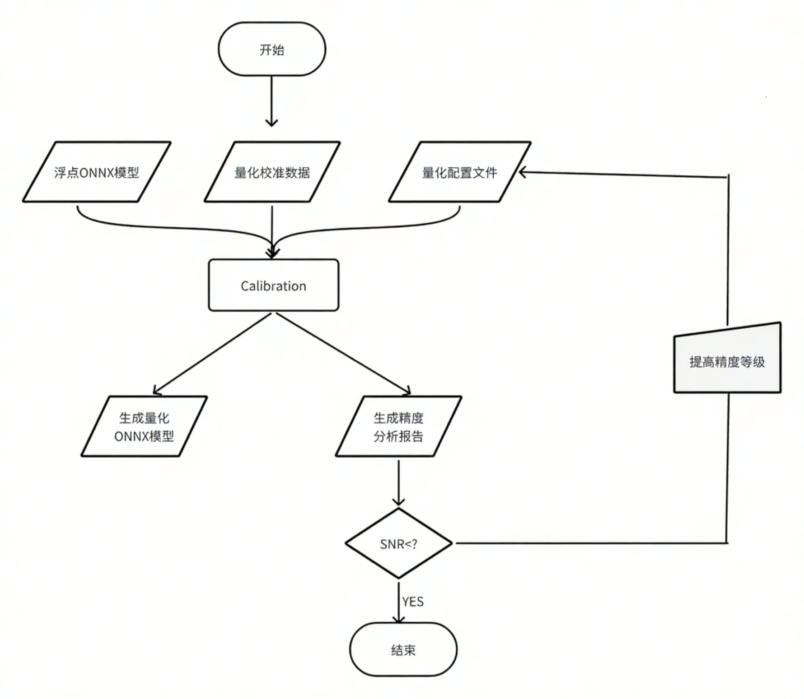
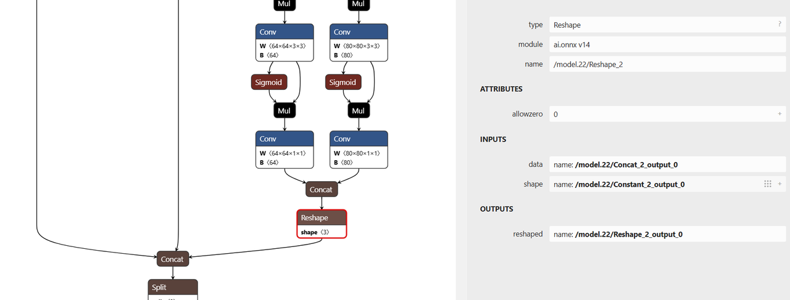

# 7.1 模型量化开发

```
最新版本：2025/09/22
```

## 工具简介

**xquant** 是基于 [PPQ v0.6.6+](https://github.com/openppl-public/ppq) 开发的模型量化工具，已集成适配主流芯片的量化策略。工具通过 JSON 配置文件统一调用接口，可将浮点格式的 ONNX 模型转换为 INT8 定点格式模型。

在使用 xquant 前，建议先将训练框架生成的模型转换为 ONNX 格式。目前主流框架均提供标准化的转换方案，具体可参考 ONNX 官方转换教程：： [https://github.com/onnx/tutorials#converting-to-onnx-format](https://github.com/onnx/tutorials#converting-to-onnx-format)

## 使用流程

量化流程如下图所示：



## 模型量化示例

以下以 [Ultralytics 社区](https://github.com/ultralytics/ultralytics) 提供的 `yolov8n` 模型为例，介绍 xquant 的量化操作流程。

### 安装量化工具包

安装命令如下：

```bash
pip install xquant --index-url https://git.spacemit.com/api/v4/projects/33/packages/pypi/simple
```

安装完成后可通过以下命令验证安装成功：

```bash
pip show xquant
```

若能正常输出 xquant 的信息，即表示安装成功。

### 获取浮点模型

- 下载原始 YOLOv8n 模型（`.pt` 格式）：
   [https://docs.ultralytics.com/zh/models/yolov8/#performance-metrics](https://docs.ultralytics.com/zh/models/yolov8/#performance-metrics)

- 使用 Ultralytics 提供的导出接口将 `.pt` 模型转换为 `.onnx`：
官方导出文档：[https://docs.ultralytics.com/zh/modes/export/](https://docs.ultralytics.com/zh/modes/export/)

通常建议导出时使用如下参数：

```bash
opset_version=13
input_shape=[1, 3, 640, 640]
```

### 配置量化工程文件

1）新建工程目录：

```
project_root/
├── yolov8/
│   ├── model/           # 放置 yolov8n.onnx 模型
│   └── data/            # 放置标定数据与配置文件
```

2）编写 `yolov8_xquant_config.json` 配置文件：

```json
{
  "model_parameters": {
    "onnx_model": "yolov8/model/yolov8n.onnx",
    "working_dir": "yolov8",
    "skip_onnxsim": false
  },
  "calibration_parameters": {
    "input_parametres": [
      {
        "mean_value": [0, 0, 0],
        "std_value": [255, 255, 255],
        "color_format": "rgb",
        "data_list_path": "yolov8/data/calib_list.txt"
      }
    ]
  },
  "quantization_parameters": {
    "truncate_var_names": [
      "/model.22/Reshape_output_0",
      "/model.22/Reshape_1_output_0",
      "/model.22/Reshape_2_output_0"
    ]
  }
}
```

- `onnx_model`：模型路径
- `mean_value` 和 `std_value`：图像归一化参数，需与训练配置保持一致。
- `color_format`：图像通道顺序（如 RGB/BGR）。
- `data_list_path`：标定数据路径文件。

示例标定图像列表 `calib_list.txt` 内容如下：

```
Calib/000000428562.jpg
Calib/000000000632.jpg
Calib/000000157756.jpg
Calib/000000044279.jpg
Calib/000000131444.jpg
Calib/000000415238.jpg
Calib/000000202228.jpg
Calib/000000441491.jpg
Calib/000000068286.jpg
Calib/000000232088.jpg
```

⚠️ 建议标定数据选自模型训练集的子集，并保持数据分布一致。

### 设置量化截断节点

YOLOv8n 模型中包含后处理（坐标解码）逻辑，建议对模型在后处理节点前进行截断，防止量化误差。配置中的 `truncate_var_names` 用于指定量化截断点：

```json
"truncate_var_names": [
  "/model.22/Reshape_output_0",
  "/model.22/Reshape_1_output_0",
  "/model.22/Reshape_2_output_0"
]
```

可使用 [Netron](https://netron.app/) 可视化工具加载 `yolov8n.onnx` 模型确认节点名称：



### 执行量化

运行以下命令进行量化：

```bash
python3 -m xquant --config yolov8/data/yolov8_xquant_config.json
```

量化完成后将生成：

- 量化模型文件：`yolov8n.q.onnx`
- 量化报告文件：`yolov8n.q_report.md`

### 查看量化报告

报告示例如下：

|      | Op                                               | Var                                            |    SNR |    MSE | Cosine | Q.MinMax     | F.MinMax     | F.Hist                                                       |
| ---: | :----------------------------------------------- | :--------------------------------------------- | -----: | -----: | -----: | :----------- | :----------- | :----------------------------------------------------------- |
|    0 | /model.28/cv2.0/cv2.0.0/act/LeakyRelu[LeakyRelu] | /model.28/cv2.0/cv2.0.0/act/LeakyRelu_output_0 | 0.0172 | 0.0004 | 0.9914 | -0.268,1.510 | -0.265,2.374 | 21,494,14495,12234,2677,1740,1129,717,456,303,197,126,81,56,42,23,8,4,6,1,0,1,1,1,0,1,1,0,0,0,0,1 |
|    1 | /model.28/cv3.2/cv3.2.1/conv/Conv[Conv]          | model.28.cv3.2.1.conv.weight[Constant]         | 0.0001 |      0 | 0.9999 | -0.554,1.801 | -0.549,1.806 | 51,34,153,442,1428,2805,7429,13413,5746,1989,867             |

精度判断指标说明：

- **SNR**：信噪比，建议高于 `0.1`
- **Cosine**：余弦相似度，建议接近 `1.0`
- 若 **SNR < 0.1** 或 **Cosine < 0.99**，说明该节点量化误差较大

参考官方文档获取更多解读：[SpacemiT 官方文档 (模型量化)](https://developer.spacemit.com/documentation?token=JXMZw3kyEi8cjfkecoTcPW6gn1c)