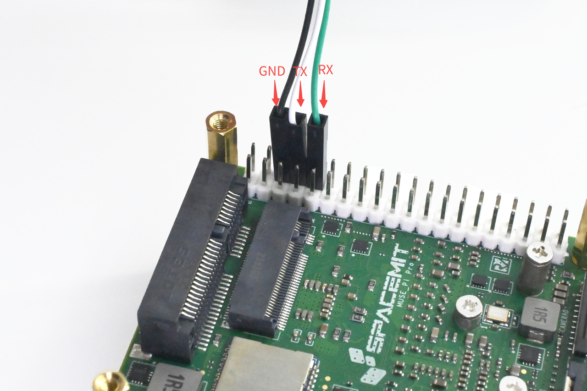
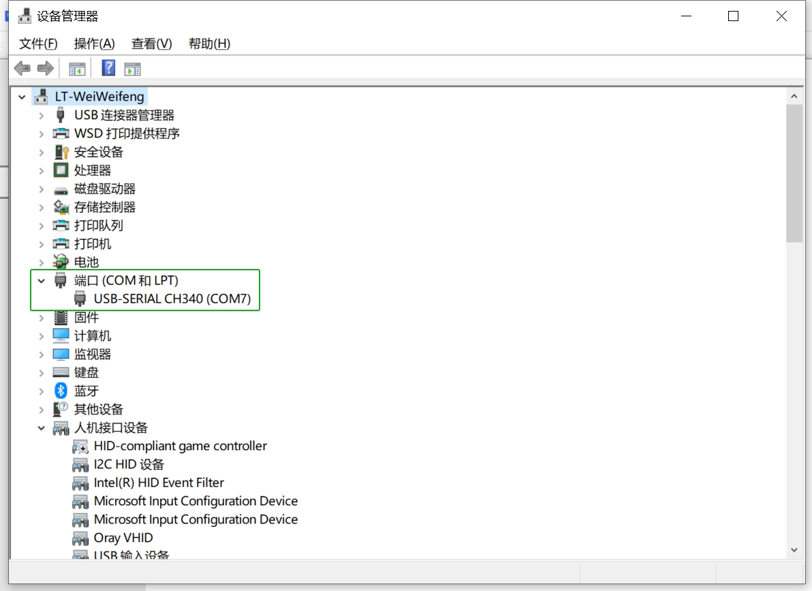
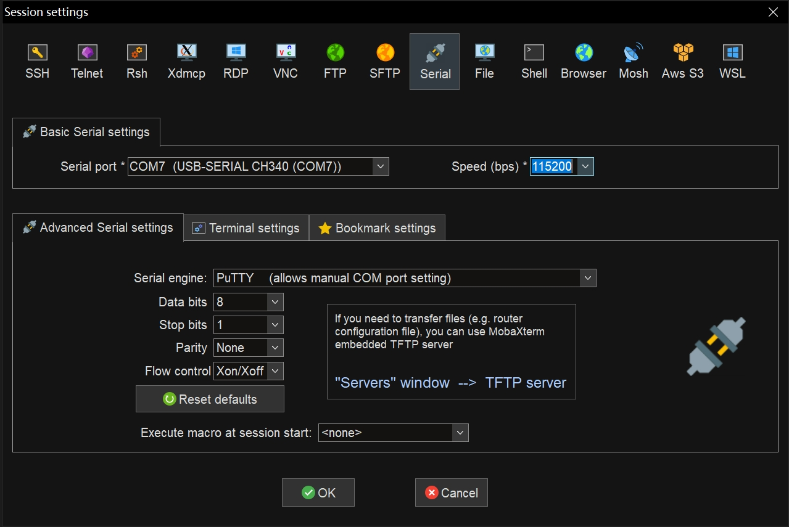
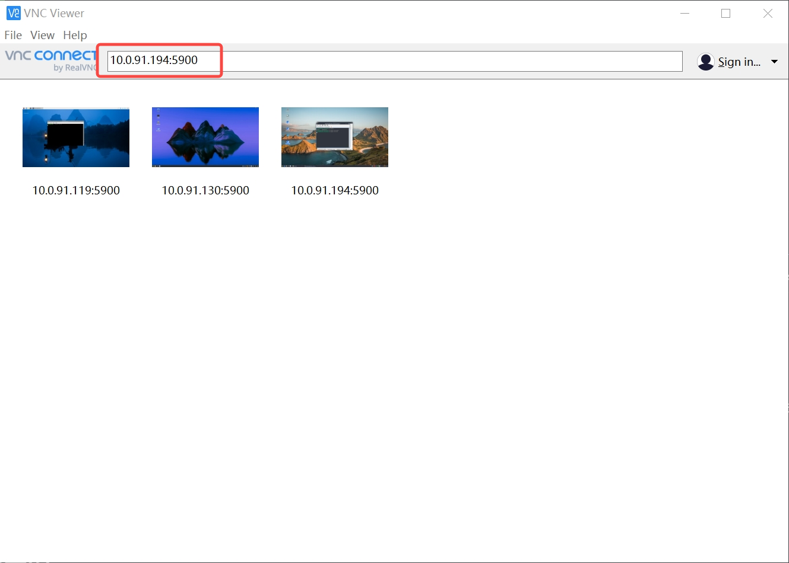
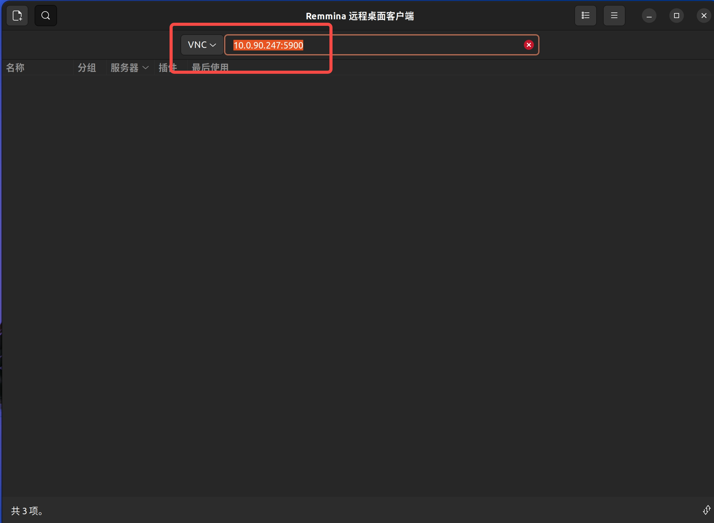

# 1.4 远程连接

本章节介绍如何通过串口和网络（SSH、VNC）在 PC 端远程访问开发板，包括连接方式、操作步骤及常见工具配置方法。

## 串口登录

串口连接适用于系统调试、刷机监控、网络未配置等场景。

### 接口连接

上位机通过 USB 转 TTL 设备与 MUSE Pi Pro 开发板的 GND 、TX、RX 接口连接。接口连接示意图如下：



### Windows 登录

以 **MobaXterm** 工具为例：

1）正确连接串口，并在 **设备管理器** 中确认识别到对应的 COM 端口，如下图所示：



2）打开 MobaXterm，依次点击 **“Sessions” → “New Session”**，选择连接类型为 **Serial**。

3）在弹出的配置窗口中设置：

- **Serial port**：选择识别到的 COM 端口（如 COM3）；
- **Speed**：设为 **115200**；
- 点击 **OK** 进入串口终端。



### Ubuntu 登录

1）打开终端，使用以下命令查看串口设备：

```bash
ls -al /dev/ttyUSB*
```

2）假设串口设备为 `/dev/ttyUSB0`，可使用 `minicom` 工具进行连接：

```bash
sudo minicom -D /dev/ttyUSB0
```

若尚未安装 `minicom`，可执行：

```bash
sudo apt install minicom
```

若首次使用 `minicom`，建议运行：

```bash
sudo minicom -s
```

进入设置界面，配置串口速率为 `115200` 并保存配置。

> 💡 提示：如登录失败或无权限访问串口，可尝试将当前用户加入 `dialout` 用户组：

```
sudo usermod -aG dialout $USER
```

## SSH 登录

SSH 是远程访问开发板的主要方式之一，适用于局域网环境。

> ⚠️ 请确保开发板已成功联网，联网方法详见：[1.3 联网设置](1.3_Environment_Setup.md#联网设置)

### Windows 登录

推荐使用 **MobaXterm** 工具，操作如下：

1）打开 MobaXterm，点击 **"Sessions" → "New Session"**，选择 **SSH**。

2）设置连接参数：

- **Remote host**：开发板 IP 地址（如 `192.168.1.100`）；
- **Specify username**：默认用户名为 `bianbu`；
- **Port**：保持默认 `22`。

3）点击 **OK** 发起连接，并输入密码完成登录。

### Ubuntu 登录

在终端中输入以下命令：

```bash
ssh bianbu@<remote_ip>
```

将 `<remote_ip>` 替换为开发板的实际 IP 地址。首次连接时会提示确认主机指纹，输入 `yes` 即可。

## VNC 登录

VNC 支持图形化桌面远程访问，需在开发板上先启用 VNC 服务。

> 开发板的 VNC 启用方法请参考：[1.3 开启 VNC 服务](1.3_Environment_Setup.md#开启-vnc-服务)

### Windows 登录

推荐使用 **RealVNC Viewer** 客户端：

1）启动 VNC Viewer；

2）在连接地址栏输入：`<remote_ip>:5900`（如 `192.168.1.100:5900`）；

3）回车即可连接至远程桌面界面。



------

### Ubuntu 登录

推荐使用 **Remmina** 客户端，配置方式如下：

1）安装 Remmina：

```bash
sudo apt update
sudo apt install remmina remmina-plugin-rdp remmina-plugin-vnc remmina-plugin-secret
```

2）启动 Remmina：

```bash
remmina
```

3）在连接配置中：

- 协议选择 **VNC**；
- 地址输入 `<remote_ip>:5900`；
- 点击回车进行连接。

