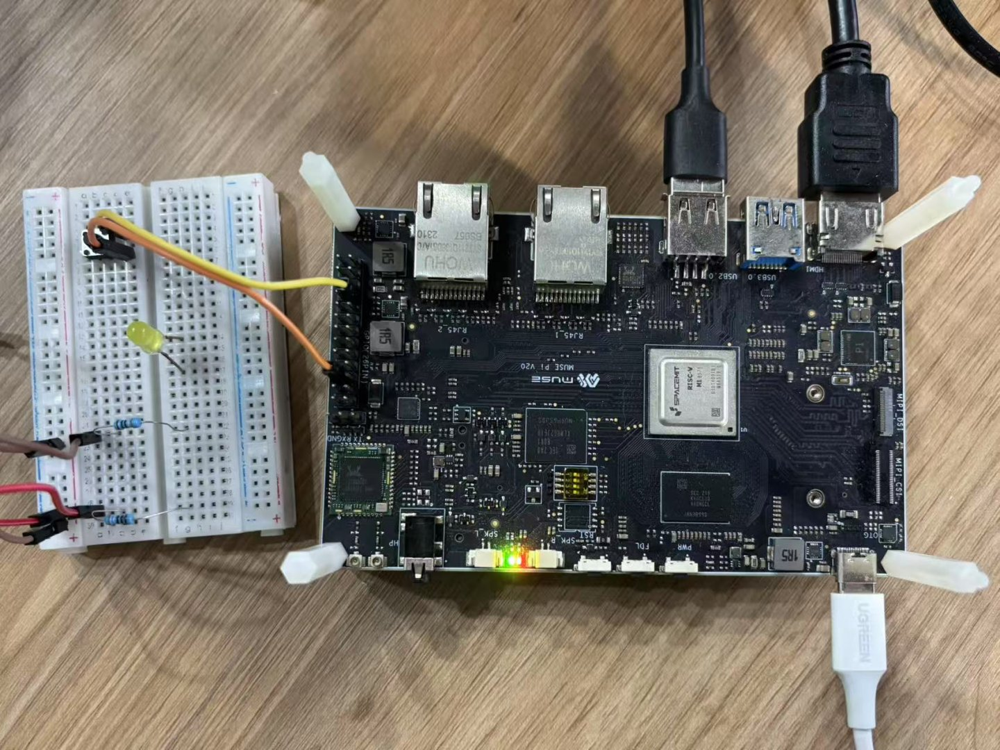
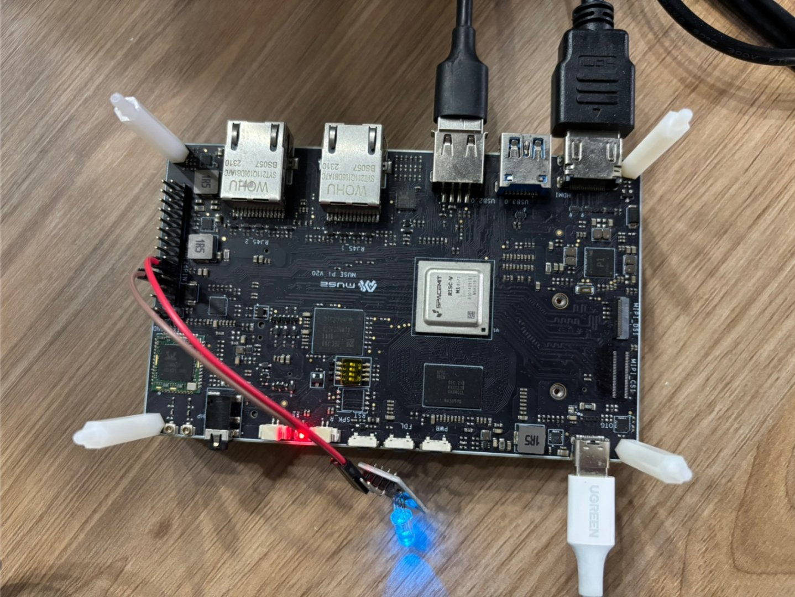

# 3.3.2 GPIO 应用说明

本文档介绍如何使用 Python 的 `gpiozero` 库控制开发板的 GPIO 功能。`gpiozero` 提供简洁、直观的接口，适用于常见的按钮、LED、舵机等设备控制。官方文档地址为：https://gpiozero.readthedocs.io/

## 准备工作

在使用 GPIO 前，请参考[《引脚定义说明》](3.3.1_Pin_Definitions.md)，确认所使用主控板型的引脚编号。本文以 MUSE Pi 开发板为示例进行说明。

## 环境安装

您可以选择在系统主环境或虚拟环境中安装 `gpiozero` 库。

- **系统主环境安装：**

```bash
sudo apt update
sudo apt install python3-gpiozero
```

- **虚拟环境安装：**

```bash
source your-venv-path/bin/activate
pip install -i https://git.spacemit.com/api/v4/projects/33/packages/pypi/simple gpiozero
```

## 引脚工厂配置

`gpiozero` 运行时需要显式指定底层引脚工厂，推荐使用 `lgpio` 库。

在程序开头添加以下配置代码：

```bash
from gpiozero.pins.lgpio import LGPIOFactory
from gpiozero import Device
Device.pin_factory = LGPIOFactory(chip=0)  # 对应 /dev/gpiochip0
```

同时设置设备节点权限：

```bash
sudo chmod a+rw /dev/gpiochip0
```

## 查看引脚布局

可使用以下命令查看开发板的 GPIO 引脚布局：

```bash
pinout
```

输出示例如下：

```bash
Description        : SpaceMIT Board spacemit k1-x MUSE-Pi board rev 1.1
Revision           : deb002
SoC                : M1-8571
RAM                : 7GB
Storage            : MicroSD/SSD
USB ports          : 2 (of which 2 USB3)
Ethernet ports     : 2 (1000Mbps max. speed)
Wi-fi              : True
Bluetooth          : True
Camera ports (CSI) : 1
Display ports (DSI): 1

,---------------------------------------------------------------.
| ooooooooooooo                                  J24  :
| 1oooooooooooo                                       : |Ethernet1
|     MUSE Pi                                      : |Ethernet2
,--------------------------------------------------------------.

MUSE_Pi:
   3V3  (1) (2)  5V
GPIO52  (3) (4)  5V
GPIO51  (5) (6)  GND
GPIO70  (7) (8)  GPIO47
   GND  (9) (10) GPIO48
GPIO71 (11) (12) GPIO74
GPIO72 (13) (14) GND
GPIO73 (15) (16) GPIO91
   3V3 (17) (18) GPIO92
GPIO77 (19) (20) GND
GPIO78 (21) (22) GPIO49
GPIO75 (23) (24) GPIO76
   GND (25) (26) GPIO50
```

## GPIO 输入操作示例

以下示例展示如何读取按钮输入状态。

### 物理连接

将按钮阳极连接至 GPIO-77，引脚阴极连接至 GND，如下图所示：



### 测试代码

```python
from gpiozero.pins.lgpio import LGPIOFactory
from gpiozero import Device
Device.pin_factory = LGPIOFactory(chip=0)

from gpiozero import Button
from signal import pause

pin_number = 77
print(f"Monitoring button on GPIO {pin_number}")

def button_pressed():
    print("Button pressed")

def button_released():
    print("Button released")

button = Button(pin_number)
button.when_pressed = button_pressed
button.when_released = button_released

pause()  # 保持程序运行
```

运行程序后，按下或松开按钮，终端输出如下：

```bash
Monitoring button on GPIO 77
Button pressed
Button released
```

## GPIO 输出操作示例

以下示例展示如何控制 GPIO 输出信号以点亮 LED。

### 物理连接

将 RGB 蓝色 LED 的正极连接至 GPIO-70，负极通过限流电阻连接至 GND，如下图所示：



### 测试代码

```python
from gpiozero.pins.lgpio import LGPIOFactory
from gpiozero import Device
Device.pin_factory = LGPIOFactory(chip=0)

from gpiozero import LED
import time

pin_number = 70
led = LED(pin_number)

try:
    while True:
        led.on()
        print(f"GPIO {pin_number} ON")
        time.sleep(1)

        led.off()
        print(f"GPIO {pin_number} OFF")
        time.sleep(1)

except KeyboardInterrupt:
    print("\n程序终止")
finally:
    led.close()
```

程序执行后，GPIO-70 引脚会每秒输出高低电平交替控制 LED 闪烁，终端同时输出控制状态。