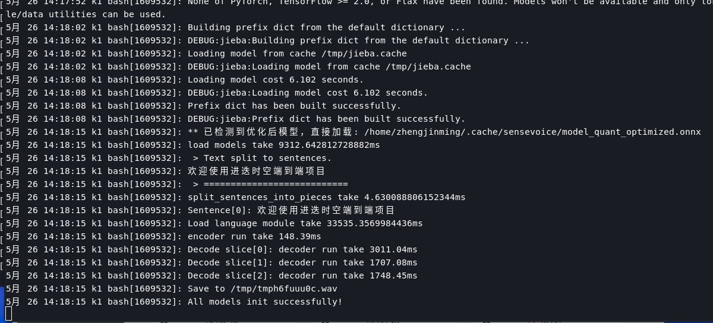

# 文本转语音(TTS)

## 功能介绍

本章节介绍文本转语音（TTS）的基本功能及使用方法。

## 一键部署（可选）

本项目提供一键安装使用的 Deb 包。

请确保设备固件版本不小于 2.2rc2。
固件下载地址：[https://archive.spacemit.com/image/k1/version/bianbu/](https://archive.spacemit.com/image/k1/version/bianbu/)

### 安装 Deb 包

```bash
sudo apt update
sudo apt install asr-llm-tts
```

安装完成后需重启设备以激活系统服务。重启完成后执行：

```bash
journalctl --user -u demo_serve -f
```

观察系统日志，直到出现如下信息：



当日志显示 `'All models init successfully!'` 即表示 TTS 服务已启动，可以使用。

### 使用

终端运行：

```bash
tts
```

按回车键即可开始使用文本转语音功能。

## 准备工作

### 克隆代码

```bash
git clone https://gitee.com/bianbu/spacemit-demo.git
```

### 安装环境

```bash
sudo apt install python3-venv

python3 -m venv .venv
source .venv/bin/activate

pip install -r requirements
```

## 检索系统播放设备

### 方法1：使用 `aplay`

```bash
root@bianbu:~# aplay -l
**** PLAYBACK 硬體裝置清單 ****
card 0: sndhdmi [snd-hdmi], device 0: SSPA2-dummy_codec dummy_codec-0 []
  子设备: 1/1
  子设备 #0: subdevice #0
card 1: sndes8326 [snd-es8326], device 0: i2s-dai0-ES8326 HiFi ES8326 HiFi-0 []
  子设备: 1/1
  子设备 #0: subdevice #0
```

根据输出结果确定播放设备索引号，并在代码中修改对应的播放设备索引。

### 方法2：使用 `pactl` 工具查询默认播放设备

安装工具：

```bash
sudo apt install pulseaudio-utils
```

查询播放设备列表：

```bash
root@bianbu:~# pactl list short sinks
64	alsa_output.platform-snd-card_1.stereo-fallback	PipeWire	s16le 2ch 48000Hz	SUSPENDED
66	alsa_output.platform-c0900100.udc.stereo-fallback	PipeWire	s16le 2ch 48000Hz	SUSPENDED
252	alsa_output.platform-snd-card_0.stereo-fallback	PipeWire	s16le 2ch 48000Hz	SUSPENDED
321	alsa_output.usb-C-Media_Electronics_Inc._USB_Audio_Device-00.analog-stereo	PipeWire	s16le 2ch 48000Hz	SUSPENDED
```

试播放音频到对应设备，确认有效播放设备：

```bash
# A. 试播放到 card_0
pw-play --target alsa_output.platform-snd-card_1.stereo-fallback /usr/share/sounds/alsa/Front_Center.wav

# B. 试播放到 card_1
pw-play --target alsa_output.platform-c0900100.udc.stereo-fallback /usr/share/sounds/alsa/Front_Center.wav

# C. 试播放到 card_3
pw-play --target alsa_output.platform-snd-card_0.stereo-fallback /usr/share/sounds/alsa/Front_Center.wav

# D. 试播放到 card_4 (外接USB扬声器)
pw-play --target alsa_output.usb-C-Media_Electronics_Inc._USB_Audio_Device-00.analog-stereo /usr/share/sounds/alsa/Front_Center.wav
```

确认设备后，设置默认播放设备：

```bash
pactl set-default-sink alsa_output.usb-C-Media_Electronics_Inc._USB_Audio_Device-00.analog-stereo
```

### 方法3：通过图形界面切换播放设备（有显示器时推荐）


点击界面中设备即可切换默认播放设备。

## 启动文本转语音程序

```bash
python 07_tts_demo.py
```

在命令行输入文本，程序将把文本转换为语音并播放。
