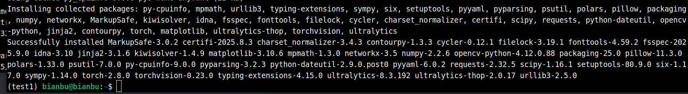
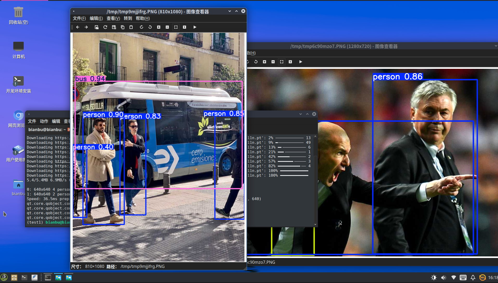

# Ultralytics 使用指南

官网：https://www.ultralytics.com/

## 简介

Ultralytics 是一家专注于**计算机视觉与深度学习**的公司，也是著名的 **YOLO (You Only Look Once) 系列目标检测模型**的重要开发与维护者。它既是一个团队的名字，也是他们开源的 Python 库的名字。

- **核心产品**
   Ultralytics YOLO —— 这是当前最主流、最易用的目标检测与图像分割开源实现之一，支持 **YOLOv3/v5/v8/v9/v11** 等不同版本。
- **主要功能**
  - **目标检测 (Object Detection)**：识别并定位图像/视频中的目标。
  - **图像分割 (Segmentation)**：在像素级别分割物体。
  - **姿态估计 (Pose Estimation)**：检测人体关键点。
  - **分类 (Classification)**：图像分类任务。
- **生态特点**
  - 纯 Python 实现，基于 **PyTorch**。
  - 提供 **pip 一键安装**：`pip install ultralytics`。
  - 开箱即用的命令行工具和 Python API。
  - 内置训练、验证、推理、导出工具链。
  - 支持多种部署格式：ONNX、TensorRT、CoreML、OpenVINO 等（SpacemiT RISCV 平台请使用 ONNX 格式部署）。

- ### 应用领域

  - 视频监控与安防

  - 自动驾驶与交通分析

  - 工业检测与机器人视觉

  - 医学影像分析

  - 智能零售


## 框架适配说明

`Ultralytics` 使用 `PyTorch` 作为其后端框架，目前在 `SpacemiT RISC-V` 上 `PyTorch`暂未接入硬件加速，因此你可以在我们平台上使用 `Ultralytics`快速验证算法，当你部署时，请使用 `spacemit-ort` 框架以获得硬件加速，具体请参考 [demo zoo](https://gitee.com/bianbu/spacemit-demo) 和 [模型量化](https://bianbu.spacemit.com/brdk/Advanced_development/7.1_Model_Quantization)


## 环境准备

### 安装依赖项

```bash
sudo apt install python3-pip python3-venv libxrender1 libgl1 libglib2.0-0t64
```

### 平台要求

**SpacemiT RISC-V：**

- 已烧录 ROS2_LXQT  系统镜像


## 安装 Ultralytics

### 设置源

```
pip config set global.index-url https://mirrors.aliyun.com/pypi/simple/
pip config set global.extra-index-url https://git.spacemit.com/api/v4/projects/33/packages/pypi/simple
```


### 配置虚拟环境

```
python3 -m venv test1
source test1/bin/activate
pip install pip -U
```


### 安装 ultralytics

```
pip install --prefer-binary ultralytics
```

等待安装完成，终端打印如下：



## 测试

示例参考来源：https://docs.ultralytics.com/zh/modes/predict/#plotting-results

由于涉及显示功能，请连接 HDMI 屏幕和键盘鼠标在板子本地运行命令。

```python
from PIL import Image

from ultralytics import YOLO

# Load a pretrained YOLO11n model
model = YOLO("yolo11n.pt")

# Run inference on 'bus.jpg'
results = model(["https://ultralytics.com/images/bus.jpg", "https://ultralytics.com/images/zidane.jpg"])  # results list

# Visualize the results
for i, r in enumerate(results):
    # Plot results image
    im_bgr = r.plot()  # BGR-order numpy array
    im_rgb = Image.fromarray(im_bgr[..., ::-1])  # RGB-order PIL image

    # Show results to screen (in supported environments)
    r.show()

    # Save results to disk
    r.save(filename=f"results{i}.jpg")
```

保存为 demo1.py

执行：

```
source test1/bin/activate
python demo1.py
```

结果如下：

