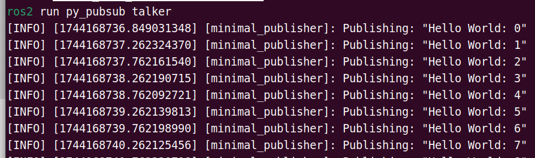
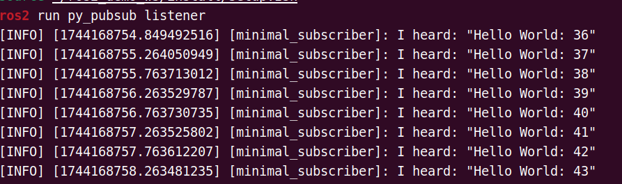
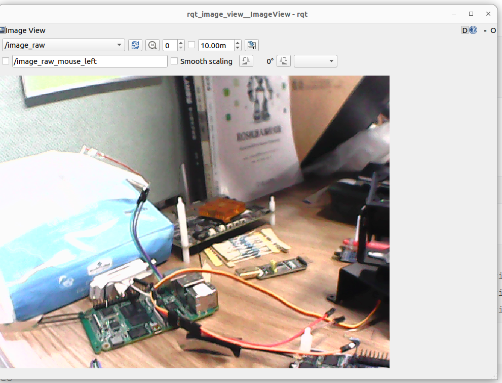

# 6.1.2 ROS2 安装使用

如果使用的是 ROS2_LXQT 可以跳过该步骤

## 平台要求

硬件：SpacemiT RISCV

操作系统：ROS2_LXQT

## 设置软件源

终端执行下面命令启用进迭时空 ROS2 软件源：

```shell
grep -q '^Suites:.*\bnoble-ros\b' /etc/apt/sources.list.d/bianbu.sources || sudo sed -i '0,/^Suites:/s//& noble-ros/' /etc/apt/sources.list.d/bianbu.sources
```

设置源优先级
```
if ! dpkg -s bianbu-desktop-lite >/dev/null 2>&1; then
  echo "bianbu-desktop-lite not installed, proceeding..."

  if [ ! -f /etc/apt/preferences.d/noble-ros.pref ]; then
    sudo tee /etc/apt/preferences.d/noble-ros.pref > /dev/null <<EOF
Package: src:opencv
Pin: release o=Spacemit, n=noble-ros
Pin-Priority: 50

Package: src:qtbase-opensource-src
Pin: release o=Spacemit, n=noble-ros
Pin-Priority: 50

Package: src:qtbase-opensource-src-gles
Pin: release o=Spacemit, n=noble-ros
Pin-Priority: 50

Package: src:pyqt5
Pin: release o=Spacemit, n=noble-ros
Pin-Priority: 50
EOF
  else
    echo "/etc/apt/preferences.d/noble-ros.pref already exists, skipping..."
  fi

else
  echo "bianbu-desktop-lite is already installed, skipping preference setup."
fi
```

```
sudo apt update
```

## 安装工具

### 安装开发工具（推荐）

如需编译 ROS2 功能包或进行二次开发，建议安装开发工具集：

```shell
sudo apt update && sudo apt install ros-dev-tools
```

### 安装 ROS-Base

基础版包含 ROS 通信库、消息接口、命令行工具等核心组件，不包含 GUI 工具：

```shell
sudo apt install ros-humble-ros-base
```

## 构建自定义 ROS2 功能包

### 创建工作空间

```shell
mkdir -p ~/ros2_demo_ws/src
```

### 加载 ROS2 环境变量

```shell
source /opt/ros/humble/setup.zsh
```

若使用 Bash 终端，请将 `setup.zsh` 替换为 `setup.bash`。

### 创建 Python 发布/订阅示例包

创建名为 `py_pubsub` 的功能包：

```shell
cd ~/ros2_demo_ws/src
ros2 pkg create --build-type ament_python --license Apache-2.0 py_pubsub
```

创建成功后，ROS2 将自动生成所需的功能包结构。

#### 编写发布节点

```shell
cd ~/ros2_demo_ws/src/py_pubsub/py_pubsub
vim publisher_member_function.py
```

粘贴如下代码：

```python
import rclpy                              # 导入 ROS2 Python 客户端库
from rclpy.node import Node               # 从 rclpy 中导入 Node 类，用于创建节点
from std_msgs.msg import String           # 导入标准的字符串消息类型（std_msgs/String）

# 定义一个继承自 Node 的类，用于创建发布者节点
class MinimalPublisher(Node):

    def __init__(self):
        super().__init__('minimal_publisher')          # 初始化父类，并设置节点名称为 "minimal_publisher"
        self.publisher_ = self.create_publisher(       # 创建一个发布者，发布消息类型为 String
            String,                                    # 消息类型为 std_msgs/String
            'topic',                                   # 主题名称为 "topic"
            10                                         # 队列大小为10，缓冲待发送的消息
        )
        timer_period = 0.5                             # 定时器周期设置为0.5秒
        self.timer = self.create_timer(                # 创建定时器，每0.5秒调用一次回调函数
            timer_period,
            self.timer_callback
        )
        self.i = 0                                      # 定义一个计数器，用于在消息中加入序号

    def timer_callback(self):
        msg = String()                                  # 创建一个 String 类型的消息对象
        msg.data = 'Hello World: %d' % self.i           # 设置消息内容，包含当前计数值
        self.publisher_.publish(msg)                    # 发布消息到 "topic"
        self.get_logger().info('Publishing: "%s"' % msg.data)  # 在终端输出当前发布的消息内容
        self.i += 1                                     # 计数器递增，用于下一条消息

# main 函数是程序入口点
def main(args=None):
    rclpy.init(args=args)                               # 初始化 rclpy

    minimal_publisher = MinimalPublisher()              # 创建 MinimalPublisher 节点对象

    rclpy.spin(minimal_publisher)                       # 保持节点运行，监听回调（比如定时器回调）

    minimal_publisher.destroy_node()                    # 节点关闭前，销毁节点资源
    rclpy.shutdown()                                    # 关闭 rclpy 系统

# 如果作为主程序运行，则调用 main() 函数
if __name__ == '__main__':
    main()
```

#### 添加依赖项

```shell
cd ~/ros2_demo_ws/src/py_pubsub
vim package.xml
```

在 `<license>Apache-2.0</license>` 后添加：

```xml
<exec_depend>rclpy</exec_depend>
<exec_depend>std_msgs</exec_depend>
```

#### 配置入口点

编辑 `setup.py` 文件，确认 `maintainer`、`license` 等字段与 `package.xml` 保持一致：

```python
maintainer='YourName',
maintainer_email='you@email.com',
description='Examples of minimal publisher/subscriber using rclpy',
license='Apache-2.0',
```

并在 `entry_points` 中添加：

```python
entry_points={
    'console_scripts': [
        'talker = py_pubsub.publisher_member_function:main',
    ],
},
```

#### 验证 setup.cfg 配置

确保 `setup.cfg` 内容如下所示（默认已正确生成）：

```ini
[develop]
script_dir=$base/lib/py_pubsub
[install]
install_scripts=$base/lib/py_pubsub
```

#### 编写订阅节点

```shell
cd ~/ros2_demo_ws/src/py_pubsub/py_pubsub
vim subscriber_member_function.py
```

粘贴以下代码：

```python
import rclpy                            # 导入 ROS2 的 Python 客户端库
from rclpy.node import Node             # 从 rclpy.node 中导入 Node 类，用于定义节点
from std_msgs.msg import String         # 导入标准消息类型 String（std_msgs/String）

# 定义一个继承自 Node 的类：MinimalSubscriber（最小订阅者示例）
class MinimalSubscriber(Node):

    def __init__(self):
        super().__init__('minimal_subscriber')   # 初始化父类，并设置节点名称为 "minimal_subscriber"

        # 创建一个订阅者，订阅名为 'topic' 的主题，消息类型为 String，队列大小为 10
        self.subscription = self.create_subscription(
            String,                              # 消息类型为 std_msgs/String
            'topic',                             # 订阅的主题名称为 'topic'
            self.listener_callback,              # 接收到消息时回调函数
            10                                   # 消息队列大小
        )

        self.subscription  # 防止变量未使用的警告（可有可无，起提示作用）

    # 回调函数：每当收到一条消息，就会调用这个函数
    def listener_callback(self, msg):
        # 打印收到的消息内容到终端
        self.get_logger().info('I heard: "%s"' % msg.data)

# main() 函数是程序的入口
def main(args=None):
    rclpy.init(args=args)                          # 初始化 ROS2 客户端功能

    minimal_subscriber = MinimalSubscriber()       # 创建 MinimalSubscriber 节点实例

    rclpy.spin(minimal_subscriber)                 # 保持节点运行，监听消息并调用回调函数
    # 显式销毁节点资源（可选，一般在程序退出前调用）
    minimal_subscriber.destroy_node()
    rclpy.shutdown()                               # 关闭 ROS2 客户端功能

# 如果是主程序执行，则调用 main 函数
if __name__ == '__main__':
    main()
```

订阅者节点的代码几乎与发布者相同。构造函数使用与发布者相同的参数创建一个订阅者。发布者和订阅者使用的主题名称和消息类型必须匹配，以便它们能够进行通信。

订阅者的构造函数和回调函数不包含任何计时器定义，因为它不需要。它的回调函数在接收到消息后立即被调用。

由于此节点与发布者具有相同的依赖项，因此无需在 package.xml 中添加任何新内容。 setup.cfg 文件也可以保持不变。

#### 添加订阅节点入口

编辑 `setup.py`，在发布节点下方添加订阅节点入口：

```python
entry_points={
    'console_scripts': [
        'talker = py_pubsub.publisher_member_function:main',
        'listener = py_pubsub.subscriber_member_function:main',
    ],
},
```

### 构建并运行功能包

1）构建功能包：

```shell
cd ~/ros2_demo_ws/
source /opt/ros/humble/setup.zsh
colcon build --packages-select py_pubsub
```

2）运行发布节点：

```shell
source /opt/ros/humble/setup.zsh
source ~/ros2_demo_ws/install/setup.zsh
ros2 run py_pubsub talker
```

3）新开一个终端，运行订阅节点：

```shell
source /opt/ros/humble/setup.zsh
source ~/ros2_demo_ws/install/setup.zsh
ros2 run py_pubsub listener
```

4）终端输出如下所示：

发布者输出：



订阅者输出：



## 使用现有功能包

本节以 USB 相机驱动为例展示如何使用 ROS2 中现有的功能包。

### 安装 `usb-cam` 驱动功能包

```shell
sudo apt update
sudo apt install ros-humble-usb-cam
source /opt/ros/humble/setup.zsh
```

### 查看 USB 相机设备号

接入前 USB 相机前，查看设备：

```shell
ls /dev/video*
```

输出显示：

```bash
/dev/video0   /dev/video11  /dev/video14  /dev/video17  /dev/video2  /dev/video5   /dev/video6  /dev/video9
/dev/video1   /dev/video12  /dev/video15  /dev/video18  /dev/video3  /dev/video50  /dev/video7  /dev/video-dec0
/dev/video10  /dev/video13  /dev/video16  /dev/video19  /dev/video4  /dev/video51  /dev/video8
```

接入 USB 相机后，查看设备：

```bash
ls /dev/video*
```

输出显示：

```bash
/dev/video0   /dev/video11  /dev/video14  /dev/video17  /dev/video2   /dev/video3  /dev/video50  /dev/video7  /dev/video-dec0
/dev/video1   /dev/video12  /dev/video15  /dev/video18  /dev/video20  /dev/video4  /dev/video51  /dev/video8
/dev/video10  /dev/video13  /dev/video16  /dev/video19  /dev/video21  /dev/video5  /dev/video6   /dev/video9
```

新增 `/dev/video20`、`/dev/video21` 等为 USB 相机设备节点。

### 启动 USB 相机节点

```shell
ros2 run usb_cam usb_cam_node_exe --ros-args -p video_device:="/dev/video20"
```

若启动成功，终端将显示如下信息（含视频分辨率、格式等）：

```
[INFO] [1744172544.075291448] [usb_cam]: camera_name value: default_cam
[WARN] [1744172544.075853419] [usb_cam]: framerate: 30.000000
[INFO] [1744172544.091075111] [usb_cam]: using default calibration URL
[INFO] [1744172544.091334950] [usb_cam]: camera calibration URL: file:///home/zq-pi3/.ros/camera_info/default_cam.yaml
[ERROR] [1744172544.091760085] [camera_calibration_parsers]: Unable to open camera calibration file [/home/zq-pi3/.ros/camera_info/default_cam.yaml]
[WARN] [1744172544.091881755] [usb_cam]: Camera calibration file /home/zq-pi3/.ros/camera_info/default_cam.yaml not found
Could not retrieve device capabilities: `/dev/v4l-subdev0`
[INFO] [1744172544.235730013] [usb_cam]: Starting 'default_cam' (/dev/video20) at 640x480 via mmap (yuyv) at 30 FPS
[swscaler @ 0x2ad6488640] No accelerated colorspace conversion found from yuv422p to rgb24.
This device supports the following formats:
    YUYV 4:2:2 640 x 480 (30 Hz)
    YUYV 4:2:2 640 x 480 (25 Hz)
    YUYV 4:2:2 640 x 480 (20 Hz)
    YUYV 4:2:2 640 x 480 (15 Hz)
    YUYV 4:2:2 640 x 480 (10 Hz)
    YUYV 4:2:2 640 x 480 (5 Hz)
[INFO] [1744172544.255035217] [usb_cam]: Setting 'brightness' to 50
unknown control 'white_balance_temperature_auto'

[INFO] [1744172544.288086828] [usb_cam]: Setting 'white_balance_temperature_auto' to 1
[INFO] [1744172544.288310083] [usb_cam]: Setting 'exposure_auto' to 3
unknown control 'exposure_auto'

[INFO] [1744172544.303411938] [usb_cam]: Setting 'focus_auto' to 0
```

### 在主机上查看图像

确保主机已安装 ROS2 Humble，使用 `rqt_image_view` 工具订阅 USB 相机采集的图像：

```shell
sudo apt install ros-humble-rqt-image-view
```

```shell
source /opt/ros/humble/setup.bash
ros2 run rqt_image_view rqt_image_view
```

在弹出的窗口中选择 `/image_raw` 主题进行查看：



## 安装 RDK 依赖

为了更加快捷地使用 RDK，建议安装下面的依赖项

```
sudo apt install -y ros-humble-camera-info-manager libopencv-dev ros-humble-image-transport ros-humble-ros2-control ros-humble-hardware-interface \
libopenblas-dev portaudio19-dev ffmpeg python3-spacemit-ort libcjson-dev libasound2-dev libboost-all-dev libbenchmark-dev ros-humble-diagnostic-updater \
libcjson-dev libasound2-dev ros-humble-libg2o ros-humble-dwb-critics libg2o-dev libsuitesparse-dev ros-humble-nav2-costmap-2d \
python3-opencv ros-humble-cv-bridge autoconf automake libtool ros-humble-pcl-ros
```

## 小结

本教程基于 ROS2 Humble 安装了最小必要组件。如需扩展功能，可按需安装相关功能包：

```shell
sudo apt install ros-humble-<package-name>
```

更多教程可参考 ROS2 官方文档：https://docs.ros.org/en/humble/Tutorials.html