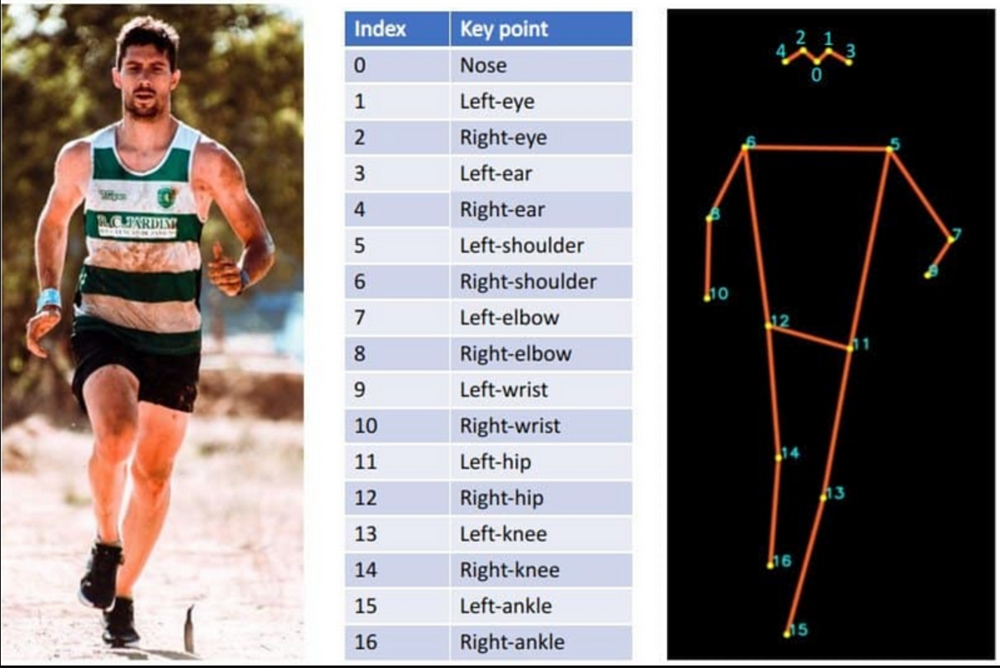
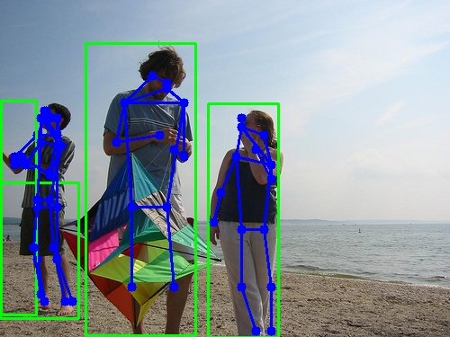
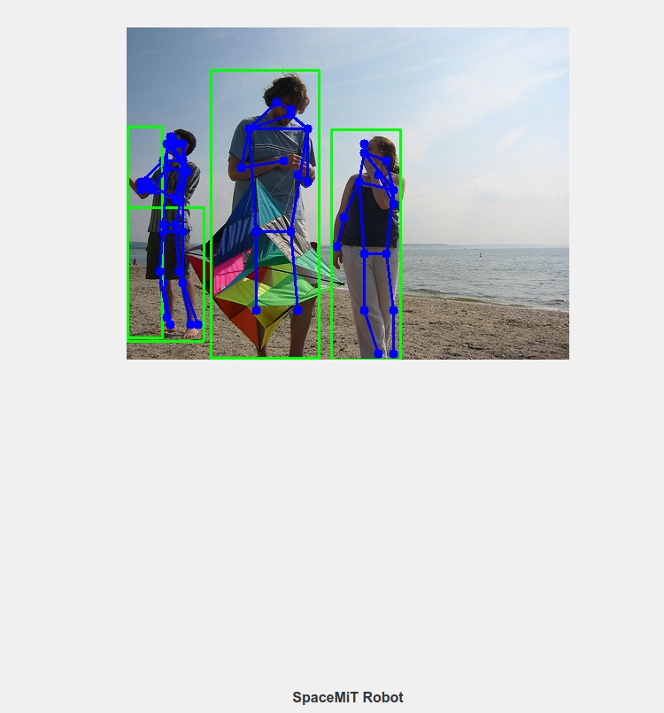

# 人体姿态检测

```
最新版本：2025/09/12
```

## YOLOv8-Pose 模型简介

`YOLOv8-Pose` 是 Ultralytics YOLOv8 系列中的 **姿态估计（Pose Estimation）** 模型，专用于检测人体关键点（如头部、肩膀、膝盖等）的位置。它基于 YOLOv8 的目标检测架构扩展，实现了快速且精确的 2D 姿态估计功能，适用于智能安防、体育分析、人机交互、机器人等应用场景。

本示例展示如何基于 SpacemiT 智算核，使用图片或视频流作为输入，执行 YOLOv8-Pose 姿态估计模型的推理，并通过 ROS 2 发布检测结果（包括边界框坐标和人体关键点）。

## 环境准备

### 安装依赖

```bash
sudo apt install python3-opencv ros-humble-cv-bridge ros-humble-camera-info-manager \
ros-humble-image-transport python3-spacemit-ort
```

### 导入 ROS2 环境

```bash
source /opt/bros/humble/setup.bash
```

## 模型配置查看

可执行以下命令，查看当前系统中已支持的模型配置：

```bash
ros2 launch rdk_perception infer_info.launch.py | grep 'pose'
```

示例输出：

```
[list-1]   - config/pose/yolov8_pose.yaml
```

后续推理时，将 `config_path` 设置为相应的 `.yaml` 文件路径，即可使用对应姿态估计模型。

## 人体关键点定义

人体关键点定义如下



分别对应着：

```
0.鼻子
1.左眼
2.右眼
3.左耳
4.右耳
5.左肩
6.右肩
7.左肘
8.右肘
9.左腕
10.右手腕
11.左髋关节
12.右髋关节
13.左膝
14.右膝盖
15.左脚踝
16.右脚踝
```


## 图片推理

**准备图片**

```bash
cp /opt/bros/humble/share/jobot_infer_py/data/detection/test.jpg .
```

### **本地保存推理结果**

```bash
ros2 launch rdk_perception infer_img.launch.py \
  config_path:='config/pose/yolov8_pose.yaml' \
  img_path:='./test.jpg'
```

输出结果将保存在当前目录的 `pose_result.jpg` 中，如图所示。



终端打印如下

```
bianbu@bianbu:~$ ros2 launch rdk_perception infer_img.launch.py   config_path:='config/pose/yolov8_pose.yaml'   img_path:='./test.jpg'
[INFO] [launch]: All log files can be found below /home/bianbu/.ros/log/2025-07-29-11-38-09-728349-bianbu-13624
[INFO] [launch]: Default logging verbosity is set to INFO
[INFO] [infer_img_node-1]: process started with pid [13631]
[infer_img_node-1] All model files already exist and do not need to be downloaded
[infer_img_node-1] all time cost:0.11103701591491699
[infer_img_node-1]
[infer_img_node-1] Person 0, [xmin:0, ymin:203, width:87, height:151], conf 0.42
[infer_img_node-1]   nose: (49.0, 131.0), vis=1.32
[infer_img_node-1]   left_eye: (55.0, 131.0), vis=1.32
[infer_img_node-1]   right_eye: (49.0, 123.0), vis=1.32
[infer_img_node-1]   left_ear: (63.0, 131.0), vis=1.32
[infer_img_node-1]   right_ear: (49.0, 131.0), vis=0.00
[infer_img_node-1]   left_shoulder: (63.0, 150.0), vis=1.32
[infer_img_node-1]   right_shoulder: (41.0, 150.0), vis=1.32
[infer_img_node-1]   left_elbow: (55.0, 191.0), vis=1.32
[infer_img_node-1]   right_elbow: (16.0, 174.0), vis=1.32
[infer_img_node-1]   left_wrist: (16.0, 183.0), vis=1.32
[infer_img_node-1]   right_wrist: (16.0, 174.0), vis=1.32
[infer_img_node-1]   left_hip: (63.0, 230.0), vis=1.32
[infer_img_node-1]   right_hip: (41.0, 230.0), vis=1.32
[infer_img_node-1]   left_knee: (63.0, 288.0), vis=1.32
[infer_img_node-1]   right_knee: (41.0, 288.0), vis=1.32
[infer_img_node-1]   left_ankle: (80.0, 335.0), vis=1.32
[infer_img_node-1]   right_ankle: (49.0, 335.0), vis=1.32
[infer_img_node-1]
[infer_img_node-1] Person 1, [xmin:1, ymin:112, width:39, height:238], conf 0.85
```


### Web 可视化推理结果

启动推理发布节点（终端 1）：

```bash
ros2 launch rdk_perception infer_img.launch.py \
  config_path:='config/pose/yolov8_pose.yaml' \
  img_path:='./test.jpg' \
  publish_result_img:=true \
  result_img_topic:='result_img' \
  result_topic:='/inference_result'
```

启动 Web 可视化服务（终端 2）：

```bash
ros2 launch rdk_visualization websocket_cpp.launch.py image_topic:='/result_img'
```

终端提示访问地址：

```
...
Please visit in your browser: http://<IP>:8080
...
```

打开浏览器输入 `http://<IP>:8080`，即可查看实时推理图像结果。


还可以通过追加 port:=xxxx 参数来指定端口号，以避免端口冲突



### 结果订阅

输入 `ros2 topic echo /inference_result` 查看推理结果话题

使用以下代码实现简单的话题订阅

```
import rclpy
from rclpy.node import Node
from std_msgs.msg import Header
from jobot_interfaces.msg import DetectionPoseResultArray

class PoseSubscriber(Node):
    def __init__(self):
        super().__init__('pose_subscriber')
        self.subscription = self.create_subscription(
            DetectionPoseResultArray,
            '/inference_result',  # 话题名，根据实际情况改
            self.listener_callback,
            10  # QoS
        )

    def listener_callback(self, msg):
        self.get_logger().info(f"Received pose results: {len(msg.results)} persons")

        for det_id, res in enumerate(msg.results):
            self.get_logger().info(
                f"\nPerson {det_id}, [xmin:{res.x_min}, ymin:{res.y_min}, "
                f"width:{res.width}, height:{res.height}], conf {res.conf:.2f}"
            )

            for i in range(len(res.keypoint_ids)):
                name = f"kp_{res.keypoint_ids[i]}"
                x = res.keypoint_xs[i]
                y = res.keypoint_ys[i]
                conf = res.keypoint_confs[i]
                self.get_logger().info(f"  {name}: ({x:.1f}, {y:.1f}), vis={conf:.2f}")

def main(args=None):
    rclpy.init(args=args)
    node = PoseSubscriber()
    rclpy.spin(node)
    node.destroy_node()
    rclpy.shutdown()

if __name__ == '__main__':
    main()
```

### 参数说明

**infer_img.launch.py 的参数说明**

| **参数名称**       | 作用                                                   | 默认值                       |
| ------------------ | ------------------------------------------------------ | ---------------------------- |
| config_path        | 配置推理时使用的模型                                   | config/detection/yolov6.yaml |
| img_path           | 推理时使用的图片路径                                   | data/detection/test.jpg      |
| publish_result_img | 是否以图像消息的形式发布推理结果                       | false                        |
| result_img_topic   | 发布的渲染图像消息名，publish_result_img为true时才有效 | /result_img                  |
| result_topic       | 发布的推理结果消息名                                   | /inference_result            |

## 视频流推理

### 启动相机（USB 示例）

```bash
ros2 launch rdk_sensors usb_cam.launch.py video_device:="/dev/video20"
```

### 启动推理并发布结果

启动推理（终端 1）：

```bash
ros2 launch rdk_perception infer_video.launch.py \
  config_path:='config/pose/yolov8_pose.yaml' \
  sub_image_topic:='/image_raw' \
  publish_result_img:=true \
  result_topic:='/inference_result'
```

Web 显示（终端 2）：

```bash
ros2 launch rdk_visualization websocket_cpp.launch.py image_topic:='/result_img'
```

终端提示访问地址：

```
...
Please visit in your browser: http://<IP>:8080
...
```

打开浏览器输入 `http://<IP>:8080`，即可查看实时推理图像结果。


还可以通过追加 port:=xxxx 参数来指定端口号，以避免端口冲突

**无可视化（仅数据输出）**

如果你只想要拿到模型推理的结果，运行下述命令：

```bash
ros2 launch rdk_perception infer_video.launch.py \
  config_path:='config/pose/yolov8_pose.yaml' \
  sub_image_topic:='/image_raw' \
  publish_result_img:=false \
  result_topic:='/inference_result'
```

### 结果订阅

输入 `ros2 topic echo /inference_result` 查看推理结果话题

使用以下代码实现简单的话题订阅

```
import rclpy
from rclpy.node import Node
from std_msgs.msg import Header
from jobot_interfaces.msg import DetectionPoseResultArray

class PoseSubscriber(Node):
    def __init__(self):
        super().__init__('pose_subscriber')
        self.subscription = self.create_subscription(
            DetectionPoseResultArray,
            '/inference_result',  # 话题名，根据实际情况改
            self.listener_callback,
            10  # QoS
        )

    def listener_callback(self, msg):
        self.get_logger().info(f"Received pose results: {len(msg.results)} persons")

        for det_id, res in enumerate(msg.results):
            self.get_logger().info(
                f"\nPerson {det_id}, [xmin:{res.x_min}, ymin:{res.y_min}, "
                f"width:{res.width}, height:{res.height}], conf {res.conf:.2f}"
            )

            for i in range(len(res.keypoint_ids)):
                name = f"kp_{res.keypoint_ids[i]}"
                x = res.keypoint_xs[i]
                y = res.keypoint_ys[i]
                conf = res.keypoint_confs[i]
                self.get_logger().info(f"  {name}: ({x:.1f}, {y:.1f}), vis={conf:.2f}")

def main(args=None):
    rclpy.init(args=args)
    node = PoseSubscriber()
    rclpy.spin(node)
    node.destroy_node()
    rclpy.shutdown()

if __name__ == '__main__':
    main()
```

### 参数说明

**infer_video.launch.py 的参数说明**

| **参数名称**       | 作用                                                   | 默认值                       |
| ------------------ | ------------------------------------------------------ | ---------------------------- |
| config_path        | 配置推理时使用的模型                                   | config/detection/yolov6.yaml |
| sub_image_topic    | 订阅的图像消息话题名                                   | /image_raw                   |
| publish_result_img | 是否以图像消息的形式发布推理结果                       | false                        |
| result_img_topic   | 发布的渲染图像消息名，publish_result_img为true时才有效 | /result_img                  |
| result_topic       | 发布的推理结果消息名                                   | /inference_result            |
