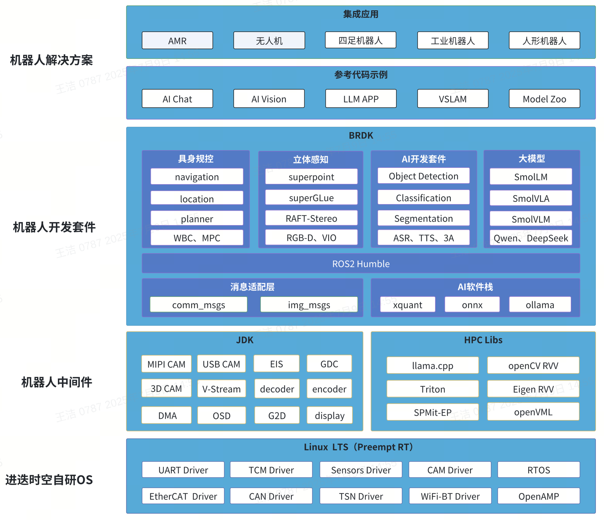

# 简介

**AI Robot** 是面向下一代智能机器人的软硬件协同解决方案，依托自研 RISC-V 芯片 K1 和自主操作系统，融合本地 AI 推理、大模型支持与高性能控制方案，广泛适配服务机器人、四足机器人、无人机、机械臂等终端。

方案核心系统 **ROS2_LXQT** 以自研操作系统 Bianbu OS 为内核底座，以 **ROS2** 为运行核心，集成多媒体中间件 **MediaEngine**、RVV优化库 **RVV-Opt Libs** 和开发套件 **RDK**，构建完整的机器人应用基础设施。系统内置丰富 AI 模型与工具链，支持语音识别、视觉感知、任务编排、路径规划等常见功能模块和参考示例，开箱即用。

## 平台愿景

AI Robot 致力于推广 RISC-V 架构在机器人领域的应用，加速构建国产智能机器人生态系统，赋能智能感知与自然交互能力，助力开发者快速部署下一代智能终端。

## 系统架构

AI Robot 机器人解决方案集成大语言模型能力，实现自然语言交互与多任务智能编排，广泛适配无人机、清洁机器人、四足机器人、机械臂、AI 智能玩具等多类型智能终端的落地应用。

系统方面，AI Robot 方案基于 ROS2_LXQT 机器人操作系统，面向 AI 机器人领域提供完整系统参考。ROS2_LXQT 以进迭时空自研操作系统 Bianbu OS 为内核底座，以 ROS2 为运行核心，集成深度优化的机器人中间件和 SDK，涵盖多媒体中间件 MediaEngine、RVV优化库 RVV-Opt Libs 和开发套件 RDK。

### RDK（ROS2 Dev Kits）

RDK 基于 ROS2 系统进行深度抽象与模块化封装，面向 AI 机器人产品开发贴合实际应用的开源参考方案。

- **集成** **AI** **开发工具链**
  内置量化工具链、基础预训练模型库（Model Zoo）及示例代码，支持主流模型格式与部署流程，开箱即用。
- **适配主流开源大模型**
  原生支持 DeepSeek、Qwen、Hugging Face Smol* 系列等主流开源大模型，集成大模型编排框架 LocalAI，前端调用接口兼容 OpenAI API，便于快速对接现有应用生态。
- **完整的语音处理解决方案**
  提供产品级 ASR（语音识别）与 TTS（语音合成）模型库，配套多麦克风阵列前处理、声源定位 SDK、语音降噪与回声消除模块，覆盖从感知到交互的全链路语音处理。
- **开源 ROS2 服务组件**
  提供丰富的开源 ROS2 功能包，包括视觉感知、语音交互、传感器接入、具身机械控制、定位导航与 LLM 任务编排等服务，支持模块化集成与定制化开发。
- **参考应用 Pipeline 全链路示例**
  提供涵盖数据采集、处理、建模与交互的端到端参考流程，助力开发者快速构建完整的机器人应用系统。

### MediaEngine

MediaEngine 基于底层 OS 对数据通路进行了高度封装，旨在实现功能模块化与代码高效复用，使开发者专注于构建高层 Pipeline，而无需关心底层数据调度与系统细节。

- **IO** **HUB 数据枢纽**
  兼容多种协议的相机设备，支持数据零拷贝传输，极致压缩系统带宽，显著降低功耗开销。
- **软硬结合的 Pipeline 加速**
  Pipeline 流程充分调度芯片内置硬件加速单元，支持图像缩放、旋转、裁剪、混合（blending）等高性能图像处理操作。
- **功能模块化编程模型**
  全流程支持模块化“搭积木式”编程，涵盖数据采集、编码压缩、模型推理、图像打水印、视频显示与多路重推流等功能模块，便于灵活组合与快速开发。
- **低延迟直显机制**
  提供灵活的视频直显策略，优化帧缓冲路径，显著压缩视频通路延迟，满足高实时性应用需求。
- **OpenCL 加速库支持**
  集成丰富的图像增强与稳定算法库，包含畸变矫正、电子防抖（EIS）等功能，通过 AI CPU 加速实现高效图像处理。

### RVV-Opt Libs（RISC-V Vector Optimization Libraries）

高性能计算能力在机器人感知与控制任务中至关重要。AI Robot 提供深度优化的高性能计算引擎，最大化发挥 K1 芯片硬件潜力。

- **基础计算库**
  集成多种主流基础计算库，包括机器视觉库 OpenCV，基础数学库 OpenVML，线性计算库 Eigen/OpenBLAS等，基于 RISC-V 平台做了向量化优化和深度调优，充分发挥 256-bit RISC-V Vector Extension（RVV）性能。
- **AI** **算子库**
  基于遵循 IME（Intelligent Matrix Engine）标准的自定义 AI 指令，构建元算子级别的 AI 算子库。通过调用标准算子 API，即可获得澎湃的 AI 算力。
- **AI** **加速推理后端**
  加速后端深度适配 RISC-V 平台，进行了算子融合，多线程调度，内存优化，SARM 动态切分等深度优化，无缝接入 ONNXRuntime、Llama.cpp 等主流推理生态。
- **高性能计算语言**
  基于 OpenAI Triton 深度适配 RISC-V 后端，可使用 Python 编写出接近硬件峰值性能的高效算子。支持将主流 CUDA 推理任务快速迁移至 RISC-V 平台，显著降低适配成本，加速落地应用。

## 方案特点

AI Robot 机器人解决方案专注于语音算法、AI 视觉与大模型应用，提供开箱即用的模块化服务，紧密结合芯片性能，助力客户加速方案落地。SDK源码开放，支持开发者自由创新。

- **支持丰富的 Model Zoo**
  涵盖大模型应用、语音处理及传统视觉 AI 模型。
- **大模型应用**
  兼容 Qwen2 系列、DeepSeek-1.5b、SomlLM2、SomlVLM、SomlVLA 系列，支持大模型语音对话，端到端语音对话延时低于 1.5 秒。
- **语音处理**
  涵盖 VAD、ASR、TTS、DOA、NS 及多麦克风声源定位。
- **传统** **AI** **视觉**
  提供目标检测、分类、追踪等深度优化基础模型，满足 1000+ 应用场景需求。
- **定位与建图**
  支持激光导航、单目视觉 VSLAM、双目里程计方案。
- **支持 Linux PreemptRT**
  兼容工业控制协议 EtherCAT、CAN、RS485/232，满足实时控制需求。
- **低延时视频通路**
  支持最高 1080P@120FPS 编码，满足无人机低延时视频需求。
- **完善配套工具链**
  包括优化的 GCC/Clang 编译器、量化工具及大模型微调工具。

## 方案优势

当前终端机器人多依赖联网，但隐私保护成为关键挑战。AI Robot 有效解决了大模型落地的核心难题：

- **开发灵活性**
  Linux SDK 系统源码全面开放，配备丰富调试工具，便于客户扩展应用与自定义算法开发。
- **成本优势**
  K1 端侧承担基础 AI 推理任务，降低对云端算力服务器的依赖，减少系统整体运营成本。
- **性能平衡**
  结合端侧轻量推理与云端高算力计算，既保障本地大模型智能升级，又避免纯云端方案带来的高延迟，实现产品随时在线智能响应。
- **隐私增强**
  通过本地算力就地处理隐私敏感任务（如语音转文字 ASR），符合多国隐私法规要求，解决大模型应用的合规难题。

## 问题反馈

如有问题或建议，欢迎访问项目社区：

🔗 [https://gitee.com/bianbu/brdk-doc/issues](https://gitee.com/bianbu/brdk-doc/issues)
