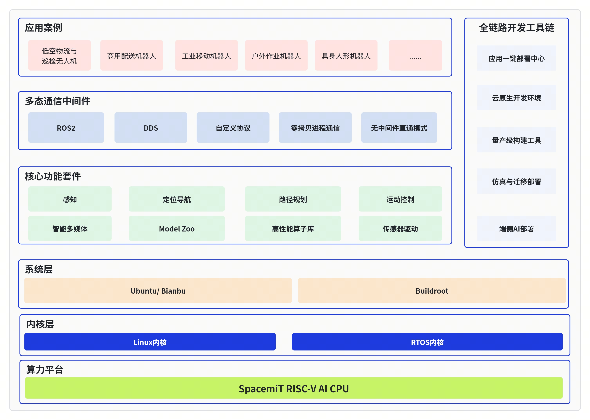

# 平台概览

**把RISCV端侧算力、AI 与 ROS2 工程化整合成“可复用的机器人底座”。**

SpacemiT Robot SDK 面向 **RISC‑V 机器人平台**，提供从 **系统与外设**、**多媒体与加速**、**AI 推理与交互能力** 到 **ROS2 机器人功能包** 的一体化软件栈，帮助你更快把“能力”变成“可跑的整机方案”。

你不需要搭建复杂的软件环境，也不必深入理解编译链路细节或 ROS2 的构建机制：Robot SDK 提供统一的快捷命令入口，支持一键式**全量编译**与**按组件编译**，把常见但繁琐的构建步骤标准化为可复用流程，让你把精力放在功能开发与源码改动上。

## 1. 你能获得什么

<div style="display:grid; grid-template-columns: repeat(2, minmax(0, 1fr)); column-gap: 0px; row-gap: 12px; align-items: start;">
  <div style="min-width: 0;">
    
    <div style="text-align:center; margin-top: 0.5em;">轮式机器人巡航</div>
  </div>
  <div style="min-width: 0;">
    
    <div style="text-align:center; margin-top: 0.5em;">机械臂搬运</div>
  </div>
</div>

<div style="display:grid; grid-template-columns: repeat(2, minmax(0, 1fr)); column-gap: 0px; row-gap: 12px; align-items: start; margin-top: 12px;">
  <div style="min-width: 0;">
    
    <div style="text-align:center; margin-top: 0.5em;">人型机器人跳舞</div>
  </div>
  <div style="min-width: 0;">
    
    <div style="text-align:center; margin-top: 0.5em;">reachy mini手势跟踪</div>
  </div>
</div>

- **可复现的端到端参考方案**：覆盖人型机器人、轮式机器人、桌面机器人、机械臂、四足狗等典型形态，帮助快速对齐工程组合方式与实践路径。
- **可复用的AI端侧能力**：视觉/语音/LLM/VLM/Agent 等能力以组件与示例提供，便于独立验证后再集成到整机。
- **可组合的ROS2功能链路**：感知、控制、SLAM、导航、规划等按功能包组织，支持按场景选择与扩展。
- **可复现的产品化配置**：通过组合仓库配置选择硬件/产品配置，把“能跑”做成“默认可跑、可维护、可升级”。
- **可定制的系统与平台底座**：外设驱动、系统服务、共享内存/多媒体加速等能力支撑端侧实时与性能需求。

## 2. 30 秒开始

- **想先跑起来（最快闭环）** ：[02-快速入门（总览）](02-快速入门/index.md)  
- **想直接复现一个端到端方案** ：[03-参考方案（总览）](03-参考方案/index.md)  
- **想按能力/模块查资料** ：从专题域进入  
  - [04-AI能力](04-AI能力/index.md)（语音/视觉/LLM/VLM/Agent）  
  - [05-机器人开发](05-机器人开发/index.md)（感知/控制/SLAM/导航/规划）  
  - [06-系统与平台](06-系统与平台/index.md)（系统服务/外设驱动/多媒体）

## 3. 架构与分层



读图指南（自上而下）：

- **应用与方案层**：端到端应用与整机参考实现（见 [03-参考方案](03-参考方案/index.md)）
- **ROS2机器人中间层**：感知、控制、SLAM、导航、规划等功能包（见 [05-机器人开发](05-机器人开发/index.md)）
- **组件能力层**：模型/推理/语音等可复用组件与服务（见 [04-AI能力](04-AI能力/index.md)）
- **系统与平台层**：系统服务、驱动、外设与多媒体能力（见 [06-系统与平台](06-系统与平台/index.md)）

```text
spacemit_robot/
├── application/                 # 应用层方案（案例聚合）
│   ├── native/                  # 非ROS2应用方案
│   │   ├── reachy_mini/
│   │   ├── lerobot_app/
│   │   ├── omni_agent/
│   │   └── humanoid_*/
│   └── ros2/                    # ROS2应用参考方案
│       └── linksee/
├── middleware/
│   └── ros2/                    # ROS2 中间层
│       ├── perception/ planning/ slam/
│       ├── control/ peripherals/ interfaces/
│       └── multimedia/ mpp/ gui/ tools/
├── components/                  # 通用能力组件层
│   ├── peripherals/ multimedia/ model_zoo/
│   ├── control/ ai-gateway/ agent_tools/
│   └── simulation/ system/ rvv_libs/ thirdparty/
├── target/                      # 硬件/产品配置聚合
└── build/                       # 一键式编译脚本
```

上面是整个SDK的目录结构，其特点如下：

- **能力与框架分离，避免“被ROS2绑死”**：component先沉淀设备、模型、多媒体、控制等通用能力，middleware只负责通信组件（如ROS2）适配与编排。可先做native版本验证，再按需接入 ROS2、FastDDS、自定义通信组件或直通模式，而不是一开始就被中间件耦合。
- **应用与能力解耦，复用链路清晰**：应用（如reachy_mini、humanoid_*）和application/ros2（如linksee）共用同一批底层组件；换形态通常是“替换应用组合”，不是重写底层能力。
- **支持组合下载，按场景最小化拉取代码**：通过repo init的-g分组机制，可按人形、轮式、桌面、感知、规划控制等场景只下载所需仓库，减少初始化时间与本地占用，提升迭代效率。
- **组合效率高，适合快速出方案**：新方案通常是“选组件 + 选中间层 + 选应用壳 + 选 target 配置”的装配过程。相比从零搭栈，更容易在短周期内做出可演示、可迭代、可维护的版本。


## 4. 版本与变更

- **版本发布与兼容性说明**：[07-版本说明](07-版本说明/index.md)