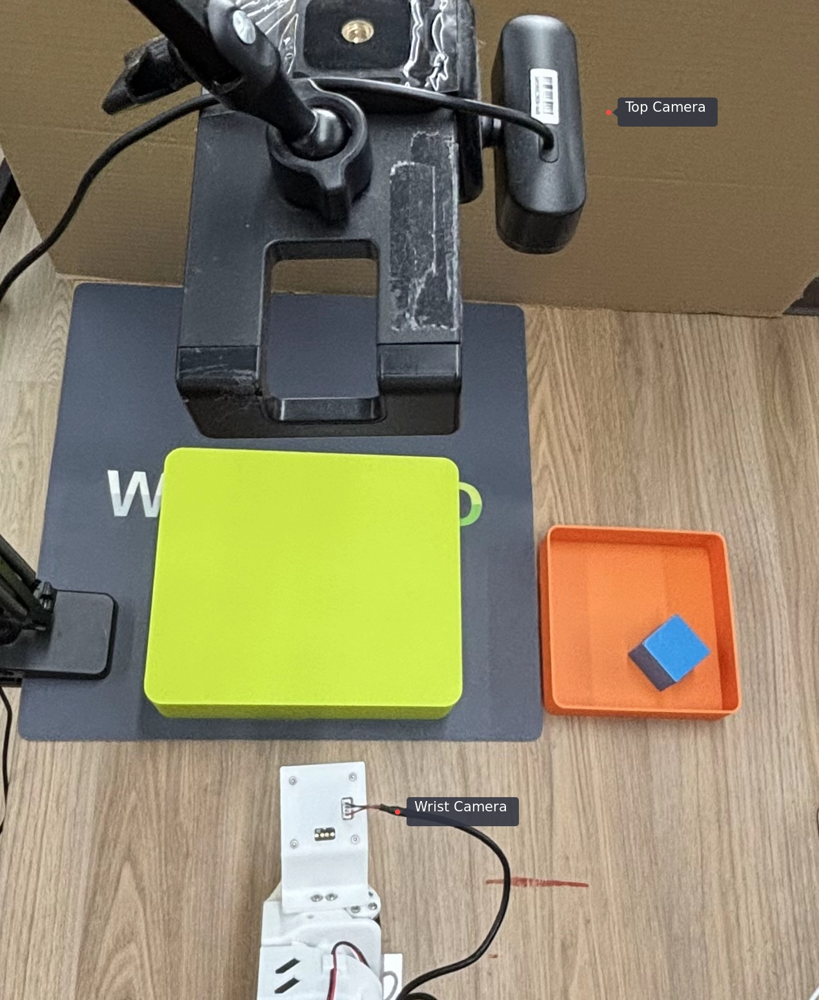
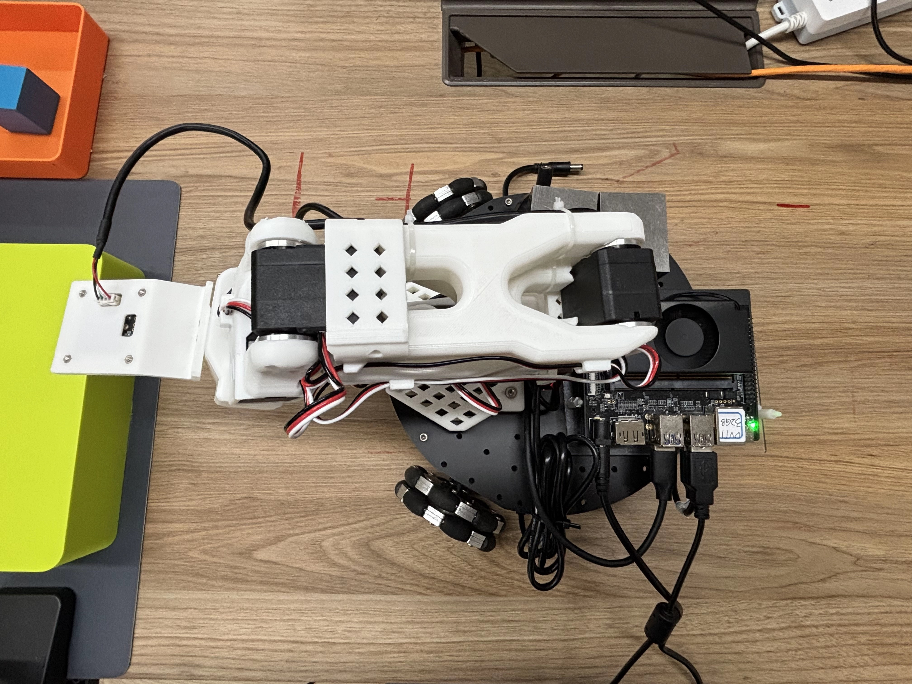
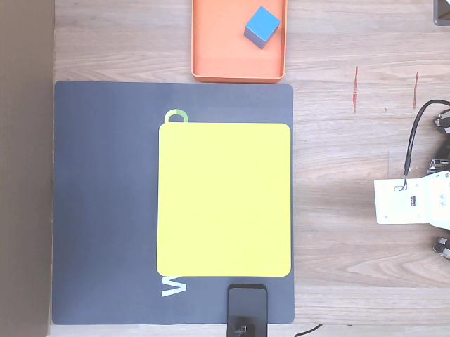
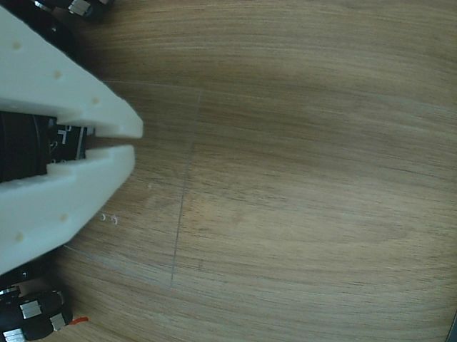
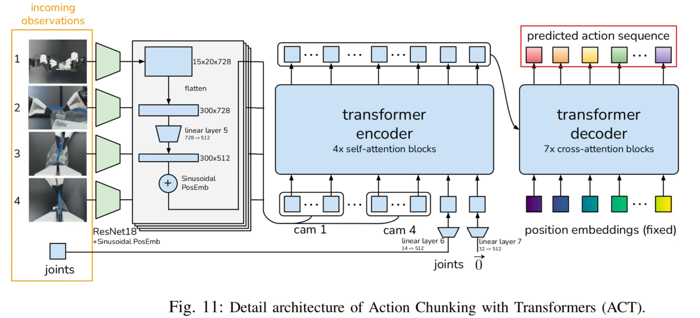
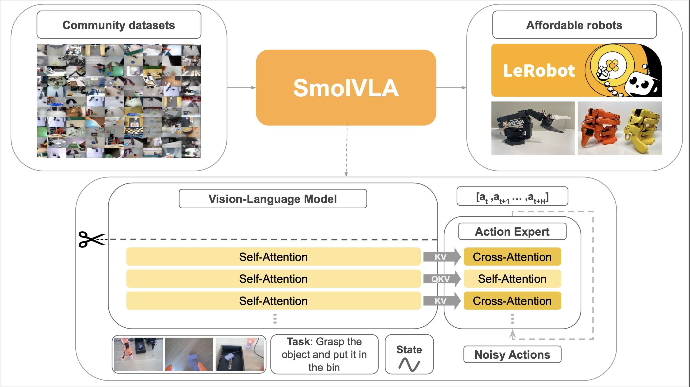
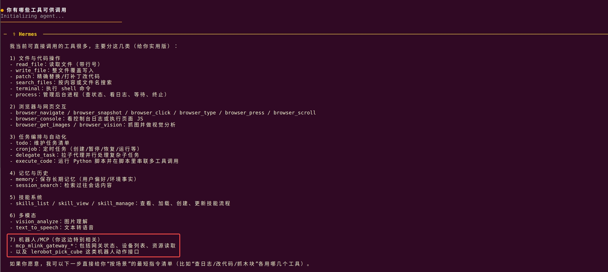

# 机械臂 LeRobot 真机推理训练

本文档介绍 Spacemit K3 上基于 LeRobot 的 SO101 机械臂真机数采、训练、推理与自然语言控制流程。内容整合 ACT/SmolVLA 模型从数据采集、训练到部署推理的完整链路，并给出将抓取能力封装为平台工具后，通过 Hermes 自然语言触发机械臂抓取任务的方法。

## 1. 方案概述

本方案面向 LeRobot 开源机械臂 SO101 真机抓取场景，支持以下功能：

- **标定和数采：**SO101 机械臂标定、遥控操作和双相机数据采集；
- **ACT 模型训练和部署：**ACT 模型在 GPU 服务器训练，并部署到 Spacemit K3 开发板本地推理；
- **SmolVLA 模型微调和分布式推理：**SmolVLA 模型在服务器微调，并介绍分布式推理方式控制开发板端机械臂；
- **MCP 工具封装：**将 LeRobot 抓取流程封装为 C++ 原生应用，通过 `mlink device → mlink gateway → MCP → Hermes` 链路注册为 MCP 工具；
- **Hermes 自然语言控制：**使用 Hermes 以自然语言方式调用 `lerobot.pick_cube` 工具，触发 SO101 机械臂执行抓取任务。

## 2. 硬件清单

| 项目 | 内容 |
| --- | --- |
| 训练平台 | 一台配置 RTX 系列及以上 GPU 的服务器 |
| 数采平台（可选） | 推荐 PC，可视化数采必须 |
| 本地环境 | Spacemit K3 开发板 + bianbu v3.0+ 固件 |
| 机械臂 | SO101 双臂（主导臂 + 随从臂）；自然语言调用场景只需要 SO101 随从臂 |
| 视觉输入 | 两个 USB 相机，本文布置为 top 全局视角和 wrist 腕部视角 |
| 关键接口 | 机械臂串口通常为 `/dev/ttyACM*`，相机设备通常为 `/dev/video*` |

运行前请确认机械臂和相机已经正确上电并连接到 K3 开发板：

- 机械臂：确认电源、通信线缆和控制接口连接正常，可通过 `lerobot-find-port` 检查端口；
- 相机：确认 USB 相机已正确接入，可通过 `lerobot-find-cameras opencv` 查看可用相机索引。

硬件整体连接如图所示：





## 3. 环境搭建

> [!NOTE]
>
> 本方案通常需要准备三类环境：
>
> - 训练环境：部署在 GPU 服务器上，用于 ACT 训练或 SmolVLA 微调；
> - 数采环境：可部署在 K3 或 PC 上，建议 PC 端数采以提升数采效率；
> - 开发板本地环境：部署在 Spacemit K3 上，用于 ACT 本地推理、mlink device 和 Hermes 调用。
>
> 如无特殊说明，以下 LeRobot 相关操作均可在开发板端执行；训练相关操作在 GPU 服务器端执行。

### 3.1 下载源码

```bash
#克隆 Spacemit 版本代码，基于 LeRobot v0.5.0 适配，集成了 Linksee 等机器人能力
git clone git@github.com:spacemit-robotics/lerobot.git
```

### 3.2 安装系统依赖

```bash
sudo apt update
sudo apt install ffmpeg
sudo apt install -y \
  libavformat-dev \
  libavcodec-dev \
  libavdevice-dev \
  libavutil-dev \
  libavfilter-dev \
  libswscale-dev \
  libswresample-dev
  
sudo apt install -y \
  build-essential \
  cmake \
  pkg-config \
  python3-dev
```

- `python3-venv`：用于创建 Python 虚拟环境；
- `ffmpeg`：用于视频帧处理和数据集视频编码。

### 3.3 pyenv 安装和使用

K3 使用 Bianbu v3+ 固件时，系统 Python 版本为 3.14；当前 Spacemit PyTorch 建议使用 Python 3.12，因此推荐通过 pyenv 创建 Python 3.12 环境。

1. 安装 pyenv：

```bash
git clone https://github.com/pyenv/pyenv.git ~/.pyenv
```

2. 配置 shell 环境：

```bash
echo 'export PYENV_ROOT="$HOME/.pyenv"' >> ~/.bashrc
echo 'command -v pyenv >/dev/null || export PATH="$PYENV_ROOT/bin:$PATH"' >> ~/.bashrc
echo 'eval "$(pyenv init -)"' >> ~/.bashrc
source ~/.bashrc
```

3. 安装 Python 3.12：

```bash
pyenv install 3.12
```

安装完成后，检查版本：

```bash
pyenv versions
```

4. 在 LeRobot 项目目录设置本地 Python 版本：

```bash
cd ~/lerobot
pyenv local 3.12.13
python3 -V
```

### 3.4 设置 Spacemit PyPI 源

在 Spacemit K3 开发板上建议启用 Spacemit PyPI 源，以避免重新编译已有包：

```bash
pip config set global.index-url https://mirrors.aliyun.com/pypi/simple
pip config set global.extra-index-url https://git.spacemit.com/api/v4/projects/33/packages/pypi/simple
```

### 3.5 安装 Python 依赖

```bash
cd ~/lerobot

# 创建并激活虚拟环境
python3 -m venv ~/.lerobot-venv
source ~/.lerobot-venv/bin/activate

# 安装 torch、torchvision
pip install torch==2.7.1
pip install torchvision==0.22.0

pip install wandb==0.24.0
pip install pyarrow==23.0.0

# 安装 LeRobot 依赖
pip install -e .
pip install "lerobot[feetech]"
```

如需训练或推理 SmolVLA，还需安装：

```bash
pip install -e '.[smolvla,async]'
```

> [!NOTE]
>
> 如果安装过程中遇到某个包编译失败，可先访问 [https://git.spacemit.com/archive/pypi/-/packages/](https://git.spacemit.com/archive/pypi/-/packages/) 查看该包是否已有预编译版本。若存在且版本满足要求，可直接安装该版本，以避免从源码编译最新版带来的耗时或失败风险。

## 4 场景一：ACT/SmolVLA 模型训练到推理

本场景覆盖 SO101 机械臂从真机标定、遥操作、数据采集，到模型训练和部署的完整流程。

### 4.1 复现步骤

#### 4.1.1 机械臂标定

1. 在机械臂完成组装和舵机标定后，接入主导臂、随从臂的电源和 USB 口，查询设备端口：

```bash
lerobot-find-port
```

2. USB 设备在 K3 中通常以 `/dev/ttyACM0`、`/dev/ttyACM1` 形式出现，按需获取权限：

```bash
sudo chmod 666 /dev/ttyACM0
sudo chmod 666 /dev/ttyACM1
```

3. 分别标定随从臂和主导臂：

```bash
# 随从臂
lerobot-calibrate \
    --robot.type=so101_follower \
    --robot.port=/dev/ttyACM0 \
    --robot.id=my_awesome_follower_arm

# 主导臂
lerobot-calibrate \
    --teleop.type=so101_leader \
    --teleop.port=/dev/ttyACM1 \
    --teleop.id=my_awesome_leader_arm
```

> [!TIP]
>
> 1. 请根据实际系统中的端口号替换 `/dev/ttyACM0` 和 `/dev/ttyACM1`。
> 2. 首次启动会发起机械臂校准流程，校准过程参考 [SO101 机械臂校准流程](https://huggingface.co/docs/lerobot/en/so101#calibrate)。
> 3. 校准文件存放于 `~/.cache/huggingface/lerobot/calibration` 目录下。

#### 4.1.2 遥控操作验证

1. 无相机遥操作：

```bash
lerobot-teleoperate \
    --robot.type=so101_follower \
    --robot.port=/dev/ttyACM0 \
    --robot.id=my_awesome_follower_arm \
    --teleop.type=so101_leader \
    --teleop.port=/dev/ttyACM1 \
    --teleop.id=my_awesome_leader_arm
```

2. 查询相机索引：

摄像头的摆放原则是确保摄像头能够捕捉到任务执行过程中的关键细节，同时避免画面中出现其他无关物体，从而保证数据集质量和精度。笔者使用了两个 USB 摄像头，其中一个固定在操作台面顶部（top），提供全局视角；另一个固定在机械臂腕部（wrist），用于获取更加细致的操作视角。top 视角和 wrist 视角分别如下图所示：





在固定好摄像头视角后，将两个 USB 摄像头连接至开发板，并运行以下命令查看摄像头 ID：

```bash
lerobot-find-cameras opencv
```

终端会打印检测到的相机信息。随后可在 `outputs/captured_images` 目录中查看每个摄像头拍摄的图片，并确认不同位置摄像头对应的端口 ID。

3. 可视化遥操作，确认 top 和 wrist 两路视觉输入质量：

```bash
lerobot-teleoperate \
    --robot.type=so101_follower \
    --robot.port=/dev/ttyACM0 \
    --robot.id=my_awesome_follower_arm \
    --robot.cameras="{
        top:  {type: opencv, index_or_path: 2, width: 640, height: 480, fps: 30, fourcc: MJPG},
        wrist: {type: opencv, index_or_path: 4, width: 640, height: 480, fps: 30, fourcc: MJPG}
    }" \
    --teleop.type=so101_leader \
    --teleop.port=/dev/ttyACM1 \
    --teleop.id=my_awesome_leader_arm \
    --display_data=true
```

记得修改相机和机械臂的设备号为系统实时索引。

#### 4.1.3 数据集采集

> [!TIP]
>
> 开发板端也可以采集数据集。若开启 `--display_data=true`，建议在 X86 PC 端进行数采以获得更流畅的显示效果。

1. 可选：登录 Hugging Face，便于上传数据集和模型：

```bash
hf auth login
HF_USER=$(hf auth whoami | head -n 1 | awk '{print $3}')
echo $HF_USER

# 如果不登录 Hugging Face，手动设置 $HF_USER 变量
HF_USER=annyi
echo $HF_USER
```

2. 开始采集抓取绿色方块数据集：

```bash
lerobot-record \
    --robot.type=so101_follower \
    --robot.port=/dev/ttyACM0 \
    --robot.id=my_awesome_follower_arm \
    --robot.cameras="{
        top:  {type: opencv, index_or_path: 2, width: 640, height: 480, fps: 30, fourcc: MJPG},
        wrist: {type: opencv, index_or_path: 4, width: 640, height: 480, fps: 30, fourcc: MJPG}
    }" \
    --teleop.type=so101_leader \
    --teleop.port=/dev/ttyACM1 \
    --teleop.id=my_awesome_leader_arm \
    --dataset.num_episodes=60 \
    --dataset.episode_time_s=30 \
    --dataset.reset_time_s=30 \
    --dataset.repo_id=${HF_USER}/record-green-cube \
    --dataset.single_task="Place the green cube into the box" \
    --dataset.root=./datasets/record-green-cube \
    --dataset.push_to_hub=True \
    --dataset.vcodec=h264 \
    --play_sounds=false \
    --display_data=true
```

关键参数说明：

- `dataset.num_episodes`：采集数据条数；
- `dataset.episode_time_s`：每条数据的采集时长；
- `dataset.reset_time_s`：每次采集之间的准备时间；
- `dataset.repo_id`：数据集仓库 ID；
- `dataset.single_task`：任务自然语言描述，可用于 VLA 模型输入；
- `dataset.root`：本地数据集保存路径；
- `dataset.push_to_hub`：是否上传到 Hugging Face Hub；
- `dataset.vcodec=h264`：K3 上推荐使用 H.264 编码；
- `display_data`：是否显示图形化界面。

录制期间可使用以下键盘控制（X11 模式下生效）：

- 按 `→`：提前停止当前 episode 或 reset，并进入下一条；
- 按 `←`：取消当前 episode 并重新录制；
- 按 `ESC`：立即停止会话，编码视频并上传数据集。

#### 4.1.4 ACT 模型训练

ACT（Action Chunking Transformer）是一种模仿学习算法，结合 Transformer 表达能力与动作分块技术，适合精细操作和较长时序的机器人控制任务。



如果数据集在开发板本地采集，需要先移动到 GPU 服务器：

- 若服务器可访问 Hugging Face，可通过 `dataset.repo_id` 加载数据集；
- 若使用本地数据集，请将数据集移动到服务器 `lerobot/datasets` 目录。

可选：登录 wandb 观察训练曲线：

```bash
wandb login
```

在服务器端启动 ACT 训练：

```bash
lerobot-train \
  --policy.type=act \
  --policy.repo_id=${HF_USER}/record-green-cube \
  --dataset.repo_id=${HF_USER}/record-green-cube \
  --dataset.root=datasets/record-green-cube \
  --output_dir=outputs/train/so101_act_pick_green_cube_amp \
  --job_name=so101_act_pick_green_cube \
  --batch_size=8 \
  --steps=100000 \
  --policy.device=cuda \
  --policy.use_amp=True
```

参数说明：

- `policy.type`：策略类型；
- `dataset.repo_id`：从 Hugging Face 下载数据集；
- `dataset.root`：使用本地数据集，优先级高于 `dataset.repo_id`；
- `output_dir`：模型检查点和训练数据保存路径；
- `job_name`：训练任务名称；
- `policy.device`：训练设备，可选 `cpu`、`cuda`、`mps`；
- `policy.use_amp`：是否开启混合精度；
- `policy.repo_id`：策略模型 ID。

> [!NOTE]
>
> 参考配置：RTX 4090、60 组操作数据、batch size 为 8，训练到 loss 收敛通常需要三小时。

#### 4.1.5 ACT 模型部署与本地推理

训练完成后，将模型检查点复制到开发板 `lerobot` 目录。模型目录结构示例：

```text
outputs/train/so101_act_pick_green_cube_amp/checkpoints/100000/pretrained_model
├── config.json
├── model.safetensors
├── policy_postprocessor.json
├── policy_postprocessor_step_0_unnormalizer_processor.safetensors
├── policy_preprocessor.json
├── policy_preprocessor_step_3_normalizer_processor.safetensors
└── train_config.json
```

其中：

- `config.json`：模型配置文件；
- `model.safetensors`：模型权重文件；
- `train_config.json`：训练参数记录文件。

也可以下载笔者已训练好的模型权重：<https://archive.spacemit.com/spacemit-ai/model_zoo/vla/act/so101_act_pick_green_cube_amp.tar.gz>。

开发板端执行 ACT 推理示例：

```bash
lerobot-record \
  --robot.type=so101_follower \
  --robot.port=/dev/ttyACM0 \
  --robot.cameras="{
        top:  {type: opencv, index_or_path: 2, width: 640, height: 480, fps: 30, fourcc: MJPG},
        wrist: {type: opencv, index_or_path: 4, width: 640, height: 480, fps: 30, fourcc: MJPG}
    }" \
  --robot.id=my_awesome_follower_arm \
  --display_data=false \
  --dataset.repo_id=${HF_USER}/eval_act \
  --dataset.single_task="Place the green cube into the box" \
  --dataset.vcodec=h264 \
  --policy.path=outputs/train/so101_act_pick_green_cube_amp/checkpoints/100000/pretrained_model \
  --policy.device=cpu \
  --dataset.episode_time_s=180 \
  --dataset.reset_time_s=30 \
  --play_sounds=false
```

请根据实际模型路径替换 `--policy.path`。

#### 4.1.6 SmolVLA 微调与分布式推理

SmolVLA 是轻量级视觉-语言-动作模型，参数量约 450M，可理解视觉输入和自然语言指令，并生成机器人动作序列。



服务器端微调示例：

```bash
lerobot-train \
  --dataset.repo_id=${HF_USER}/record-green-cube \
  --dataset.root=datasets/record-green-cube \
  --policy.path=lerobot/smolvla_base \
  --policy.repo_id=${HF_USER}/smolvla_so101_pickplace_finetune \
  --output_dir=outputs/train/smolvla_so101_pickplace_finetune \
  --job_name=smolvla_so101_pickplace \
  --policy.device=cuda \
  --steps=100000 \
  --wandb.enable=false
```

当前开发板本地算力不建议直接运行 SmolVLA，可使用分布式推理：开发板作为客户端负责采集观测和执行动作，PC/服务器作为服务端负责模型推理，双方通过 gRPC 通信。

服务端启动：

```bash
python -m lerobot.async_inference.policy_server \
     --host=0.0.0.0 \
     --port=8080 \
     --fps=30 \
     --inference_latency=0.033 \
     --obs_queue_timeout=1
```

开发板客户端启动：

```bash
python -m lerobot.async_inference.robot_client \
    --robot.type=so101_follower \
    --robot.port=/dev/ttyACM0 \
    --robot.cameras="{
        top:  {type: opencv, index_or_path: 2, width: 640, height: 480, fps: 30, fourcc: MJPG},
        wrist: {type: opencv, index_or_path: 4, width: 640, height: 480, fps: 30, fourcc: MJPG}
    }" \
    --robot.id=my_awesome_follower_arm \
    --task="Place the green cube into the box" \
    --server_address=${server_ip}:8080 \
    --policy_type=smolvla \
    --pretrained_name_or_path=outputs/train/smolvla_so101_pickplace_finetune/checkpoints/last/pretrained_model \
    --policy_device=cuda \
    --actions_per_chunk=50 \
    --chunk_size_threshold=0.5 \
    --aggregate_fn_name=weighted_average \
    --debug_visualize_queue_size=True
```

更多参数可参考 LeRobot async inference 文档：<https://huggingface.co/docs/lerobot/en/async>。

### 4.2 运行效果

ACT 模型训练完成后，可在 K3 上通过 CPU 执行本地推理，控制随从臂完成“将方块放入盒子”的任务。


## 5 场景二：自然语言控制 SO101 机械臂抓取

本场景将底层 LeRobot 抓取流程封装为 C++ 原生应用，并通过 `mlink device → mlink gateway → MCP → Hermes` 链路注册为 MCP工具，集成到 Hermes Agent 框架中，支持使用自然语言控制 LeRobot 开源机械臂完成抓取任务。

### 5.1 复现步骤

#### 5.1.1 运行环境准备

##### 代码下载

先下载 Spacemit Robot SDK 代码：

```
mkdir spacemit_robot
cd spacemit_robot
repo init -u https://github.com/spacemit-robotics/manifest.git -b main -m default.xml \
  --repo-url=https://gitee.com/spacemit-robotics/git-repo
repo sync -j4
repo start robot-dev --all
```

自然语言控制示例代码位于：

```text
spacemit_robot/application/native/lerobot_app
```

##### 模型准备

`pick_cube` 依赖底层 LeRobot 工作流及对应模型文件。首次运行前，请先准备模型：

- 可使用前文训练得到的 ACT 策略模型；
- 也可下载笔者已训练好的模型权重：<https://archive.spacemit.com/spacemit-ai/model_zoo/vla/act/so101_act_pick_green_cube_amp.tar.gz>；
- 将模型放置到本地约定目录，例如 `models/` 或运行脚本中指定的模型目录；
- 确认模型路径与 `scripts/pick_cube_record.sh` 中配置一致。

##### 机械臂标定

按照 4.1.1 节 完成随从臂标定。

##### 修改相机和机械臂设备索引

查看相机和机械臂设备索引，确保索引号与 `scripts/pick_cube_record.sh` 中配置一致。

##### 虚拟环境安装

底层 lerobot 属于 Python 生态，首次运行前需要准备当前应用的虚拟环境：

```bash
# 进入 spacemit robot sdk，并设置环境变量
cd spacemit_robot
source build/envsetup.sh

# 设置 Python 版本为3.12
pyenv local 3.12.13
python3 -V

m_env_build application/native/lerobot_app
```

或者进入应用目录安装：

```bash
cd application/native/lerobot_app
bash scripts/setup_env.sh
```

脚本会在仓库根目录下准备虚拟环境：

```text
output/envs/lerobot_app
```

#### 5.1.2 编译 mlink device 依赖

`lerobot_device` 在编译时依赖 `mlink` 提供的头文件和动态库。编译 `lerobot` 相关程序前，先完成 `mlink device` 构建：

```bash
cd spacemit_robot
source build/envsetup.sh
cd components/agent_tools/mlink/device
mm
```

构建完成后，通常可看到以下产物：

```text
output/staging/include/mlink.h
output/staging/lib/libmlink_device.so
output/staging/bin/mlink_device_test
```

其中：

- `output/staging/include/mlink.h`：供 `lerobot_device` 编译时引用的头文件；
- `output/staging/lib/libmlink_device.so`：供 `lerobot_device` 链接及运行时加载的动态库；
- `output/staging/bin/mlink_device_test`：`mlink device` 组件自带测试程序。

#### 5.1.3 构建 lerobot 原生应用

进入目录构建：

```bash
cd spacemit_robot
source build/envsetup.sh
cd application/native/lerobot_app
mm
```

构建完成后，产物安装到：

```text
output/staging/bin/lerobot_native
output/staging/bin/lerobot_device
```

- `output/staging/bin/lerobot_native`：本地命令行执行入口，用于直接触发 `pick_cube` 等 task；
- `output/staging/bin/lerobot_device`：mlink 设备进程，用于向 gateway 动态注册工具并转发调用到 `lerobot_native`。

如果只做本地调试，也可以使用独立 CMake：

```bash
cd application/native/lerobot_app
cmake -B build -S .
cmake --build build
```

此时本地产物位于：

```text
build/lerobot_native
build/lerobot_device
```

#### 5.1.4 直接运行工具

```
lerobot_native tool-pick-cube
```

该命令会直接启动抓取任务。

#### 5.1.5 验证工具注册

1. 启动 gateway 

```
cd spacemit_robot
source build/envsetup.sh
m_env_build components/agent_tools/mlink/gateway

source output/envs/mlink-gateway/bin/activate
mlink gateway restart
```

2. 启动 `mlink device`：

```bash
lerobot_device unix lerobot
```

3. 检查 gateway 工具列表：

```bash
mlink gateway tools
```

若注册成功，应看到工具名：

```text
lerobot.pick_cube
```

#### 5.1.6 Hermes 自然语言调用

安装 Hermes：

```bash
sudo apt-get update
sudo apt-get install --reinstall hermes-agent
```

配置模型：

```bash
hermes model
```

随后按照命令行向导完成密钥和模型配置。

启动交互式 CLI：

```bash
hermes
```

当 gateway 已运行且 `lerobot_device` 已连接后，Hermes 就能通过 MCP 看到 `lerobot.pick_cube`。

如需将本机 gateway 的 HTTP MCP endpoint 写入 Hermes 配置，可维护 `~/.hermes/config.yaml`：

```yaml
mcp_servers:
    mlink-gateway:
        transport: http
        url: http://127.0.0.1:18765/mcp
        enabled: true
```

配置完成后，在 Hermes CLI 中输入自然语言指令，例如“抓木块”。Hermes 会将请求路由到 `lerobot.pick_cube` tool，进而触发机械臂执行对应抓取动作。

### 5.2 运行效果

在 K3 上打开 hermes 终端，用自然语言与它对话，查询可调用的工具可以看到“抓木块”工具；输入“抓木块”，机械臂会执行对应任务，效果如 4.2 节所示。



## 6. 常见问题

| 现象 | 处理 |
| --- | --- |
| 找不到机械臂串口 | 执行 `lerobot-find-port` 确认端口，检查电源和 USB 连接，并根据实际情况替换 `/dev/ttyACM*`。 |
| 串口权限不足 | 执行 `sudo chmod 666 /dev/ttyACM0`，如有多个设备则对对应端口分别授权。 |
| 找不到相机或相机索引不正确 | 执行 `lerobot-find-cameras opencv`，根据输出替换 `index_or_path`。 |
| 可视化数采卡顿 | 建议在 X86 PC 端开启 `--display_data=true` 进行数采；K3 端可设置 `--display_data=false`。 |
| Rerun 渲染失败 | Bianbu LXQt 图形渲染后端为 GLES，执行 `export WGPU_BACKEND=gles` 后重试。 |
| 推理模型路径错误 | 检查 `--policy.path` 或 `scripts/pick_cube_record.sh` 中的模型路径是否与实际文件一致。 |
| `lerobot.pick_cube` 未出现在工具列表 | 确认 `mlink gateway` 已启动，`lerobot_device` 已运行，并重新执行 `mlink gateway tools`。 |
| Hermes 无法调用工具 | 检查 `~/.hermes/config.yaml` 中 MCP endpoint 是否指向 `http://127.0.0.1:18765/mcp`，并确认 gateway 正常运行。 |
