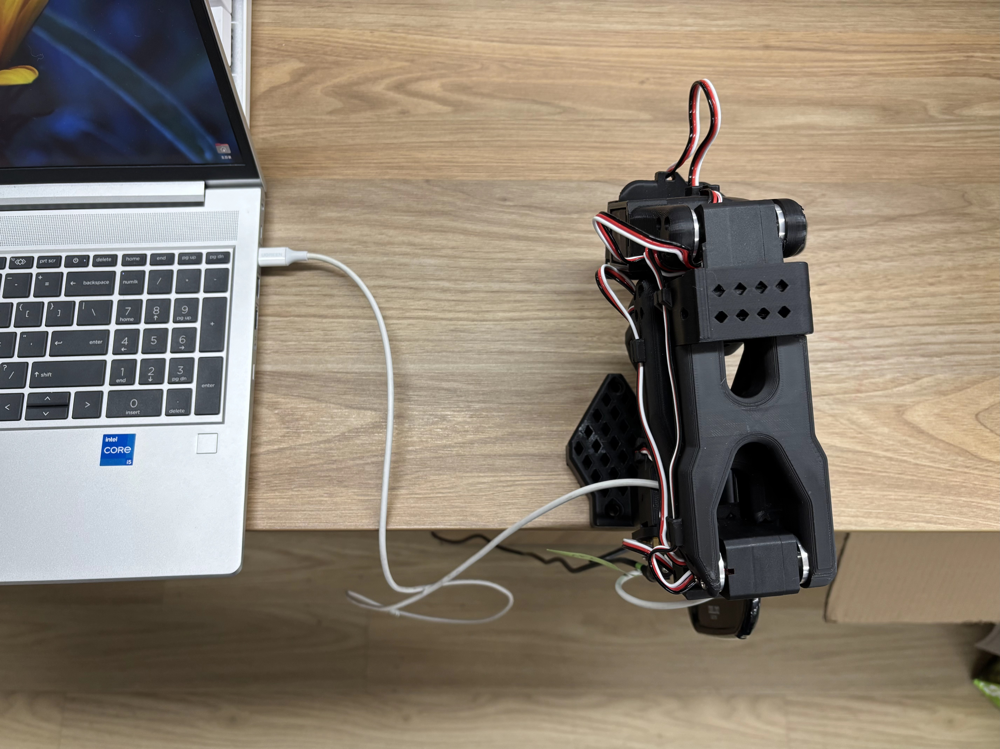
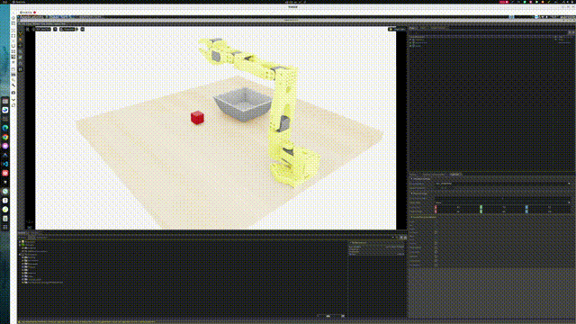

# 机械臂 LeRobot 仿真推理训练

本文档介绍如何基于 LeIsaac 项目，在 Isaac Sim 环境中完成 LeRobot 机器人从仿真数据采集、数据集转换、模型训练到分布式推理评测的完整流程。

## 1. 方案概述

本方案面向 SO101 机械臂仿真训练与推理场景，支持以下功能：

- **数据通信：**基于 LeIsaac 分布式架构，在仿真器与推理器之间完成数据通信与任务执行；
- **数据采集：**使用 SO101 Leader 臂进行远程遥操作，在 Isaac Sim 中完成仿真数据采集；
- **数据转换：**将采集得到的 HDF5 数据转换为 LeRobot 数据集格式；
- **模型训练：**基于 LeRobot ACT 策略完成模型训练；
- **推理测评：**将训练得到的 checkpoint 部署到推理端，在仿真环境中完成分布式推理与评测。

LeIsaac 采用“仿真器 + 推理器”的分布式架构：

| 组件 | 职责 | 部署位置 |
| --- | --- | --- |
| 仿真器/服务器 | Isaac Sim/Lab 环境管理、数据采集、评测执行、可选 Lab 训练 | NVIDIA GPU + CUDA 12.8 |
| 推理器/本地 | SO101 Leader 连接、关节状态采样、推理服务（gRPC） | PC 或 Spacemit K3 开发板 |

仿真器和推理器采用 gRPC 进行双向通信，支持客户端流式观测上传和单向动作下发。

## 2. 硬件清单

| 项目 | 内容 |
| --- | --- |
| 仿真器/服务器 | NVIDIA GPU + CUDA 12.8 |
| 数采平台（可选） | PC |
| 推理器/本地 | Spacemit K3 开发板 + bianbu v4.0+ 固件                         |
| 机械臂 | SO101 主导臂（用于遥操作和数采） |
| 视觉输入 | 无需外接相机，仿真环境提供视觉输入 |
| 关键接口 | SO101 Leader 串口通常为 `/dev/ttyACM0`；仿真器与推理器需网络互通 |

遥操和数采时，PC 与 SO101 主导臂连接如图所示：



## 3. 环境搭建

整个流程需要分别准备服务器端仿真环境和本地推理/遥操作环境。

### 3.1 仿真器/服务器环境

1. 克隆仓库并初始化 Conda 环境：

```bash
git clone git@github.com:spacemit-robotics/leisaac.git --recursive
cd leisaac

conda create -n leisaac python=3.11
conda activate leisaac
```

2. 安装依赖：

```bash
# PyTorch 与 CUDA
pip install --upgrade pip
pip install -U torch==2.7.0 torchvision==0.22.0 --index-url https://download.pytorch.org/whl/cu128

# Isaac Sim
pip install "isaacsim[all,extscache]==5.1.0" --extra-index-url https://pypi.nvidia.com

# 系统依赖
sudo apt install cmake build-essential

# Isaac Lab
cd dependencies/IsaacLab
./isaaclab.sh --install
cd ../..

# LeIsaac
pip install -e source/leisaac

# LeRobot，数据集转换需要
pip install lerobot==0.4.2
pip install numpy==1.26.0
```

3. 下载仿真资产：

下载 [GitHub Releases v0.1.0](https://github.com/LightwheelAI/leisaac/releases/download/v0.1.0/assets.tar.gz) 中的资产包，并解压至 `assets` 目录。

预期目录结构如下：

```text
assets/
├── robots/
│   └── so101_follower.usd
└── scenes/
    ├── kitchen_with_orange/
    ├── table_with_cube/
    └── custom_scene/
```

4. 添加自定义任务：

参考 LeIsaac 文档 [add custom task](https://lightwheelai.github.io/leisaac/docs/tutorials/custom_task)，添加客制化仿真场景。

5. 验证环境：

```bash
python scripts/environments/list_envs.py
```

若能正常输出可用任务列表，表示服务器仿真环境配置正确。

### 3.2 推理器/本地环境

本地需安装数据采集和分布式推理依赖。

1. 克隆仓库并初始化虚拟环境：

```bash
git clone git@github.com:spacemit-robotics/leisaac.git --recursive
cd leisaac

# 指定 python 版本为 3.12
pyenv local 3.12.13
python3 -V

python -m venv ~/.local-venv
source ~/.local-venv/bin/activate
```

2. 安装数据采集依赖：

```bash
pip install pyserial deepdiff tqdm feetech-servo-sdk
```

3. 安装分布式推理依赖：

```bash
# 安装 torch 依赖
pip install torch==2.7.1
pip install torchvision==0.22.0

# 安装剩余依赖
pip install wandb==0.24.0
pip install pyarrow==23.0.0
pip install lerobot==0.5.0
pip install grpcio grpcio-tools protobuf
```

若使用本地开发版 LeRobot：

```bash
cd /path/to/lerobot

# 安装 torch 依赖
pip install torch==2.7.1
pip install torchvision==0.22.0

# 安装剩余依赖
pip install wandb==0.24.0
pip install pyarrow==23.0.0
pip install -e .
pip install -e ".[async]"
```

4. 配置串口权限：

SO101 Leader 臂通常使用 `/dev/ttyACM0`。若提示权限不足，执行：

```bash
sudo chmod 666 /dev/ttyACM0
```

## 4 场景一：端到端仿真推理测评

本场景完成从远程遥操作、Isaac Sim 仿真录制、HDF5 数据集转换到 ACT 模型训练和推理的流程。

### 4.1 复现步骤

#### 4.1.1 启动 Leader 数据发送服务

在板端或 PC 端启动 SO101 Leader 数据发送服务：

```bash
python scripts/tools/leader_sender.py \
    --port /dev/ttyACM0 \
    --listen-port 5050
```

首次使用将自动触发 SO101 Leader 臂校准。若需重新校准，添加 `--recalibrate`：

```bash
python scripts/tools/leader_sender.py \
    --port /dev/ttyACM0 \
    --listen-port 5050 \
    --recalibrate
```

参数说明：

| 参数 | 示例值 | 说明 |
| --- | --- | --- |
| `--port` | `/dev/ttyACM0` | SO101 Leader 臂的串口设备路径 |
| `--listen-port` | `5050` | 接收服务器连接的监听端口 |

> [!TIP]
>
> 1. 标定过程参考 [SO101 机械臂标定流程](https://huggingface.co/docs/lerobot/en/so101#calibrate)。
> 2. 标定文件存放于 `~/.cache/huggingface/lerobot/calibration` 目录下。

#### 4.1.2 启动仿真环境并录制数据

在仿真器/服务器端加载仿真环境，启动远程 Teleop 采集：

```bash
python scripts/environments/teleoperation/teleop_network.py \
    --task LeIsaac-SO101-CustomTask-v0 \
    --leader-host 10.0.91.83 \
    --leader-port 5050 \
    --device cuda \
    --enable_cameras \
    --record \
    --dataset_file ./datasets/custom_task.hdf5
```

参数说明：

| 参数 | 示例值 | 说明 |
| --- | --- | --- |
| `--task` | `LeIsaac-SO101-CustomTask-v0` | 任务标识符，决定环境配置、观测和动作空间 |
| `--leader-host` | `10.0.91.83` | 板端或 PC 的 IP 地址 |
| `--leader-port` | `5050` | 与 `leader_sender.py` 监听端口一致 |
| `--dataset_file` | `./datasets/custom_task.hdf5` | 数据集保存路径（HDF5 格式） |
| `--enable_cameras` | — | 启用摄像头数据采集 |
| `--record` | — | 启用数据录制 |

采集时的控制器操作：

| 按键 | 功能 |
| --- | --- |
| `B` | 开始或恢复机械臂控制 |
| `R` | 标记失败轨迹，重置环境 |
| `N` | 标记成功轨迹，重置环境 |
| `Ctrl + C` | 结束采集并保存数据 |

#### 4.1.3 转换为 LeRobot 数据集

该步骤将 HDF5 格式录制文件转换为 LeRobot 数据集格式，在服务器端执行。

安装依赖：

```bash
conda activate leisaac

# 前面已安装则忽略
pip install lerobot==0.4.2
pip install numpy==1.26.0
```

执行转换：

```bash
python scripts/convert/isaaclab2lerobotv3.py \
    --task_name=LeIsaac-SO101-CustomTask-v0 \
    --repo_id=EverNorif/so101_test_custom_task \
    --hdf5_root=./datasets \
    --hdf5_files=custom_task.hdf5
```

参数说明：

| 参数 | 示例值 | 说明 |
| --- | --- | --- |
| `--task_name` | `LeIsaac-SO101-CustomTask-v0` | 采集使用的任务名，用于读取环境配置 |
| `--repo_id` | `EverNorif/so101_test_custom_task` | 数据集在 Hugging Face Hub 的标识 |
| `--hdf5_root` | `./datasets` | HDF5 文件所在目录 |
| `--hdf5_files` | `custom_task.hdf5` | 待转换的文件名，支持逗号分隔多文件 |

转换完成后将生成 LeRobot 格式数据集，默认位于 `~/.cache/huggingface/lerobot`，可按需推送至 Hugging Face Hub。

#### 4.1.4 训练 ACT 模型

LeIsaac 重点聚焦数据采集和推理评测，模型训练由外部框架承担，支持：

- [LeRobot](https://github.com/huggingface/lerobot)（推荐）；
- [GR00T](https://github.com/NVIDIA/Isaac-GR00T)。

LeRobot ACT 模型训练示例：

```bash
cd /path/to/lerobot
conda activate leisaac

lerobot-train \
  --policy.type=act \
  --policy.repo_id=EverNorif/act_test_custom_task \
  --dataset.repo_id=EverNorif/so101_test_custom_task \
  --output_dir=outputs/train/act_test_custom_task_amp \
  --job_name=act_test_custom_task \
  --batch_size=4 \
  --steps=100000 \
  --policy.device=cuda \
  --policy.use_amp=true
```

关键参数：

| 参数 | 示例值 | 说明 |
| --- | --- | --- |
| `--dataset.repo_id` | `EverNorif/so101_test_custom_task` | 转换后的数据集标识 |
| `--policy.repo_id` | `EverNorif/act_test_custom_task` | 训练完成后的模型标识 |
| `--output_dir` | `outputs/train/act_test_custom_task_amp` | 本地 checkpoint 保存目录 |
| `--steps` | `100000` | 训练步数 |
| `--policy.device` | `cuda` | 训练设备 |
| `--policy.use_amp` | `true` | 是否开启混合精度训练 |

训练完成后的 checkpoint 目录结构示例：

```text
outputs/train/act_test_custom_task/checkpoints/last/pretrained_model/
├── config.json                                                       # 模型配置文件，包含 chunk_size、层数、隐层维度等超参数
├── model.safetensors                                                 # 模型权重
├── policy_preprocessor.json                                          # 观测预处理配置
├── policy_preprocessor_step_3_normalizer_processor.safetensors       # 观测数据均值和标准差
├── policy_postprocessor.json                                         # 动作后处理配置
├── policy_postprocessor_step_0_unnormalizer_processor.safetensors    # 动作反归一化参数
└── train_config.json                                                  # 训练配置记录
```

模型训练完成后，需将 checkpoint 目录传输到推理端 `leisaac/models` 目录。也可以下载笔者已训练好的模型权重：<https://archive.spacemit.com/spacemit-ai/model_zoo/vla/act/act_test_custom_task_amp.tar.gz>。保持一致的仿真环境即可直接分布式推理。

#### 4.1.5 分布式仿真推理

##### 前置检查

开始推理前，请确认：

- [ ] 服务器可正常启动仿真环境，`list_envs.py` 输出无误；
- [ ] 本地已完整安装 LeRobot 推理环境，包含 `async` 扩展；
- [ ] 本地可访问训练好的 `checkpoint` 目录；
- [ ] 服务器和本地网络互通；
- [ ] `--policy_action_horizon` 与模型 `config.json` 中的 `chunk_size` 一致。

##### 启动推理服务

在推理器/本地端启动推理服务：

```bash
python -m lerobot.async_inference.policy_server \
    --host=0.0.0.0 \
    --port=5555
```

参数说明：

| 参数     | 示例值    | 说明                                        |
| -------- | --------- | ------------------------------------------- |
| `--host` | `0.0.0.0` | 监听所有网卡，允许远程连接                  |
| `--port` | `5555`    | 监听端口，需与服务器端 `--policy_port` 一致 |

##### 启动仿真评测

在仿真器/服务器端启动仿真评测：

```bash
python scripts/evaluation/policy_inference.py \
    --task=LeIsaac-SO101-CustomTask-v0 \
    --eval_rounds=1 \
    --policy_type=lerobot-act \
    --policy_host=10.0.91.83 \
    --policy_port=5555 \
    --policy_timeout_ms=5000 \
    --policy_action_horizon=100 \
    --device=cpu \
    --enable_cameras \
    --policy_checkpoint_path models/outputs/train/act_test_custom_task_amp/checkpoints/100000/pretrained_model
```

参数说明：

| 参数                       | 示例值                                                       | 说明                                                 |
| -------------------------- | ------------------------------------------------------------ | ---------------------------------------------------- |
| `--task`                   | `LeIsaac-SO101-CustomTask-v0`                                | 评测任务标识                                         |
| `--policy_host`            | `10.0.91.83`                                                 | 推理服务端 IP 地址；同机可填 `127.0.0.1`             |
| `--policy_port`            | `5555`                                                       | 推理服务监听端口                                     |
| `--policy_type`            | `lerobot-act`                                                | 策略类型，支持 `lerobot-act`、`lerobot-smolvla` 等   |
| `--policy_checkpoint_path` | `models/outputs/train/act_test_custom_task_amp/checkpoints/100000/pretrained_model` | Checkpoint 路径                                      |
| `--policy_timeout_ms`      | `5000`                                                       | 等待推理服务返回动作的超时时间，低算力设备可适当调大 |
| `--policy_action_horizon`  | `100`                                                        | 必须与模型 `config.json` 的 `chunk_size` 相同        |
| `--device`                 | `cpu`                                                        | 仿真评测脚本使用的计算设备                           |
| `--enable_cameras`         | —                                                            | 启用仿真相机观测                                     |

### 4.2 运行效果

开启分布式仿真推理之后，仿真器会向推理服务发送观测数据，推理服务根据 ACT checkpoint 返回动作序列，最终在 Isaac Sim 仿真环境中驱动 SO101 机械臂完成目标任务。效果如图所示。



## 5. 常见问题

| 现象 | 处理 |
| --- | --- |
| `list_envs.py` 无法列出任务 | 检查 Isaac Sim、Isaac Lab、LeIsaac 是否安装完成，并确认资产包已解压到 `assets` 目录。 |
| 找不到 SO101 Leader 串口 | 检查机械臂连接，确认端口是否为 `/dev/ttyACM0`，必要时替换 `--port` 参数。 |
| 串口权限不足 | 执行 `sudo chmod 666 /dev/ttyACM0` 后重试。 |
| 仿真器无法连接 Leader 服务 | 确认 `leader_sender.py` 已启动，`--leader-host` 为板端或 PC 的正确 IP，且防火墙未阻断 `5050` 端口。 |
| HDF5 转换失败 | 检查 `--task_name` 是否与采集任务一致，`--hdf5_root` 和 `--hdf5_files` 是否指向实际文件。 |
| 训练命令参数报错 | 确认 LeRobot 版本与命令参数匹配；混合精度参数应使用 `--policy.use_amp=true`。 |
| 推理服务无动作输出或每帧超时 | 适当调大 `--policy_timeout_ms`，并确认推理端 checkpoint 路径可访问。 |
| 评测动作维度或时序异常 | 确认 `--policy_action_horizon` 与模型 `config.json` 中的 `chunk_size` 保持一致。 |
| 服务器与本地无法通信 | 确认两端网络互通，`--policy_host` 指向推理服务所在设备 IP，端口与 `policy_server` 一致。 |
