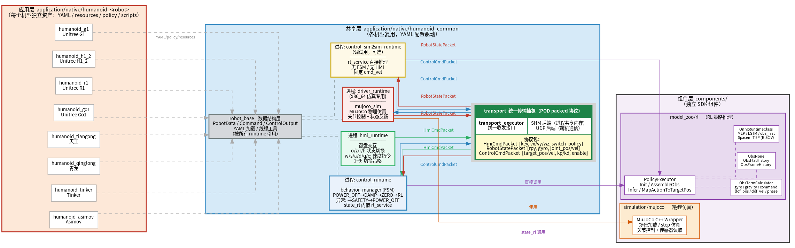
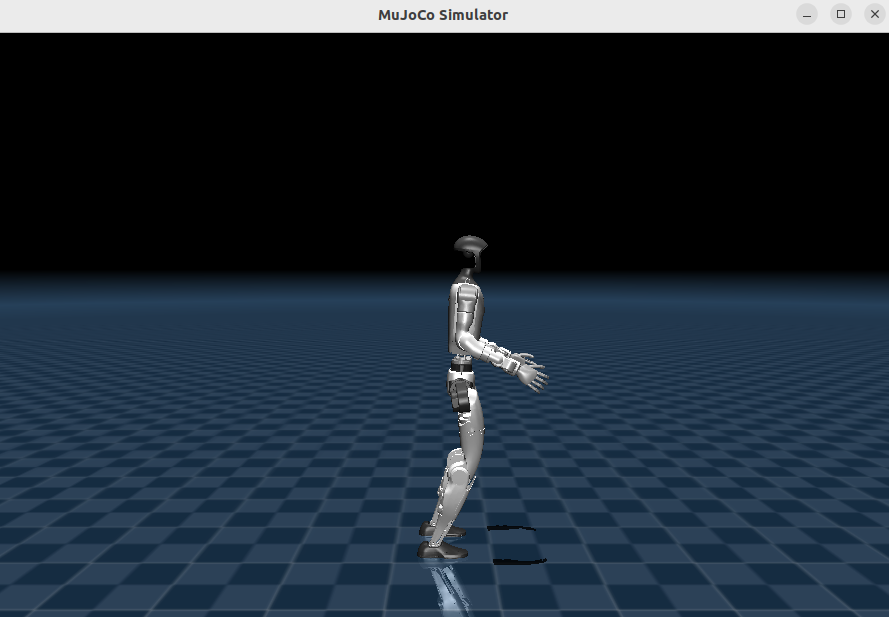
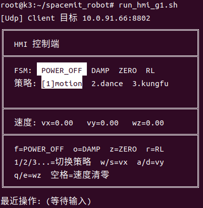
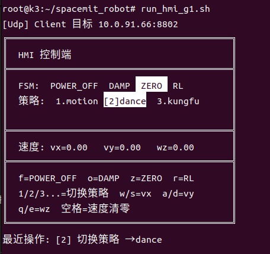
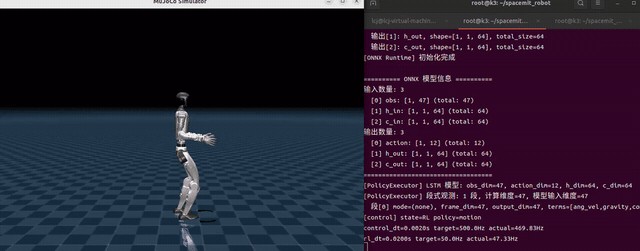
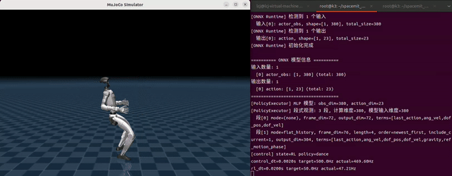
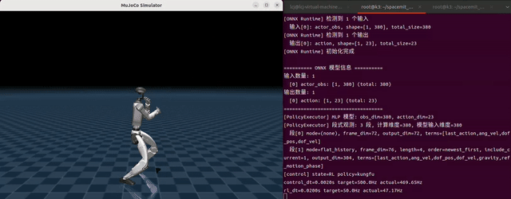
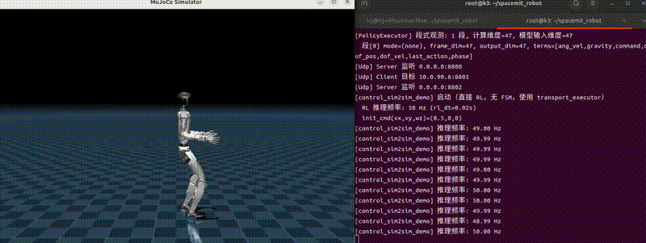

# 人形机器人 Humanoid

## 1. 方案概述

基于 SpacemiT K3 板卡的人形机器人运动控制方案，支持 MuJoCo 仿真部署。当前 SDK 已提供 8 款机型的应用案例：

| 机型 | 描述 | 自由度 |
| --- | --- | --- |
| g1 | 宇树人形机器人：Unitree G1 | 29（左腿 6 + 右腿 6 + 腰 3 + 左臂 7 + 右臂 7） |
| h1_2 | 宇树全尺寸人形机器人：Unitree H1_2 | 27（左腿 6 + 右腿 6 + 腰 1 + 左臂 7 + 右臂 7） |
| r1 | 宇树小尺寸人形机器人：Unitree R1 | 24（左腿 6 + 右腿 6 + 腰 2 + 左臂 5 + 右臂 5） |
| go1 | 宇树四足机器人：Unitree Go1 | 12（FR 3 + FL 3 + RR 3 + RL 3） |
| asimov | 双足机器人：Asimov | 12（左腿 6 + 右腿 6） |
| tinker | 上海人形双足机器人：Tinker | 10（左腿 5 + 右腿 5） |
| qinglong | 上海人形全尺寸人形机器人：青龙 | 31（左腿 6 + 右腿 6 + 腰 3 + 头 2 + 左臂 7 + 右臂 7） |
| tiangong | 北京人形全尺寸人形机器人：天工 2 | 20（左腿 6 + 右腿 6 + 左臂 4 + 右臂 4） |

**SDK 总体架构**：



SDK 按三层组织：

- **应用层** `application/native/humanoid_<robot>`：每款机型一个独立仓库，仅含资产文件（YAML 配置、MuJoCo 资源、ONNX 策略、启动脚本），不含可执行代码
- **共享层** `application/native/humanoid_common`：4 个 runtime 进程（`driver_runtime`、`control_runtime`、`control_sim2sim_runtime`、`hmi_runtime`），以及三个共享库 `robot_base`（数据结构）、`behavior_manager`（FSM 状态机）、`transport`（含 SHM / UDP 两个后端）
- **组件层** `components/`：`model_zoo/rl`（ONNX RL 推理）和 `simulation/mujoco`（MuJoCo 封装），独立于人形 SDK，可被其他项目复用

**相关目录**：

```
application/native/
├── humanoid_unitree_g1/                            # 应用层（以 g1 为例，其他机型结构相同）
│   ├── config/g1.yaml                      #   运行配置：关节定义、transport、RL 策略参数
│   ├── policy/                             #   ONNX 策略模型（motion / dance / kungfu / tracking …）
│   ├── resources/                          #   MuJoCo 资源（URDF、XML 场景、STL 网格）
│   └── scripts/                            #   启动脚本（run_driver_g1.sh、run_control_g1.sh 等）
├── humanoid_unitree_h1_2/                          # 其他 7 款机型，结构同上
├── humanoid_unitree_r1/
├── …
└── humanoid_common/                        # 共享层（所有机型复用）
    ├── include/
    │   ├── robot_base.h                    #   对外头文件：RobotData / Command / ControlOutput / YAML 配置读取
    │   ├── behavior_manager.h              #   对外头文件：FSM 状态机接口、StateName 枚举
    │   └── transport_executor.h            #   对外头文件：统一传输接口、Role 枚举、工厂函数
    ├── src/
    │   ├── runtime/
    │   │   ├── driver_runtime.cpp          #   仿真驱动进程（x86_64，链接 MuJoCo）
    │   │   ├── control_runtime.cpp         #   FSM 控制进程（含 behavior_manager + rl_service）
    │   │   ├── control_sim2sim_runtime.cpp  #   sim2sim 调试进程（直接 RL 推理，无 FSM）
    │   │   └── hmi_runtime.cpp             #   键盘交互进程（状态切换 + 速度指令）
    │   ├── robot_base/
    │   │   ├── robot_base.cpp              #   RobotData 实现：YAML 加载关节定义、数据初始化
    │   │   └── thread_utils.cpp            #   线程工具：实时优先级设置、CPU 亲和性绑定
    │   ├── behavior_manager/
    │   │   ├── behavior_manager.cpp        #   对外接口实现：Init / Update / GetStateName
    │   │   ├── behavior_fsm.h              #   FSM 内部实现：状态注册、转换表、Tick 驱动
    │   │   ├── behavior_fsm.cpp
    │   │   ├── behavior_state.h            #   状态基类：Enter / Execute / Exit 虚接口
    │   │   ├── state_factory.h             #   状态工厂：按 StateName 创建具体状态实例
    │   │   └── states/
    │   │       ├── state_power_off.cpp     #     POWER_OFF：输出零力矩，初始状态
    │   │       ├── state_damp.cpp          #     DAMP：kp=0 + kd 阻尼，软性支撑
    │   │       ├── state_zero.cpp          #     ZERO：五次多项式插值回初始位置
    │   │       ├── state_rl.cpp            #     RL：异步推理线程，调用 rl_service
    │   │       └── state_safety.cpp        #     SAFETY：IMU/关节超限触发，缓慢卸力
    │   └── transport/
    │       ├── transport_executor/
    │       │   ├── transport_executor.cpp  #     统一收发编排：按 Role 分发 Send/Recv
    │       │   ├── transport_packet.h      #     协议包定义：HmiCmdPacket / ControlCmdPacket / RobotStatePacket
    │       │   ├── transport_shm_impl.h    #     SHM 后端适配器接口
    │       │   ├── transport_shm_impl.cpp  #     SHM 后端适配器实现
    │       │   ├── transport_udp_impl.h    #     UDP 后端适配器接口
    │       │   └── transport_udp_impl.cpp  #     UDP 后端适配器实现
    │       ├── shm/
    │       │   ├── shm_transport.h         #     共享内存传输：POSIX shm + 自旋锁
    │       │   └── shm_transport.cpp
    │       └── udp/
    │           ├── udp_transport.h         #     UDP 传输：异步收发 + 序列化
    │           └── udp_transport.cpp
    └── example/
        ├── robot_base/
        │   ├── test_robot_base.cpp         #   功能测试：YAML 加载、数据结构验证
        │   └── config_example.yaml
        ├── behavior_manager/
        │   ├── test_behavior.cpp           #   功能测试：FSM 状态转换验证
        │   └── config_example.yaml
        └── transport_executor/
            ├── test_transport_executor.cpp  #   功能测试：SHM/UDP 收发验证
            └── config_example.yaml

components/                                 # 组件层（独立 SDK，可被其他项目复用）
├── model_zoo/rl/                           #   RL 策略推理（详见 §4.3-RL 文档）
└── simulation/mujoco/                      #   MuJoCo 物理仿真封装
    ├── include/
    │   └── mujoco_sim.h                    #     对外唯一头文件：MujocoSim 类、SimState / SimCommand
    ├── src/
    │   ├── mujoco_sim.cpp                  #     仿真器实现：加载 XML 模型、Step、渲染、状态读写
    │   └── mujoco_config.cpp               #     YAML 配置解析：模型路径、仿真参数、渲染选项
    ├── cmake/
    │   └── FindMuJoCo.cmake                #     MuJoCo 库查找脚本
    └── example/
        ├── test_mujoco.cpp                 #     功能测试：加载模型、运行仿真、验证状态输出
        └── config_example.yaml
```

SDK 提供两种运行模式，差异仅在控制端进程组合：

- **FSM 模式（三进程）**：`hmi_runtime` + `control_runtime`（含 behavior_manager）+ `driver_runtime`，详见 [§4.1](#41-fsm-完整测试三进程)
- **sim2sim 模式（双进程）**：`control_sim2sim_runtime` + `driver_runtime`，详见 [§4.2](#42-sim2sim-测试跳过-fsm直接-rl)

通信后端通过 YAML 的 `transport.type` 切换，代码无需修改：
- `shm`（共享内存）：同机多进程，延迟 ~1–5 μs，适用于单机仿真
- `udp`：跨机通信，适用于 PC 运行仿真 + K3 板卡运行控制

## 2. 硬件清单

| 项目 | 内容 |
| --- | --- |
| 单机仿真 | x86_64 PC，安装 Ubuntu 22.04 或 24.04 |
| 跨机仿真 | x86_64 PC（运行 driver）+ SpacemiT K3 Com260 Kit 板（运行 control + hmi），两机同局域网 |

## 3. 环境搭建

### 3.1 x86_64 PC 端依赖

**系统依赖**：

```bash
sudo apt install -y libeigen3-dev libyaml-cpp-dev libglfw3-dev cmake g++
```

**MuJoCo**：

```bash
mkdir -p ~/.mujoco
wget https://github.com/google-deepmind/mujoco/releases/download/3.4.0/mujoco-3.4.0-linux-x86_64.tar.gz
tar -xzf mujoco-3.4.0-linux-x86_64.tar.gz -C ~/.mujoco/
# 解压后目录结构：~/.mujoco/mujoco-3.4.0/
```

> CMake 查找顺序：`MUJOCO_DIR` 环境变量或编译参数 → `~/.mujoco/mujoco-*`（自动选最新版）→ `~/.mujoco` → `/usr/local` → `/opt/mujoco`。若安装到非默认路径，可通过 `export MUJOCO_DIR=/path/to/mujoco` 或编译时 `-DMUJOCO_DIR=/path/to/mujoco` 指定。其他版本见 [github.com/google-deepmind/mujoco/releases](https://github.com/google-deepmind/mujoco/releases)。

**ONNX Runtime**（仅在需要 x86_64 本机测试 RL 推理时安装）：

```bash
wget https://github.com/microsoft/onnxruntime/releases/download/v1.21.0/onnxruntime-linux-x64-1.21.0.tgz
tar -xzf onnxruntime-linux-x64-1.21.0.tgz
sudo cp -r onnxruntime-linux-x64-1.21.0/include/* /usr/local/include/
sudo cp -r onnxruntime-linux-x64-1.21.0/lib/* /usr/local/lib/
sudo ldconfig
```

> CMake 查找顺序：`ONNXRUNTIME_DIR` 环境变量或编译参数 → `/usr/local` → `/usr`。若安装到非默认路径，可通过 `export ONNXRUNTIME_DIR=/path/to/onnxruntime` 或编译时 `-DONNXRUNTIME_DIR=/path/to/onnxruntime` 指定。其他版本（≥ 1.17）见 [github.com/microsoft/onnxruntime/releases](https://github.com/microsoft/onnxruntime/releases)。

### 3.2 K3 板卡端依赖

**系统依赖**：

```bash
sudo apt install -y libeigen3-dev libyaml-cpp-dev spacemit-tcm pkg-config
```

**SpacemiT 定制版 ONNX Runtime**（包含 A100 核 EP 加速，替换标准版）：

```bash
# 如已安装标准 apt 版本，先卸载：
sudo apt remove libonnxruntime-dev libonnxruntime1.23 python3-onnxruntime

# 安装 SpacemiT 定制版：
sudo apt install -y libonnx-dev libonnx-testdata libonnx1t64 \
  libonnxruntime-providers onnxruntime-tools python3-onnx \
  python3-spacemit-ort spacemit-onnxruntime
```

### 3.3 获取代码并编译

**获取代码**：

- PC 与 K3 均需拉取人形模块全套相关代码（详见 [快速入门 · 构建编译](../02-快速入门/2.3-构建编译.md)）：

- K3 构建系统在编译前会检查 target JSON 中所有包目录是否存在，`simulation/mujoco` 的 CMake 在 rv64 架构下会自动跳过，K3 上无需安装 MuJoCo 二进制

```bash
repo init -u https://github.com/spacemit-robotics/manifest.git -b main -m default.xml \
  --repo-url=https://gitee.com/spacemit-robotics/git-repo \
  -g core,model_zoo_rl,humanoid,simulation
repo sync -j4
repo start robot-dev --all
```

> 单独拉取特定机型（如 g1），将 `humanoid` 替换为 `humanoid_common,humanoid_unitree_g1`即可。

**选择目标并编译**（以 g1 为例，其他机型替换 `g1` 即可）：

```bash
source build/envsetup.sh
lunch k3-com260-kit-humanoid-unitree-g1
m
```

编译完成后，脚本和可执行文件均安装至 `output/staging/bin/`，已通过 `envsetup.sh` 加入 PATH，可直接按名调用。

> **注意**：`driver_runtime` 链接 MuJoCo，仅在 x86_64 上编译；K3 板卡上 CMake 自动跳过，无需手动处理。

## 4. 跨机 FSM 全链仿真测试


包含完整控制链路仿真：键盘输入 → HMI 指令 → FSM 状态切换 → RL 推理 → 仿真驱动。

PC 运行 MuJoCo 仿真（driver_runtime），K3 板卡运行控制逻辑（control_runtime + hmi_runtime），通过 UDP 通信。用于验证 K3 板卡上人形机器人运动控制与 RL 推理的完整链路，以下以 g1 为例。

**前置条件**：
1. 首次使用时，完成编译后，在 K3 板卡上运行对应机型的下载脚本拉取 RL 策略模型：

```bash
source build/envsetup.sh
download_models_g1.sh
```

- 每款机型的 `download_models_<robot>.sh` 脚本在编译对应 target 后安装至 `output/staging/bin/`，已通过 `envsetup.sh` 加入 PATH，`source` 后可直接按名调用。脚本会将该机型所有 RL 策略模型下载至对应机型目录的 `policy/` 下。

2. 确认 `application/native/humanoid_unitree_g1/config/g1.yaml` 中 `transport.type: "udp"`，并填写实际 IP：

```yaml
transport:
  type: "udp"
  udp:
    driver_ip: "192.168.1.100"   # PC 的 IP
    control_ip: "192.168.1.200"  # K3 板卡的 IP
```

2. 确认 K3 与 PC 处于同一网段下，可互相 ping 通，保证跨机仿真 UDP 通信正常

### 4.1 PC 端启动仿真引擎

```bash
source build/envsetup.sh
run_driver_g1.sh
```

**预期输出**：MuJoCo 窗口弹出后，终端打印仿真参数和 UDP 端口信息：



```bash
[ThreadLoop] 线程 driver_main 配置完成 (cpu=-1, sched=other, priority=0)
[MuJoCo] 机器人: g1
[MuJoCo] 窗口置顶: 成功
[MuJoCo] 仿真频率: 500 Hz
[MuJoCo] 自由度: 29
[MuJoCo] 悬挂保护: 启用 (高度: 0.75m)
[MuJoCo] 按 Ctrl+C 退出
[MuJoCo] 按 F 键切换悬挂保护
[MuJoCo] 按 ↑/↓ 键调节悬挂高度 (±5cm)
[MuJoCo] 按 R 键重置悬挂高度到默认值
[Udp] Client 目标 10.0.91.0:8800
[Udp] Server 监听 0.0.0.0:8801
[driver_demo] 启动（使用 transport_executor）
```

### 4.2 K3 板卡端启动控制和 HMI

**终端1**

```bash
source build/envsetup.sh
run_control_g1.sh
```

**预期输出**

终端持续刷新状态行，`actual` 频率非零说明与 driver 通信已建立：

```bash
[ThreadLoop] 线程 control_main 配置完成 (cpu=-1, sched=other, priority=0)
[BehaviorManager] 机器人: g1, 自由度: 29
[ONNX Runtime] ImpClass 构造
[ONNX Runtime] OnnxRuntimeClass 构造
[BehaviorManager] RL 状态: 已加载 (/root/spacemit_robot/application/native/humanoid_unitree_g1/policy/motion/motion.onnx)
[StatePowerOff] 进入不上电状态
[FSM] 初始化完成，当前状态: POWER_OFF
[BehaviorManager] 初始化完成
[Udp] Server 监听 0.0.0.0:8800
[Udp] Client 目标 10.0.90.6:8801
[Udp] Server 监听 0.0.0.0:8802
[control_demo] 启动（使用 transport_executor）
[control] state=POWER_OFF policy=motion
control_dt=0.0020s target=500.0Hz actual=479.98Hz
rl_dt=0.0200s target=50.0Hz actual=0.00Hz
```

**终端2**

```bash
source build/envsetup.sh
run_hmi_g1.sh
```

**预期输出**

终端打印如下 TUI 界面，实时显示 FSM 状态、策略列表和速度指令：

```bash
[Udp] Client 目标 10.0.91.0:8802
╔══════════════════════════════════════════╗
║  HMI 控制端                              ║
╠══════════════════════════════════════════╣
║  FSM:  POWER_OFF  DAMP  ZERO  RL         ║
║  策略: [1]motion  2.dance  3.kungfu      ║
║                                          ║
╠══════════════════════════════════════════╣
║  速度: vx=0.00   vy=0.00   wz=0.00       ║
╠══════════════════════════════════════════╣
║  f=POWER_OFF  o=DAMP  z=ZERO  r=RL       ║
║  1/2/3...=切换策略  w/s=vx  a/d=vy       ║
║  q/e=wz  空格=速度清零                   ║
╚══════════════════════════════════════════╝
最近操作: (等待输入)
```

**键盘操作**（在 hmi 终端中）：



| 按键 | 功能 |
| --- | --- |
| `o` | 进入 DAMP（阻尼保持） |
| `z` | 进入 ZERO（回零位） |
| `r` | 进入 RL 控制 |
| `f` | 切换到 POWER_OFF（完全失力） |
| `w` / `s` | 增 / 减前进速度 vx |
| `a` / `d` | 增 / 减横向速度 vy |
| `q` / `e` | 增 / 减旋转角速度 wz |
| `空格` | 速度清零 |
| `1`~`9` | 切换到对应序号的 RL 策略 |

`1`~`9` 可在非 RL 状态下预选策略，无需重启进程。策略序号由 YAML 中 `rl_policy.onnx_infer` 下的策略列表顺序决定（从 1 开始）。切换在非 RL 状态（如 ZERO、DAMP）下生效，进入 RL 状态时使用预选的策略；RL 运行中发送切换指令会被忽略。下图为在 ZERO 状态下切换到 dance 策略的示例：



### 4.3 运行效果

MuJoCo 窗口打开后机器人悬挂在空中；按 `o` → `z` → `r` 依次切换状态，进入 RL 后机器人站立并响应速度指令。MuJoCo 窗口内可按 `F` 切换悬挂保护，`↑`/`↓` 调节悬挂高度，`R` 重置悬挂高度。

- 跨机FSM仿真效果



- 舞蹈动作演示



- 功夫动作演示



图中左侧为 PC 端 MuJoCo 仿真窗口，右侧为 K3 板卡上 `control_runtime` 的终端界面。终端每 100ms 刷新三行状态：当前 FSM 状态和激活策略名、`control_dt`（控制周期）对应的目标频率与实际频率、`rl_dt`（RL 推理周期）对应的目标频率与实际频率。

## 5. 跨机 sim2sim 算法仿真测试


不含 FSM 状态机与 hmi 操作端，用于快速验证新 RL 策略端侧部署的推理效果。

PC 运行 MuJoCo 仿真（driver_runtime），K3 板卡运行 RL 推理（sim2sim_runtime），通过 UDP 通信。以下以 g1 为例。

**前置条件**参考第 4 节（含模型下载步骤）。

### 5.1 PC 端启动仿真驱动

```bash
source build/envsetup.sh
run_driver_g1.sh
```

预期输出与4.1 一致，显示mujoco界面与相同driver_runtime终端打印

### 5.2 K3 板卡端启动 sim2sim 控制

```bash
source build/envsetup.sh
run_sim2sim_g1.sh
```

该测试会加载并运行 YAML 中 `rl_policy.default_policy` 指定的策略模型。

**预期输出**

显示如下终端打印：

```bash
[ONNX Runtime] ImpClass 构造
[ONNX Runtime] OnnxRuntimeClass 构造
[ONNX Runtime] 开始初始化模型: /root/spacemit_robot/application/native/humanoid_unitree_g1/policy/motion/motion.onnx
[ONNX Runtime] 模型加载成功
[ONNX Runtime] 检测到 3 个输入
  输入[0]: obs, shape=[1, 47], total_size=47
  输入[1]: h_in, shape=[1, 1, 64], total_size=64
  输入[2]: c_in, shape=[1, 1, 64], total_size=64
[ONNX Runtime] 检测到 3 个输出
  输出[0]: action, shape=[1, 12], total_size=12
  输出[1]: h_out, shape=[1, 1, 64], total_size=64
  输出[2]: c_out, shape=[1, 1, 64], total_size=64
[ONNX Runtime] 初始化完成

========== ONNX 模型信息 ==========
输入数量: 3
  [0] obs: [1, 47] (total: 47)
  [1] h_in: [1, 1, 64] (total: 64)
  [2] c_in: [1, 1, 64] (total: 64)
输出数量: 3
  [0] action: [1, 12] (total: 12)
  [1] h_out: [1, 1, 64] (total: 64)
  [2] c_out: [1, 1, 64] (total: 64)
===================================
[PolicyExecutor] LSTM 模型: obs_dim=47, action_dim=12, h_dim=64, c_dim=64
[PolicyExecutor] 段式观测: 1 段, 计算维度=47, 模型输入维度=47
  段[0] mode=(none), frame_dim=47, output_dim=47, terms=[ang_vel,gravity,command,dof_pos,dof_vel,last_action,phase]
[Udp] Server 监听 0.0.0.0:8800
[Udp] Client 目标 10.0.90.6:8801
[Udp] Server 监听 0.0.0.0:8802
[control_sim2sim_demo] 启动（直接 RL，无 FSM，使用 transport_executor）
  RL 推理频率: 50 Hz (rl_dt=0.02s)
  init_cmd(vx,vy,wz)=(0.5,0,0)
[control_sim2sim_demo] 推理频率: 48.99 Hz
[control_sim2sim_demo] 推理频率: 50.00 Hz
[control_sim2sim_demo] 推理频率: 50.00 Hz
[control_sim2sim_demo] 推理频率: 48.99 Hz
```

### 5.3 运行效果

MuJoCo 窗口打开后，K3 端直接进入 RL 推理循环，机器人站立并保持姿态，无需键盘切换状态。



左侧为 PC 端 MuJoCo 仿真窗口，右侧为 K3 板卡上 `sim2sim_runtime` 的终端界面，终端每秒打印当前实时RL推理频率。

## 6. PC 单机仿真

PC 本机同样可进行类似的 FSM 全链仿真测试与 sim2sim 算法测试，无需 K3 板卡，适用于开发阶段的快速迭代验证。

两种测试模式的操作方式均与上述类似，仅需关注以下两点**前置条件**：

1. PC 已在/usr目录安装预编译的onnxruntime
2. 修改通信方式，可使用本机UDP通信，即driver_ip与control_ip均设为127.0.0.1；或使用本机SHM通信，修改`application/native/humanoid_unitree_g1/config/g1.yaml`中的`transport.type:`字段为`shm`：

```yaml
transport:
  type: "shm" 
  
  shm: 
    prefix: "g1"        # 共享内存名称前缀（通道：/hmrs_g1_state, /hmrs_g1_control, /hmrs_g1_hmi）
    capacity: 4         # 环形缓冲区槽位数
    slot_size: 4096     # 每个槽位大小（字节，需大于最大 packet）
```

## 7. 常见问题

| 现象 | 处理 |
| --- | --- |
| `driver_runtime 未找到` | `run_driver_g1.sh` 在 K3 板卡上执行，而 driver_runtime 仅编译在 x86_64 上，请在 PC 上运行 |
| `[MujocoConfig] MuJoCo XML 文件不存在: ...` | YAML 中 `robot_base.robot_dir` 指向的目录下缺少 `resources/xml/scene.xml`，检查路径是否正确、文件是否存在 |
| 进程启动后通信无数据 | udp 模式：检查 YAML 中 `driver_ip` / `control_ip` 是否填写正确，确认两机可互相 ping 通，检查防火墙是否放行 8800-8802 端口；shm 模式：用 `ls /dev/shm/hmrs_*` 确认共享内存文件已创建 |
| `[Udp] bind 失败, ip=... port=...` | 端口被占用或 IP 不存在。用 `ss -ulnp \| grep 880` 检查端口占用，确认 YAML 中的 IP 是本机实际地址 |
| `配置文件不存在: ...` 或 `YAML 解析失败: ...` | YAML 路径错误或格式有误。确认启动脚本中传入的 YAML 路径正确，用 `python3 -c "import yaml; yaml.safe_load(open('g1.yaml'))"` 验证格式 |
| `[PolicyConfigLoader] ONNX 模型文件不存在: .../policy/...onnx` | 模型文件未下载。运行对应机型的下载脚本，如 `download_models_g1.sh`，完成后重试 |
| `[StateRL] IMU 倾角超限!` → 自动进入 SAFETY | 机器人姿态异常触发安全保护，属于正常保护机制。检查策略是否适配当前机型，或调整策略 YAML 中 `max_roll` / `max_pitch` 阈值（默认 1.0 rad，位于 `rl_policy.onnx_infer.<策略名>` 下） |
| RL 控制不稳定 / 立即摔倒 | 策略模型与机型 num_dof 不匹配，检查 YAML 中 `action_joint_index` 和 `rl_default_pos` 配置 |
