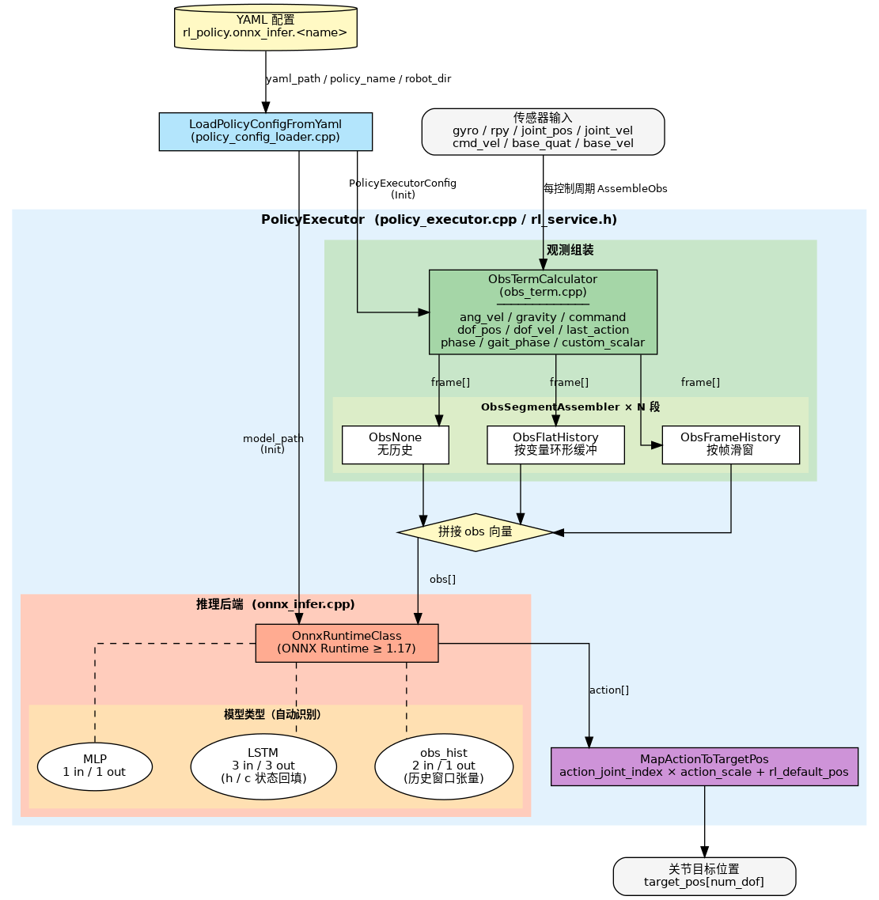

# 强化学习

> **文档类型**：算法与模型能力
> **说明**：基于 ONNX Runtime 的 RL 强化学习策略推理执行器，支持 MLP、LSTM 及带历史观测输入等模型结构，提供段式观测组装功能。本文档涵盖模块概述、环境搭建、示例运行、API 调用、调试和常见问题。

## 1. 模块概述

- **主要功能**：基于 ONNX Runtime 的机器人 RL 策略推理执行器。负责从 YAML 配置文件加载策略模型，按配置组装观测向量（obs），执行推理，并将策略输出映射为关节目标位置。模块与机器人型号完全解耦，所有参数由 YAML 驱动。
- **核心特性**：
  - 支持 MLP、LSTM、obs_hist 三种模型结构（自动识别，无需手动指定）
  - 段式观测组装：每个 obs segment 独立配置 terms 和历史模式（无历史 / flat_history / frame_history）
  - 多策略切换：同一配置文件可定义多个策略，运行时按名切换
  - 推理后端：当前为 ONNX Runtime，接口与后端解耦
- **软件框图**：

  

- **相关目录**：

  ```
  components/model_zoo/rl/
  ├── include/
  │   └── rl_service.h                      # 对外唯一头文件：PolicyExecutor、LoadedPolicyConfig 等
  ├── src/
  │   ├── policy_executor.cpp               # 编排层：Init/AssembleObs/Infer/MapAction 实现（接口声明在 rl_service.h）
  │   ├── policy_config_loader.cpp          # YAML 解析：加载策略配置到 PolicyExecutorConfig（接口声明在 rl_service.h）
  │   ├── obs_assembler.h                   # 观测段组装器抽象基类（纯虚接口，仅头文件）
  │   ├── obs_term.h / obs_term.cpp         # 观测项计算器：各 term（gyro/dof_pos/phase 等）的数值计算
  │   ├── obs_none.h / obs_none.cpp         # 无历史模式组装器（mode 为空）
  │   ├── obs_flat_history.h / .cpp         # 按变量分组的环形历史缓冲组装器（mode: flat_history）
  │   ├── obs_frame_history.h / .cpp        # 按帧滑窗历史缓冲组装器（mode: frame_history）
  │   └── backends/
  │       ├── onnx_infer.h                  # ONNX Runtime 推理封装：模型加载、维度推断、Run
  │       └── onnx_infer.cpp
  ├── cmake/
  │   └── FindONNXRuntime.cmake             # ONNX Runtime 查找脚本
  ├── example/
  │   ├── test_policy_executor.cpp          # 功能测试：验证配置加载、推理链路、维度正确性
  │   ├── test_onnx_infer.cpp               # 功能测试：验证 ONNX Runtime 后端安装与模型可推理
  │   ├── benchmark_onnx_infer.cpp          # 性能基准：隔离测试 ORT 推理延迟（排除 obs 组装干扰）
  │   └── benchmark_policy_executor.cpp     # 性能基准：AssembleObs→Infer→MapAction 端到端分段计时
  └── scripts/
      ├── run_benchmark_onnx.sh             # 封装 benchmark_onnx_infer，自动定位 SDK_ROOT
      ├── run_benchmark_policy.sh           # 封装 benchmark_policy_executor，自动定位 SDK_ROOT
      └── pt2onnx.py                        # PyTorch→ONNX 转换脚本，自动检测 MLP/LSTM/GRU 并外置状态
  ```

## 2. 环境准备

### 前置条件

- **运行环境**：C++17，CMake ≥ 3.16
- **ONNX Runtime**：
  - x86_64 开发机：下载预编译onnxruntime ≥ 1.17，安装到 `/usr/local` (仅在需要pc本机测试RL推理时)
  - K3 板卡（rv64）：安装 SpacemiT 定制版，卸载标准 apt 版本

    ```bash
    # K3 板卡：如误装 apt 源的原版 onnxruntime 可能运行时会有问题，需卸载:  
    sudo apt remove libonnxruntime-dev libonnxruntime1.23 python3-onnxruntime
    # 安装 spacemit-onnxruntime 定制版（包含 A100核 EP加速）:  
    apt install -y libonnx-dev libonnx-testdata libonnx1t64 \
    libonnxruntime-providers onnxruntime-tools python3-onnx \
    python3-spacemit-ort spacemit-onnxruntime
    ```

- **其他依赖**：Eigen3、yaml-cpp（均可通过 apt 安装）

    ```bash
    sudo apt install -y libeigen3-dev libyaml-cpp-dev
    ```

- **环境变量**：

    ```bash
    source ~/spacemit_robot/build/envsetup.sh
    ```

### 构建编译

- **获取代码**：

  RL 组件路径为 `components/model_zoo/rl`。运行示例和基准测试还需要对应机型的仓库（包含策略下载脚本和 YAML 配置），按需选择以下拉取方式：

  1. **拉取指定机型**（以 g1 为例）：

  ```bash
  repo init -u https://github.com/spacemit-robotics/manifest.git -b main -m default.xml \
    --repo-url=https://gitee.com/spacemit-robotics/git-repo \
    -g core,model_zoo_rl,humanoid_unitree_g1
  repo sync -j4
  repo start robot-dev --all
  ```

  拉取后，运行该机型的下载脚本获取 ONNX 策略模型：

  ```bash
  SDK_ROOT=$(pwd) application/native/humanoid_unitree_g1/scripts/download_models_g1.sh
  ```

  2. **一次拉取所有机型**（获取全部机型的下载脚本，按需运行各机型策略下载）：

  ```bash
  repo init -u https://github.com/spacemit-robotics/manifest.git -b main -m default.xml \
    --repo-url=https://gitee.com/spacemit-robotics/git-repo \
    -g core,model_zoo_rl,humanoid
  repo sync -j4
  repo start robot-dev --all
  ```

  拉取完成后，按需运行各机型 RL 策略的下载脚本（以 g1 和 tiangong 为例）：

  ```bash
  SDK_ROOT=$(pwd) application/native/humanoid_unitree_g1/scripts/download_models_g1.sh
  SDK_ROOT=$(pwd) application/native/humanoid_tiangong/scripts/download_models_tiangong.sh
  ```

  > 各机型 group 名：`humanoid_unitree_g1`、`humanoid_unitree_h1_2`、`humanoid_unitree_r1`、`humanoid_unitree_go1`、`humanoid_qinglong`、`humanoid_tiangong`。

- **编译**：

    ```bash
    source ~/spacemit_robot/build/envsetup.sh
    cd components/model_zoo/rl
    mm
    ```

- **产物**：
  - `output/staging/lib/librl.so` — 推理库
  - `output/staging/bin/test_policy_executor` — 完整接口功能测试
  - `output/staging/bin/test_onnx_infer` — ONNX 后端功能测试
  - `output/staging/bin/benchmark_onnx_infer` — 纯推理性能基准
  - `output/staging/bin/benchmark_policy_executor` — 完整链路性能基准
  - `output/staging/bin/run_benchmark_onnx.sh` — 纯推理基准启动脚本
  - `output/staging/bin/run_benchmark_policy.sh` — 完整链路基准启动脚本

## 3. 示例使用（从 0 跑通）

### 3.1 策略推理全链路测试

验证配置加载、obs 组装、推理、动作映射全流程。

**前置条件**：

1. rl组件`mm`编译完成，`output/staging/bin/test_policy_executor` 已生成；

2. 检查具体机型案例的仓库源码是否就位，对应机型的 YAML 在源码中提供（如 `application/native/humanoid_unitree_g1/config/g1.yaml`）；

3. 策略模型（.onnx）需通过以下命令运行下载脚本获取，在仓库根目录执行（以 g1 为例，其他机型替换 `g1` 即可）：

```bash
SDK_ROOT=$(pwd) application/native/humanoid_unitree_g1/scripts/download_models_g1.sh
```

上述命令会将 g1 的 RL 策略模型下载至 `application/native/humanoid_unitree_g1/policy/` 下各子目录。

**步骤 1**：进入 spacemit_robot 根目录

```bash
cd ~/spacemit_robot
```

**步骤 2**：运行测试（以 g1 的 motion 策略为例）

```bash
./output/staging/bin/test_policy_executor \
  application/native/humanoid_unitree_g1/config/g1.yaml \
  motion \
  application/native/humanoid_unitree_g1
```

参数说明：`<yaml路径> <policy_name> <robot_dir>`，`robot_dir` 用于解析 YAML 中的模型相对路径。

**预期输出**：

```
[test] 加载配置: application/native/humanoid_unitree_g1/config/g1.yaml, policy: motion, robot_dir: application/native/humanoid_unitree_g1
[test] 初始化 PolicyExecutor
[ONNX Runtime] ...（模型加载日志）
[PolicyExecutor] LSTM 模型: obs_dim=47, action_dim=12, h_dim=64, c_dim=64
[PolicyExecutor] 段式观测: 1 段, 计算维度=47, 模型输入维度=47
  段[0] mode=(none), frame_dim=47, output_dim=47, terms=[ang_vel,gravity,command,dof_pos,dof_vel,last_action,phase]

========================================
  测试 1: 模型属性查询接口
========================================
  观测维度: 47
  动作维度: 12
  是否为 LSTM 模型: 是
  是否使用 obs_hist 输入: 否

========================================
  测试 2: 观测组装、推理、动作映射
========================================
  执行 5 帧推理循环...
    Frame 0: obs_dim=47 action_dim=12 target_pos_dim=29
    Frame 1: obs_dim=47 action_dim=12 target_pos_dim=29
    Frame 2: obs_dim=47 action_dim=12 target_pos_dim=29
    Frame 3: obs_dim=47 action_dim=12 target_pos_dim=29
    Frame 4: obs_dim=47 action_dim=12 target_pos_dim=29

========================================
  测试 3: 单帧详细推理流程
========================================
  观测向量维度: 47 (期望: 47)
  ✓ 观测维度正确
  动作输出维度: 12 (期望: 12)
  ✓ 动作维度正确
  关节目标位置数量: 29 (期望: 29)
  ✓ 关节维度正确

========================================
✓ 所有测试成功！
========================================
```

### 3.2 ONNX 后端单独测试

直接向推理引擎输入随机张量，验证 ONNX Runtime 的推理能力。支持单模型测试和批量扫描两种模式。

**前置条件**：需已下载策略模型，参考 [§3.1 前置条件](#31-策略推理全链路测试) 中的下载步骤。

**单模型测试**：

```bash
./output/staging/bin/test_onnx_infer \
  application/native/humanoid_unitree_g1/policy/motion/motion.onnx --random
```

**预期输出**（关键信息摘录）：

```
========== ONNX 模型信息 ==========
输入数量: 3
  [0] obs: [1, 47] (total: 47)
  [1] h_in: [1, 1, 64] (total: 64)
  [2] c_in: [1, 1, 64] (total: 64)
输出数量: 3
  [0] action: [1, 12] (total: 12)
  [1] h_out: [1, 1, 64] (total: 64)
  [2] c_out: [1, 1, 64] (total: 64)
===================================

[test] 执行推理 (50 次迭代)...
[test] 推理完成. 平均耗时: 0.023 ms, Min: 0.018 ms, Max: 0.198 ms

[test] 测试成功
```

**批量扫描**（扫描指定目录下所有 .onnx 文件，fork 子进程防止崩溃影响主进程）：

```bash
./output/staging/bin/test_onnx_infer --scan application/native/humanoid_unitree_g1
```

**预期输出**（关键信息摘录）：

```
=========================================================================================
  ONNX 推理批量测试报告
=========================================================================================

------------------------------------------------------------------------------------------
  [ PASS ]  .../policy/motion/motion.onnx
  │
  ├─ 输入(3): obs[1,47]  h_in[1,1,64]  c_in[1,1,64]
  ├─ 输出(3): action[1,12]  h_out[1,1,64]  c_out[1,1,64]
  └─ 推理耗时 (Avg/Min/Max): 0.02 / 0.02 / 0.19 ms (50 次迭代)

------------------------------------------------------------------------------------------
  [ PASS ]  .../policy/tracking/tracking.onnx
  │
  ├─ 输入(2): obs[1,160]  time_step[1,1]
  ├─ 输出(7): actions[1,29]  joint_pos[1,29]  joint_vel[1,29]  ...
  └─ 推理耗时 (Avg/Min/Max): 0.05 / 0.03 / 0.63 ms (50 次迭代)

=========================================================================================
  共 4 个模型    通过: 4    失败: 0
=========================================================================================
```

### 3.3 性能基准测试

评估 K3 板卡上的 RL 推理实时性，分为纯推理和完整链路两个基准。

**前置条件**：需已下载策略模型，参考 [§3.1 前置条件](#31-策略推理全链路测试) 中的下载步骤。

**纯推理基准**（隔离 ONNX Runtime 性能，排除 obs 组装和动作映射干扰）：

```bash
run_benchmark_onnx.sh g1 motion
```

**完整链路基准**（AssembleObs → Infer → MapActionToTargetPos 分段计时）：

```bash
run_benchmark_policy.sh g1 motion
```

脚本从任意目录调用均可，自动推算 SDK 根目录。详见 [§附录：性能基准测试](#附录性能基准测试)。

## 4. 应用开发

本章介绍 RL 模块的核心接口和集成方法。

**完整示例代码**：[components/model_zoo/rl/example/test_policy_executor.cpp](../../../components/model_zoo/rl/example/test_policy_executor.cpp)

**详细接口文档**：[components/model_zoo/rl/README.md](../../../components/model_zoo/rl/README.md)

### 对外接口

头文件：`include/rl_service.h`，链接库：`librl.so`

### 调用流程

```cpp
#include "rl_service.h"
using namespace rl_policy;

// 1. 从 YAML 加载策略配置
LoadedPolicyConfig cfg = LoadPolicyConfigFromYaml(yaml_path, policy_name, robot_dir);

// 2. 初始化执行器
PolicyExecutor policy;
policy.Init(cfg.exec_cfg);

// 3. 每控制周期：组装观测 → 推理 → 映射动作
Eigen::VectorXf obs;
policy.AssembleObs(gyro, rpy, cmd_vx, cmd_vy, cmd_wz,
                   joint_pos, joint_vel, base_quat, base_vel, dt, obs);

std::vector<double> action;
policy.Infer(obs, action);

std::vector<double> target_pos(num_dof, 0.0);
policy.MapActionToTargetPos(action, target_pos);
```

### 关键接口说明

| 接口 | 说明 |
| --- | --- |
| `LoadPolicyConfigFromYaml(yaml, name, robot_dir)` | 解析 YAML 中 `rl_policy.onnx_infer.<name>` 节点，返回完整配置 |
| `Init(cfg)` | 加载 ONNX 模型，初始化 obs assembler 和 LSTM 状态 |
| `ObsDim()` / `ActionDim()` | 查询观测/动作向量维度 |
| `HasLstm()` / `HasObsHist()` | 查询模型结构类型（是否包含 LSTM / obs_hist 输入） |
| `PrintModelInfo()` | 打印模型信息（输入/输出维度、LSTM/obs_hist 状态） |
| `AssembleObs(...)` | 按段配置组装观测向量，内部维护历史缓冲 |
| `Infer(obs, action)` | 执行推理，MLP / LSTM / obs_hist 自动分派 |
| `MapActionToTargetPos(action, target_pos)` | 按 `action_joint_index` 将策略输出映射到全身关节位置 |
| `SetCustomScalar(name, val)` / `GetCustomScalar(name)` | 设置/获取自定义标量（如 `"z"` 相位、`"stand_flag"` 标志）。需在 AssembleObs 前调用，初始值由 YAML `custom_scalar_defaults` 配置 |

### YAML 配置结构（关键字段）

```yaml
rl_policy:
  onnx_infer:
    motion:                          # policy_name
      model_path: "policy/motion/policy.onnx"   # 相对 robot_dir
      action_scale: [0.25]
      rl_default_pos: [...]          # 大小 = num_dof
      action_joint_index: [0,1,...,11]
      
      # 观测段配置
      obs_segments:
        - terms: [ang_vel, gravity, command, dof_pos, dof_vel, last_action, phase]
          mode: ""                   # 无历史
        - terms: [dof_pos, dof_vel]
          mode: "flat_history"       # 按变量分组的历史
          length: 10                 # 历史帧数
          order: "oldest_first"      # 历史排序方向
      
      # 自定义标量默认值
      custom_scalar_defaults:
        z: 0.0
        stand_flag: 0.0
      
      # 维度校验
      strict_obs_dim_check: true
  
  # 指令配置
  command:
    scale: [2.0, 2.0, 0.25]          # [vx, vy, wz] 缩放系数
    init: [0.0, 0.0, 0.0]            # 初始速度指令
  
  # 推理降频
  infer_decimation: 4                # 每 4 个控制周期推理一次
```

## 5. 调试指南

- **查看模型结构**：使用 `test_onnx_infer <model.onnx>` 查看模型输入/输出维度和类型
- **验证推理链路**：使用 `test_policy_executor` 验证配置加载、obs 组装、推理、动作映射全流程
- **性能分析**：使用 `run_benchmark_policy.sh` 查看各环节耗时，识别性能瓶颈
- **观测维度调试**：
  - 运行 `test_policy_executor` 查看实际组装的 obs 维度
  - 对比 `ObsDim()` 返回的期望维度
  - 检查 YAML 中 `obs_segments` 配置是否与训练时一致

## 6. 常见问题

| 现象 | 可能原因 | 处理 |
| --- | --- | --- |
| `[PolicyConfigLoader] 策略 'xxx' 的配置不存在` | YAML 中 `rl_policy.onnx_infer.policies` 下无该策略名 | 检查 YAML 配置，确认策略名拼写正确；查看 `policy_names` 列表 |
| `[PolicyConfigLoader] ONNX 模型文件不存在` | `model_path` 路径错误或文件缺失 | 检查 `robot_dir/policy/<policy_name>/<model>.onnx` 是否存在；确认 `model_path` 配置正确 |
| `[PolicyExecutor] 观测维度不匹配` | `strict_dim_check: true` 时，YAML 配置的 obs 维度与模型输入不一致 | 运行 `test_policy_executor` 查看实际维度；对比训练时的 obs 配置；调整 `obs_segments[].terms` |
| `[PolicyExecutor] 观测维度错误: 实际=X, 期望=Y` | `Infer()` 时传入的 obs 维度与 `ObsDim()` 不匹配 | 检查 `AssembleObs()` 输出；确保 obs 向量未被意外修改 |
| `[PolicyExecutor] 未知段模式: xxx` | YAML 中 `segment_mode` 配置了不支持的值 | 只支持 `""` (无历史) / `"flat_history"` / `"frame_history"`，检查拼写 |
| `[PolicyExecutor] 不支持的模型类型` | ONNX 模型输入/输出数量不符合 MLP/LSTM/obs_hist 规范 | 检查模型导出：MLP (1in/1out)、LSTM (3in/3out)、obs_hist (2in/1out)；用 `test_onnx_infer` 查看模型结构 |
| 机器人抖动或动作异常 | 归一化参数与训练不一致；或 `action_scale` 过大 | 对比训练配置检查 `ang_vel_scale` / `dof_pos_scale` / `dof_vel_scale`；降低 `action_scale` 测试 |

## 附录：性能基准测试

### 工具说明

| 脚本 | 测试内容 | 适用场景 |
| --- | --- | --- |
| `run_benchmark_onnx.sh` | 纯 ONNX 推理延迟 | 对比不同硬件 / 模型结构的推理引擎性能 |
| `run_benchmark_policy.sh` | AssembleObs + Infer + MapActionToTargetPos 分段延迟 | 评估真实运控场景端到端性能，识别瓶颈 |

**参数说明**：

| 参数 | 说明 | 默认值 |
| --- | --- | --- |
| `robot` | 机型名称 | `g1` |
| `policy` | 策略名称 | `motion` |
| `--warmup N` | 预热轮数，消除首次加载开销 | `100` |
| `--rounds N` | 正式统计轮数 | `1000` |
| `--hz N` | 目标控制频率，用于计算 deadline 和超时率 | `50` |
| `--verbose` | 逐帧输出延迟，用于排查尖刺 | 关闭 |

**输出指标说明**：

| 指标 | 含义 |
| --- | --- |
| Avg | 平均延迟 |
| Std | 标准差，反映延迟的离散程度 |
| P50 | 中位数，50% 的推理比它快 |
| P95 | 95% 的推理比它快，代表典型最坏情况 |
| P99 | 99% 的推理比它快，代表极端尾延迟 |
| Max | 单次最坏情况 |
| Miss | 超过 deadline（1000 / hz ms）的帧数及占比 |

> RL 运控是硬实时闭环，P99 比均值更重要：控制环抖动会被 PD 放大成关节颤抖，P99 决定系统稳定性上限。

### 测试命令

```bash
# 默认参数（g1 + motion，100 warmup + 1000 rounds，50Hz deadline）
run_benchmark_onnx.sh
run_benchmark_policy.sh

# 自定义参数
run_benchmark_policy.sh g1 motion --rounds 2000          # 增加测试轮数，提高统计准确性
run_benchmark_policy.sh g1 motion --warmup 200           # 增加预热轮数，消除冷启动影响
run_benchmark_policy.sh tiangong walk                    # 测试其他机型/策略
```

### 典型数据

**纯推理基准（`run_benchmark_onnx.sh g1 motion`）**：

| 平台 | 策略 | Avg (ms) | Std (ms) | P50 (ms) | P95 (ms) | P99 (ms) | Max (ms) | Miss (50Hz) |
| --- | --- | --- | --- | --- | --- | --- | --- | --- |
| K3 COM260 KIT | g1 / motion | 0.178 | 0.003 | 0.177 | 0.179 | 0.190 | 0.224 | 0 / 1000 (0.00%) |

**完整链路基准（`run_benchmark_policy.sh g1 motion`）**：

| 平台 | 环节 | Avg (ms) | P50 (ms) | P95 (ms) | P99 (ms) | Max (ms) |
| --- | --- | --- | --- | --- | --- | --- |
| K3 COM260 KIT | Obs Assembly | 0.016 | 0.016 | 0.016 | 0.016 | 0.058 |
| K3 COM260 KIT | Inference | 0.196 | 0.195 | 0.203 | 0.208 | 0.268 |
| K3 COM260 KIT | Action Mapping | 0.004 | 0.004 | 0.004 | 0.004 | 0.011 |
| K3 COM260 KIT | **End-to-End** | **0.215** | **0.214** | **0.223** | **0.228** | **0.329** |
| | **Miss (50Hz)** | **0 / 1000 (0.00%)** | | | | |

> **性能分析**：K3 COM260 KIT 板卡上 g1 motion 策略（LSTM 模型）的推理延迟约 0.2ms，端到端延迟约 0.22ms，推理占端到端耗时 91%，满足 50Hz 实时控制要求（deadline 20ms）。
