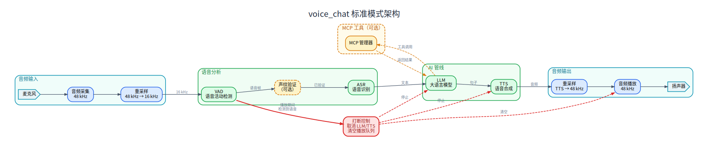

# Agent

## 1. 模块概述

`omni_agent` 是 SDK 中的端到端语音对话应用，位于 `application/native/omni_agent`。它把 audio、VAD、ASR、LLM、TTS、声纹和 MCP 工具调用组合成完整语音助手：

```text
AudioCapture -> VAD -> 声纹验证（可选） -> ASR -> LLM/MCP -> TTS -> AudioPlayer
```

### 1.1 整体架构图

下图覆盖标准 `voice_chat` 进程，不包含 `voice_chat_aec` 软件 AEC 模式。



当前主推标准 `voice_chat` 入口，默认构建不启用 `voice_chat_aec`。SDK 配套的音频子板提供硬件侧音频前处理能力，包括回声消除、降噪和 360° 声源方位估计（DOA，用于判断说话人方向）。常规语音对话默认使用硬件侧音频处理，不需要软件回采 AEC。

当前提供两个入口：

| 程序 | 源码入口 | 适用场景 |
| --- | --- | --- |
| `voice_chat` | `application/native/omni_agent/examples/voice_chat.cpp` | 标准模式，默认构建和主推入口，适合配套音频子板或外设自带音频处理的场景。 |
| `voice_chat_aec` | `application/native/omni_agent/examples/voice_chat_aec.cpp` | 可选软件回采 AEC 模式，启用 WebRTC AEC3，全双工 48kHz 音频链路，默认不编译。 |

主要依赖组件：

| 组件 | 路径 | 作用 |
| --- | --- | --- |
| audio | `components/multimedia/audio` | 音频采集、播放和重采样。 |
| VAD | `components/model_zoo/vad` | Silero VAD，检测说话开始、结束和 barge-in。 |
| ASR | `components/model_zoo/asr` | SenseVoice 等语音识别后端。 |
| TTS | `components/model_zoo/tts` | Matcha-TTS / Kokoro 语音合成。 |
| voiceprint | `components/model_zoo/voiceprint` | 可选说话人验证。 |
| MCP | `components/agent_tools/mcp` | 可选工具调用客户端。 |

## 2. 环境准备

### 前置条件

SDK 源码获取和基础编译环境配置统一参考 [2.3-构建编译](../02-快速入门/2.3-构建编译.md)。完成 SDK 初始化后，回到本文继续执行“构建编译”。

后续命令默认在 `spacemit_robot` SDK 根目录执行。

### 构建编译

Agent 使用 `target/k3-com260-omni-agent.json` 目标配置。首次构建建议在 SDK 根目录执行完整构建，确保 audio、VAD、ASR、TTS、声纹和 MCP 依赖都已生成：

```bash
source build/envsetup.sh
lunch k3-com260-omni-agent
m
```

只改 Agent 代码时，可以只编 `omni_agent`：

```bash
source build/envsetup.sh
lunch k3-com260-omni-agent
cd application/native/omni_agent
mm
```

默认只构建标准 `voice_chat`。如确实需要软件回采 AEC，再显式启用 `voice_chat_aec`：

```bash
cd application/native/omni_agent
mm -DUSE_AEC=ON
```

构建完成后，`voice_chat` 会安装到 `output/staging/bin`；显式启用 `USE_AEC=ON` 时，`voice_chat_aec` 也会安装到同一目录。加载 `build/envsetup.sh` 后可直接运行。

常用 CMake 选项：

| 选项 | 默认值 | 说明 |
| --- | --- | --- |
| `USE_MCP` | `ON` | 启用 MCP 工具调用支持。 |
| `USE_AEC` | `OFF` | 可选构建 WebRTC AEC3 软件回采版本 `voice_chat_aec`，默认关闭。 |

运行前还需要一个 OpenAI 兼容 LLM 服务。先安装 `llama-server` 工具包，并把 LLM 模型放到 `~/.cache/models/llm`：

```bash
sudo apt install llama.cpp-tools-spacemit

mkdir -p ~/.cache/models/llm
cd ~/.cache/models/llm
wget https://archive.spacemit.com/spacemit-ai/model_zoo/llm/Qwen3-0.6B-Q4_0.gguf
```

然后启动本地模型服务：

```bash
llama-server -m ~/.cache/models/llm/Qwen3-0.6B-Q4_0.gguf \
    -t 4 --reasoning-budget 0 --port 9191 --host 0.0.0.0
```

## 3. 示例使用

### 3.1 标准语音对话

```bash
voice_chat --llm-url http://localhost:9191 --tts matcha:zh-en
```

关键日志包括：

```text
[1/5] LLM 后端: http://localhost:9191 OK
[2/5] 初始化 VAD... OK (Silero VAD)
[3/5] 初始化 ASR... OK
[4/5] 初始化 TTS (matcha:zh-en)... OK
[5/5] 初始化音频设备... OK
[等待语音输入...]
```

常用参数：

| 参数 | 默认值 | 说明 |
| --- | --- | --- |
| `--llm-url <url>` | 必填 | OpenAI 兼容 LLM 服务地址。 |
| `--model <name>` | `qwen2.5:0.5b` | LLM 模型名。 |
| `--tts <engine>` | `matcha:zh` | `matcha:zh`、`matcha:en`、`matcha:zh-en`、`kokoro` 或 `kokoro:<voice>`。 |
| `-i, --input-device <id>` | 系统默认 | 录音设备索引。 |
| `-o, --output-device <id>` | 系统默认 | 播放设备索引。 |
| `-l, --list-devices` | 无 | 列出音频设备。 |
| `--capture-rate <hz>` | 16000 | 标准模式录音采样率。 |
| `--playback-rate <hz>` | 48000 | 播放采样率。 |
| `--mcp-config <path>` | 空 | MCP 配置文件。 |

### 3.2 启用声纹验证

先注册说话人：

```bash
register_speaker -n muggle -t 2
```

再启动语音对话并要求只接受 `muggle`：

```bash
voice_chat --llm-url http://localhost:9191 --tts matcha:zh-en \
    -vp --vp-database ./speakers.db --vp-threads 2 --vp-verify muggle
```

实测日志中，声纹通过时继续 ASR；不通过时丢弃音频：

```text
[VP] 验证 "muggle": 通过 (score: 0.717)
[ASR] 开始识别...
[VP] 验证 "muggle": 不通过 (score: 0.546)
[VP] 未识别说话人，丢弃音频
```

### 3.3 用户打断 barge-in

TTS 播放期间，VAD 会继续监听麦克风。当连续多帧检测到用户说话时，系统停止当前播放并中断 LLM 生成：

```text
[Barge-in] 用户打断 (连续5帧, prob=0.856)，停止播放
[LLM] 已因 barge-in 中断生成
[TTS] Barge-in 打断，保留音频缓冲区
```

标准 `voice_chat` 是默认推荐路径。配套音频子板已提供回声消除、降噪和 360° 声源方位估计（DOA）等硬件侧前处理；只有在没有硬件侧音频处理、且确实需要软件回采 AEC 时，才启用 `voice_chat_aec`。构建 `-DUSE_AEC=ON` 后运行：

```bash
voice_chat_aec --llm-url http://localhost:9191 --tts matcha:zh-en
```

`voice_chat_aec` 使用 `--sample-rate` 配置全双工采样率，不使用标准模式的 `--capture-rate` / `--playback-rate`。

### 3.4 MCP 工具调用

MCP 组件路径为 `components/agent_tools/mcp`，示例配置位于 `components/agent_tools/mcp/examples/configs/`：

| 配置 | 说明 |
| --- | --- |
| `config_stdio.json` | 通过 stdio 自动启动 Calculator 和 TimeService。 |
| `config_socket.json` | 连接 Unix Socket 服务。 |
| `config_http.json` | 连接 HTTP MCP 服务。 |
| `config_mixed.json` | 混合 stdio 与 socket。 |
| `config_registry.json` | 通过注册中心动态发现 HTTP 服务。 |

如果只连接已经部署好的远端 MCP 服务，`voice_chat` 侧只需要传入 `--mcp-config`。如果要运行仓库自带的 Python 示例服务，需要先创建并激活虚拟环境，再安装 MCP 服务端依赖：

```bash
sudo apt install python3-venv python-is-python3 python3-pip
python3 -m venv ~/.comm-env
source ~/.comm-env/bin/activate

python -m pip install flask mcp starlette uvicorn psutil \
    --prefer-binary \
    --retries 0 \
    --timeout 2 \
    --index-url https://git.spacemit.com/api/v4/projects/33/packages/pypi/simple \
    --extra-index-url https://mirrors.aliyun.com/pypi/simple/
```

这里使用 SpaceMIT PyPI 源作为主源，是为了获取 RISC-V 可用的原生依赖 wheel，例如 `pydantic-core`；同时用公开镜像作为补充源获取 `py3-none-any` 纯 Python 包。`--prefer-binary` 用于避免 pip 优先选择公开源上的新版源码包并触发本地编译。SpaceMIT 源没有的包可能会触发 GitLab PyPI 上游转发到 `pypi.org`，`--retries 0 --timeout 2` 用于快速跳过转发超时等待。

MCP 配置中的服务连接方式由 `type` 字段表示：

```json
{
  "servers": [
    {
      "name": "Calculator",
      "type": "stdio",
      "command": "python3",
      "args": ["examples/services/calculator/stdio_server.py"]
    },
    {
      "name": "SystemMonitor",
      "type": "socket",
      "path": "/tmp/mcp_system_monitor.sock"
    },
    {
      "name": "TimeService",
      "type": "http",
      "url": "http://localhost:8002/mcp"
    }
  ]
}
```

运行示例：

```bash
source ~/.comm-env/bin/activate
cd components/agent_tools/mcp/examples
./start_all_services.sh start

cd -
voice_chat --llm-url http://localhost:9191 \
    --tts matcha:zh-en \
    --mcp-config components/agent_tools/mcp/examples/configs/config_registry.json
```

MCP 场景建议显式使用 `--tts matcha:zh-en`。工具返回内容里经常包含英文、数字、系统字段名或路径，默认 `matcha:zh` 更适合纯中文文本，不适合朗读这类中英混合结果。

## 4. 应用开发

`omni_agent` 内部公共代码分布如下：

| 路径 | 说明 |
| --- | --- |
| `include/engine_init.hpp` / `src/engine_init.cpp` | 初始化 LLM、VAD、ASR、TTS、MCP、声纹。 |
| `include/voice_pipeline.hpp` / `src/voice_pipeline.cpp` | ASR -> LLM -> TTS 的对话流水线。 |
| `include/voice_common.hpp` / `src/voice_common.cpp` | TTS 后端解析、全局状态和公共工具函数。 |
| `include/aec_duplex_processor.hpp` / `src/aec_duplex_processor.cpp` | AEC 全双工音频处理。 |
| `include/mcp_helper.hpp` / `src/mcp_helper.cpp` | MCP 配置解析和工具格式转换。 |

如果要新增业务逻辑，优先在 `voice_pipeline` 周围扩展，不要把组件初始化、音频设备控制和 LLM/TTS 生成逻辑混在同一个函数里。新增 TTS 后端、ASR 后端或声纹策略时，应先在对应组件内完成封装，再由 `engine_init` 读取配置。

## 5. 调试指南

调试 Agent 时建议按链路分段确认，先保证 LLM 服务和音频设备可用，再检查 VAD、ASR、TTS、声纹和 MCP：

- 启动前用 `voice_chat -l` 列出音频设备，并用 audio 文档中的录音、播放命令单独验证。
- LLM 问题先检查 `llama-server` 是否监听在 `--llm-url` 对应地址，再看 `voice_chat` 初始化日志。
- 语音链路问题按 VAD 开始/结束、ASR 识别文本、LLM 回复、TTS 播放顺序定位。
- MCP 问题先独立运行 `components/agent_tools/mcp/examples` 下的服务，再传入 `--mcp-config`。
- barge-in 误触发优先记录播放音量、麦克风距离和是否使用硬件音频前处理。

## 6. 常见问题

| 现象 | 可能原因 | 处理 |
| --- | --- | --- |
| 启动时报必须指定 LLM 地址 | 未传 `--llm-url` | 启动 `llama-server` 后传入正确 URL。 |
| 没有麦克风或扬声器声音 | 设备索引不对 | `voice_chat -l` 查看设备，再用 `-i` / `-o` 指定。 |
| ASR 前几秒延迟大 | SenseVoice 首次 warmup | 以 warmup 后的后续轮次评估交互时延。 |
| 播放时误触发 barge-in | 麦克风收到扬声器回声 | 优先使用配套音频子板的回声消除和降噪能力，或降低音量；没有硬件侧处理时再启用 `voice_chat_aec`。 |
| 注册人经常识别不到 | 声纹分数低于阈值，或注册音频不够干净清晰 | 适当降低 `--vp-threshold`（默认 0.6），或重新录制干净、清晰、音量稳定的声纹样本。 |
| MCP 工具不可用 | 服务未启动或配置路径错 | 先用 MCP 示例独立验证，再传 `--mcp-config`。 |

## 附录：K3 实测结果

以下为 K3 平台实测结果：

| 场景 | 结果 |
| --- | --- |
| 标准 `voice_chat` 初始化 | LLM、VAD、ASR、TTS、音频设备均初始化成功。 |
| 声纹验证 | 通过样本 score 0.717 / 0.624 / 0.643；未通过样本被丢弃。 |
| ASR 对话轮次 | 2.18s 音频处理 0.31s，RTF 0.144；2.21s 音频处理 0.29s，RTF 0.129。 |
| TTS 流式回复 | 多轮中文回复整体 RTF 约 0.359-0.384。 |
| barge-in | 检测到连续 5 帧用户语音后停止播放并中断 LLM 生成。 |
| MCP 工具发现 | `config_registry.json` 连接 Calculator、TimeService、SystemMonitor 3 个 HTTP 服务，发现 17 个工具。 |
| MCP 工具调用 | SystemMonitor 返回系统概览；Calculator 计算 `11 × 12 = 132`；TimeService 返回 `Asia/Shanghai` 当前时间。 |
| MCP 场景 ASR | 三轮语音输入 RTF 分别为 1.456、0.126、0.118；首轮包含首次推理开销。 |
| MCP 场景 TTS | 工具回复流式合成 RTF 分别为 0.387、0.379、0.382。 |

**测试方法**：在 K3 板卡上使用 `target/k3-com260-omni-agent.json` 构建并启动本地 `llama-server`，分别运行标准语音对话、声纹验证、barge-in 和 MCP 配置示例；结果来自 `voice_chat` 初始化、ASR/TTS RTF、声纹 score 和 MCP 工具发现/调用日志。
