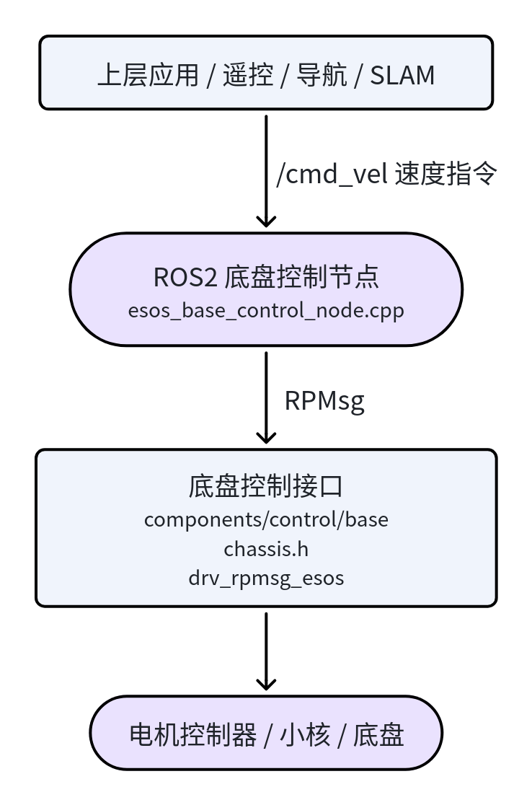
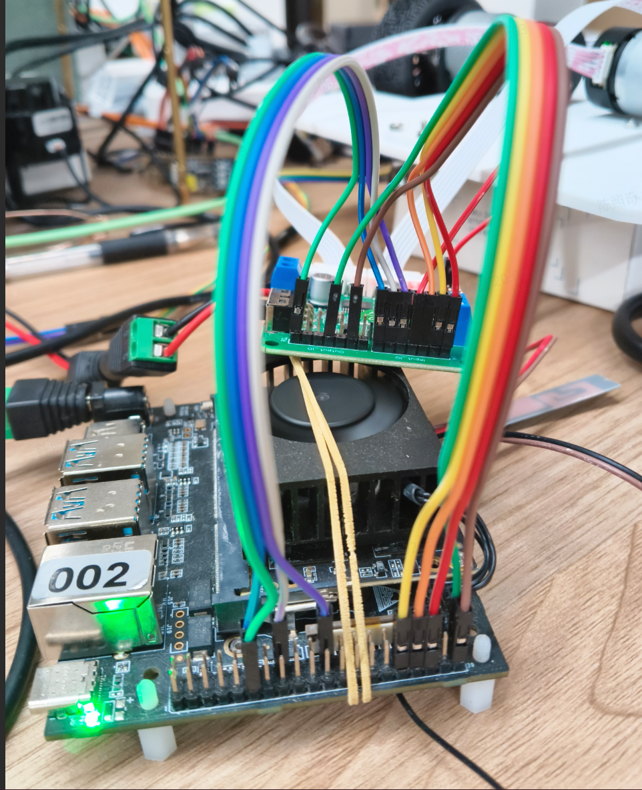
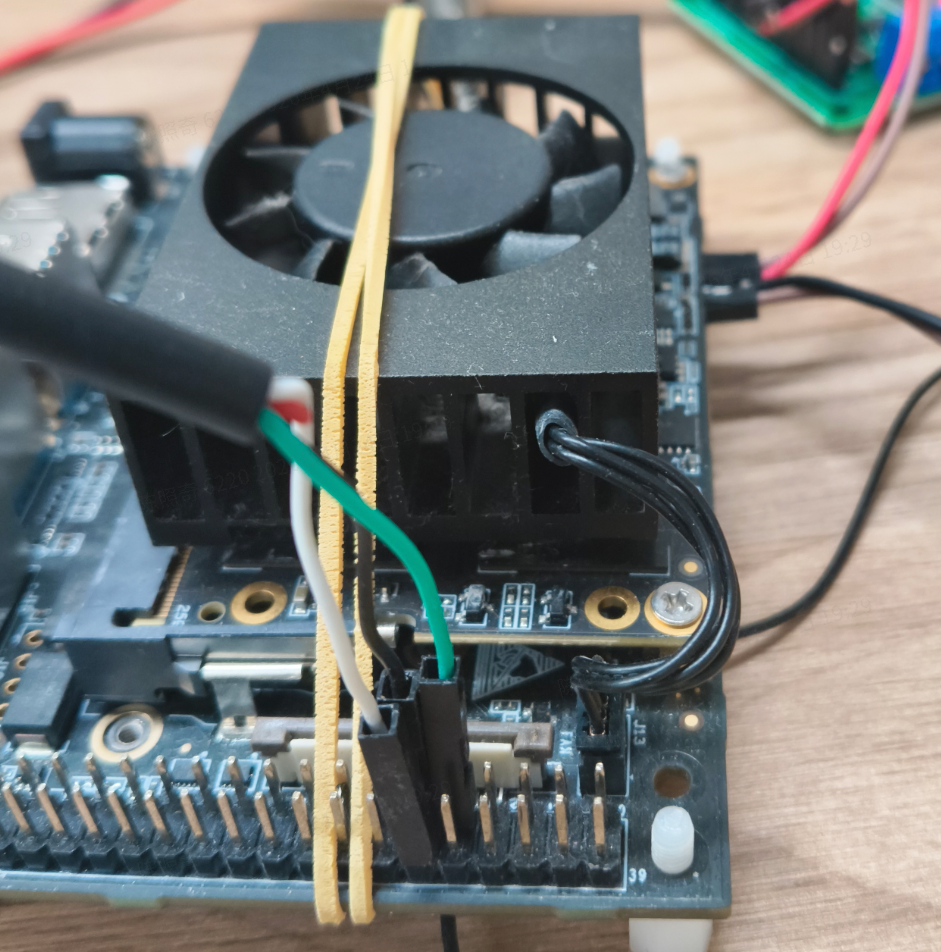
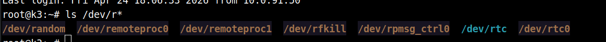
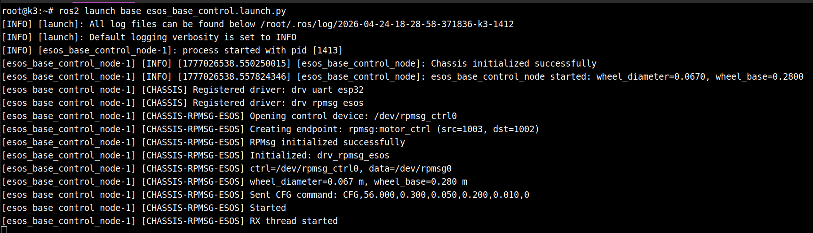
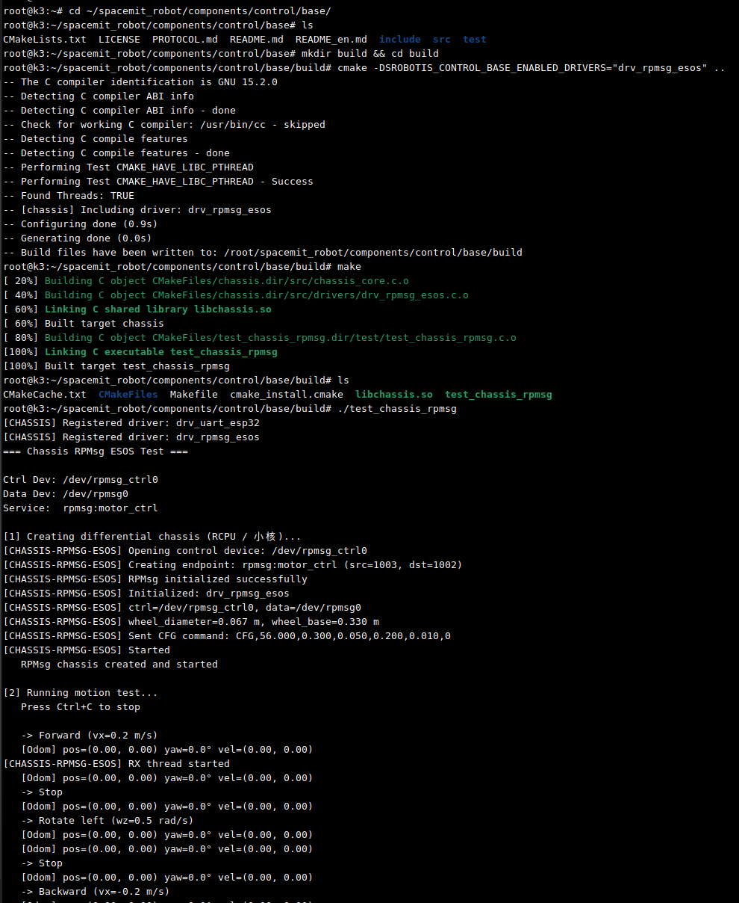

# 运动控制 · 底盘控制

## 1. 模块概述

- **主要功能**
  底盘控制模块位于机器人运动控制链路的底层与 ROS 2 接入层之间，负责将上层速度指令转换为底盘可执行的电机控制命令，并回传里程计数据。
  当前项目提供了两类接入路径：
  1. `components/control/base`：原生 C 底盘控制库，统一抽象多种底盘类型与通信驱动；
  2. `middleware/ros2/control/base` 与 `application/ros2/linksee`：ROS 2 节点与应用示例，完成 `/cmd_vel` 到 `/odom` 的闭环。
- **规格或特性**
  - 支持底盘类型：
    - 两轮差速 `CHASSIS_TYPE_DIFF_2WD`
    - 四轮差速 `CHASSIS_TYPE_DIFF_4WD`
    - 四轮麦克纳姆 `CHASSIS_TYPE_MECANUM_4WD`
    - 三轮全向 `CHASSIS_TYPE_OMNI_3WD`
    - 四轮全向 `CHASSIS_TYPE_OMNI_4WD`
  - 当前项目中已落地的主路径为**两轮差速底盘**
  - 支持驱动：
    - `drv_rpmsg_esos`：RPMsg 小核通信驱动
  - ROS 2 接口：
    - 订阅：`/cmd_vel`（`geometry_msgs/msg/Twist`）
    - 发布：`/odom`（`nav_msgs/msg/Odometry`）
    - 可选发布 TF：`odom -> base_footprint`
  - 默认参数：
    - 控制发送频率 `send_hz=20.0`
    - 里程计发布频率 `odom_hz=50.0`
    - 指令超时保护 `cmd_vel_timeout=0.4s`
    - 默认轮径 `wheel_diameter=0.067m`
    - 默认轮距 `wheel_base=0.183m` 或 `0.28m`（不同实现路径略有差异，部署时以 launch 参数为准）
- **软件框图**



- **相关目录结构**

| 路径 | 职责 |
| --- | --- |
| `components/control/base/` | 底盘控制基础库，提供统一 C API、底盘驱动抽象与协议实现 |
| `components/control/base/include/chassis.h` | 底盘类型、速度/位姿结构体、配置结构体、核心 API |
| `components/control/base/src/drivers/drv_rpmsg_esos.c` | RPMsg 底盘驱动 |
| `middleware/ros2/control/base/` | ROS 2 底盘控制节点封装 |
| `middleware/ros2/control/base/src/esos_base_control_node.cpp` | RPMsg 方案 ROS 2 节点实现 |
| `middleware/ros2/control/base/launch/esos_base_control.launch.py` | RPMsg 方案启动文件 |
| `application/ros2/linksee/launch/base_control_esos.launch.py` | ESOS/RPMsg 底盘控制启动示例 |

## 2. 环境准备

SDK 源码获取和基础编译环境配置统一参考 [Linksee参考方案](../../03-参考方案/3.2-移动机器人Linksee.md)。完成 SDK 初始化后，回到本文继续执

### 硬件连接

小核与电机驱动



小核串口连接



小核正常时串口打印:


### 前置条件

- **运行环境**

  - K3 Bianbu26
  - ROS 2 环境，仓库文档中已按 ROS 2 工作区方式组织，示例主要面向 ROS 2

- **依赖与外部资源**
  - 基础依赖安装：

  ```
  sudo apt update
  sudo apt install ros-dev-tools ros-humble-ros-base python3-numpy ros-humble-teleop-twist-keyboard \
  libpcap-dev libuvc-dev python3-serial
  ```

  - 确认已经执行小核替换

```
sudo apt update && sudo apt install -y --allow-downgrades wget
wget https://archive.spacemit.com/ros2/prebuilt/esos_kernel/update_esos.sh
bash update_esos.sh
```


- **环境变量与初始化**

  - SDK 构建环境：
    - `source build/envsetup.sh`
  - ROS 2 运行环境：
    - 全量构建后执行 `source ~/spacemit_robot/output/staging/setup.bash`

- **硬件与连接**

  - 支持的硬件接入方式：

  - 小核底盘设备节点：`/dev/rpmsg_ctrl0`

  - 需要正确连接底盘控制器、电机、编码器及供电
  - 轮径、轮距、电机方向需与实际机械参数一致

### 构建编译

- **获取代码**
  - 顶层目录为 `~/spacemit_robot`

- **本模块编译**

  **1）底层 C 库单独构建**

  工作目录：`components/control/base`

  ```bash
  cd ~/spacemit_robot/components/control/base
  mkdir build && cd build
  cmake -DSROBOTIS_CONTROL_BASE_ENABLED_DRIVERS="drv_rpmsg_esos" ..
  make
  ```

  **2）通过 SDK 统一构建（建议）**

  工作目录：仓库根目录

  ```bash
  source build/envsetup.sh
  lunch # 选择 linksee 方案
  m
  ```

- **产物说明**
  - SDK 统一构建输出目录：`~/spacemit_robot/output/staging`
  - 原生测试程序示例：
    - `components/control/base/test/test_chassis_uart.c` 对应测试二进制

- **常见差异说明**
  - `components/control/base` 是底层通用库
  - `application/ros2/linksee` 提供 ESOS / RPMsg 底盘控制集成示例

---

## 3. ROS2 示例使用

### 快速启动

**前置**：见 §2，已满足 ROS 2 环境，且 RPMsg 设备节点存在，ESOS 小核固件已正常工作。

**步骤 1**：确认 RPMsg 设备

```bash
ls /dev/rpmsg*
```

**预期现象**：

- 能看到 `/dev/rpmsg_ctrl0`设备节点



**步骤 2**：启动 ESOS 底盘控制节点

```bash
ros2 launch base esos_base_control.launch.py
```

如需显式指定参数：

```bash
ros2 launch base esos_base_control.launch.py \
  wheel_diameter:=0.067 \
  wheel_base:=0.183 \
  publish_tf:=true
```

**预期现象**：
- 节点成功启动
- 日志出现底盘初始化成功信息
- 无 `Failed to create chassis device` 错误



**步骤 3**：启动键盘控制节点

```bash
source /opt/ros/humble/setup.bash
ros2 run teleop_twist_keyboard teleop_twist_keyboard
```

**预期现象**：

- 使用i、j、, 、l 可以控制底盘电机运动

**步骤 4**：查看里程计输出

```bash
ros2 topic echo /odom
```

**预期现象**：
- 能收到里程计消息
- 位置和姿态随运动更新

### 可用参数解释

- 以下参数对应 `middleware/ros2/control/base/launch/esos_base_control.launch.py` 中的启动参数，可在执行 `ros2 launch base esos_base_control.launch.py` 时通过 `参数名:=参数值` 覆盖默认值。

| 参数名 | 默认值 | 说明 |
| --- | --- | --- |
| `send_hz` | `20.0` | 底盘控制命令发送频率，单位 Hz。值越大，速度指令下发越及时，但控制负载也会增加。 |
| `odom_hz` | `50.0` | 里程计发布频率，单位 Hz，用于控制 `/odom` 发布周期。 |
| `cmd_vel_timeout` | `0.4` | `/cmd_vel` 超时时间，单位秒。超过该时间未收到新速度指令时，节点会自动将底盘速度置零。 |
| `publish_tf` | `true` | 是否发布 `odom -> base_footprint` 的 TF 变换。若已有其他节点发布同名 TF，应关闭以避免冲突。 |
| `odom_topic` | `odom` | 里程计话题名称，默认发布到 `/odom`。 |
| `odom_frame` | `odom` | 里程计坐标系名称。 |
| `base_frame` | `base_footprint` | 机器人底盘坐标系名称。 |
| `wheel_diameter` | `0.067` | 车轮直径，单位米。需与实际轮子尺寸一致，否则会影响速度换算与里程计精度。 |
| `wheel_base` | `0.28` | 左右轮中心距，单位米。需与实际底盘轮距一致，否则会影响转向和位姿估计。 |
| `motor1_factor` | `1.0` | 电机 1 修正系数，用于补偿单侧轮速误差或安装差异。 |
| `motor2_factor` | `1.0` | 电机 2 修正系数，用于补偿另一侧轮速误差或安装差异。 |
| `reduction_ratio` | `56.0` | 电机减速比，应与实际电机/减速箱参数匹配。 |
| `ff_factor` | `0.3` | 前馈控制系数，用于改善电机速度响应。 |
| `pid_kp` | `0.05` | PID 比例项系数。 |
| `pid_ki` | `0.2` | PID 积分项系数。 |
| `pid_kd` | `0.01` | PID 微分项系数。 |
| `cfg_send_on_startup` | `true` | 节点启动时是否立即向底盘发送一次配置参数。建议保持开启。 |
| `feedback_enable` | `false` | 是否启用底盘反馈功能。小核固件支持状态上报，可开启。 |
| `rpmsg_ctrl_dev` | `/dev/rpmsg_ctrl0` | RPMsg 控制设备节点路径。 |
| `rpmsg_data_dev` | `/dev/rpmsg0` | RPMsg 数据设备节点路径。 |
| `rpmsg_service_name` | `rpmsg:motor_ctrl` | RPMsg 服务名称，需与小核侧注册服务名一致。 |
| `rpmsg_local_addr` | `1003` | RPMsg 本地地址，需与通信配置匹配。 |
| `rpmsg_remote_addr` | `1002` | RPMsg 远端地址，通常为小核服务地址。 |

**示例**：

```bash
ros2 launch base esos_base_control.launch.py \
  wheel_diameter:=0.067 \
  wheel_base:=0.28 \
  publish_tf:=true \
  feedback_enable:=false
```


---

## 4. 底层接口控制示例

### 直接编译示例

```
cd ~/spacemit_robot/components/control/base/
mkdir build && cd build
cmake -DSROBOTIS_CONTROL_BASE_ENABLED_DRIVERS="drv_rpmsg_esos" ..
make
```

### 运行示例

```
./test_chassis_rpmsg
```

终端输出：




## 5. 应用开发

- **API 接口**
  - 原生 C API 头文件：`components/control/base/include/chassis.h`
  - ROS 2 接口形态：
    - 输入话题：`/cmd_vel`
    - 输出话题：`/odom`
    - TF：`odom -> base_footprint`
  - 核心 C API：
    - `chassis_alloc()`
    - `chassis_set_velocity()`
    - `chassis_get_odom()`
    - `chassis_brake()`
    - `chassis_relax()`
    - `chassis_free()`
- **调用方式与注意点**
  - C 层使用方式：
    1. 准备 `chassis_uart_config` 或 `chassis_rpmsg_config`
    2. 调用 `chassis_alloc()` 创建设备
    3. 周期调用 `chassis_set_velocity()`
    4. 调用 `chassis_get_odom()` 获取速度与位姿
    5. 退出前调用 `chassis_brake()` 和 `chassis_free()`
  - 注意点：
    - `wheel_diameter`、`wheel_base` 必须与实物一致
    - ROS 2 节点存在 `cmd_vel_timeout` 超时保护，长时间不发控制命令会自动置零
    - 若系统中已有其他模块发布相同 TF，应关闭 `publish_tf` 避免冲突
    - `motor1_factor` / `motor2_factor` 用于左右轮修正，实车跑偏时需标定
- **参考 demo 或示例路径**
  - RPMsg launch：`middleware/ros2/control/base/launch/esos_base_control.launch.py`
  - ROS 2 C++ 节点：`middleware/ros2/control/base/src/esos_base_control_node.cpp`

---

## 6. 调试指南

- 常用调试手段
  - 检查控制输入：
    - `ros2 topic echo /cmd_vel`
  - 检查里程计输出：
    - `ros2 topic echo /odom`
  - 检查 TF：
    - `ros2 run tf2_ros tf2_echo odom base_footprint`
  - 检查 RPMsg 设备：
    - `ls -l /dev/rpmsg*`

- 建议的排障顺序
  1. 先确认设备节点是否存在
  2. 再确认底层库是否已正确构建
  3. 再确认 ROS 2 节点是否正常启动
  4. 最后检查 `/cmd_vel`、`/odom`、是否打通


---

## 7. 常见问题

| 现象 | 可能原因 | 处理 |
| --- | --- | --- |
| 节点启动成功但底盘不动 | 没有 `/cmd_vel` 输入；超时保护将速度清零；底层驱动不匹配 | `ros2 topic echo /cmd_vel`；适当调大 `cmd_vel_timeout`；确认 RPMsg 链路 |
| `/odom` 无数据 | 底盘驱动未返回反馈；底层设备未连通 | 检查 RPMsg 设备与底层驱动状态 |
| `/odom` 漂移或数值异常 | 轮径/轮距配置不准；左右轮修正未标定；地面打滑 | 重新标定 `wheel_diameter`、`wheel_base`、`motor1_factor`、`motor2_factor` |
| 机器人前进偏航 | 左右轮速度不一致；电机方向或接线有误 | 调整电机修正系数；检查接线与底层方向定义 |
| 转向方向相反 | 左右轮映射或旋转方向定义不一致 | 用低速分别测试前进/原地转向，修正电机方向或协议解释 |
| TF 冲突 | 系统中多个模块同时发布 `odom -> base_footprint` | 关闭其中一路 `publish_tf`，统一 TF 发布源 |
| ESOS 节点初始化失败 | `components/control/base` 未构建安装；RPMsg 设备缺失 | 先构建底层库；确认 `/dev/rpmsg*` 存在且小核固件正常 |

