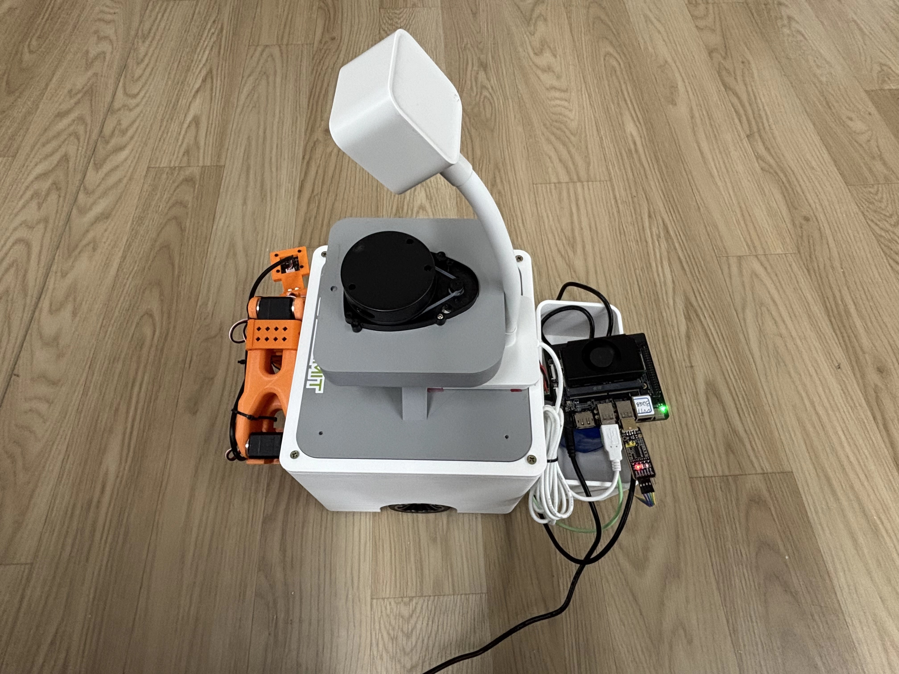

# 运动控制 · 机械臂控制

## 1. 模块概述

`manipulator` 组件提供统一的机械臂控制 C API，用于屏蔽底层硬件差异，并向上层提供机械臂实例创建、关节运动、直线运动、目标位姿控制、状态获取以及示教模式切换等能力。当前该组件已支持 HuggingFace 开源 [SO-101 机械臂](https://huggingface.co/docs/lerobot/en/so101#so-101) UART 驱动，并可通过插件机制扩展其他机械臂设备。  

### 规格特性

该模块具备以下功能：  

- 对外提供纯 C 接口，便于在 C/C++ 工程或上层服务中复用；  
- 支持关节空间运动（PTP / MoveJ）、笛卡尔目标位姿求解以及直线运动（MoveL，依赖 IK/FK 求解器）；  
- 支持在运行时绑定运动学求解器，当前可选 `dummy` 与 `pinocchio` 后端；  
- 支持 SO-101 五自由度机械臂控制，关节角单位为 `rad`，末端位置单位为 `m`；  
- 上层可通过高频周期调用 `manip_tick()` 推进控制流程，推荐控制周期约为 200Hz；  
- 支持校准流程，包括零位偏移与行程范围记录；  
- 支持硬件测试、运动学测试以及 dummy 驱动单元测试。  

### 代码结构

该模块代码位于 `components/control/manipulator`，整体结构如下：  

```
manipulator/
├── include/
│   ├── manipulator.h                    # 公共 API 接口
│   ├── kinematics_interface.h           # 运动学求解器接口
│   └── so101_utils.h                    # SO-101 工具定义
├── src/
│   ├── manipulator.c                    # 核心实现（驱动注册、设备管理）
│   ├── manipulator_core.h               # 内部头文件
│   ├── drivers/
│   │   ├── drv_dummy.c                  # Dummy 驱动（测试/占位）
│   │   └── drv_uart_so101.c             # SO-101 UART 驱动
│   └── kinematics/
│       ├── kinematics.c                 # 求解器注册框架
│       ├── kinematics_dummy.c           # Dummy 求解器
│       └── kinematics_pinocchio.cpp     # Pinocchio 后端
├── urdf/
│   └── so101.urdf                       # SO-101 简化 URDF
├── test/
│   ├── test_manipulator.c               # 单元测试
│   ├── test_kinematics.c                # 运动学测试
│   └── test_hw_so101.c                  # 硬件交互测试
├── CMakeLists.txt                       # 构建配置
├── package.xml                          # 依赖声明
├── LICENSE                              # Apache-2.0 许可证
├── NOTICE                               # 第三方归属声明
└── README.md                            # 本文档
```

## 2. 环境准备

### 前置条件

#### 硬件与连接

| 项目     | 内容                             |
| -------- | -------------------------------- |
| 硬件平台 | Spacemit K3 开发板               |
| 机械臂   | SO101 机械臂                     |
| 连接器   | 机械臂与 K3 开发板通过 UART 连接 |

机械臂关节通过一根总线控制，整体通过 USB 串口连接到 K3 开发板，如图所示：



#### 软件环境

| 项目 | 内容 |
| ---- | ---- |
| 操作系统 | Bianbu 3.0+ |
| 编译标准 | C99 / C++14                                                  |
| 基础工具 | `cmake`、`build-essential`                                   |
| 基础依赖 | `pthreads`、`libm`                                           |
| 控制依赖 | `pinocchio`、`components/peripherals/motor`、`components/control/grasp` |

#### 权限设置

UART 设备在 K3 板卡中常以 `/dev/ttyACM0` 形式出现，运行以下代码使得开发板获取机械臂的读写权限：

```Bash
sudo chmod 666 /dev/ttyACM0
```

首次上电前需确认线缆连接、电源容量与机械臂固定状态，避免碰撞。

### 构建编译

进入模块代码目录，构建编译： 

```bash
cd components/control/manipulator
mkdir build && cd build
cmake ..
make -j$(nproc)
```

默认会生成 `libmanipulator.so`，并复制 `urdf/` 到构建目录下。  

若需要完整启用 SO-101 驱动与 Pinocchio 运动学，可执行：  

```bash
cd components/control/manipulator
rm -rf build && mkdir build && cd build
cmake .. -DMANIP_BUILD_HW_TEST=ON
make -j$(nproc)
```

典型产物包括：  

| 产物 | 说明 |
| --- | --- |
| `build/libmanipulator.so` | 机械臂控制共享库 |
| `build/test_manipulator` | dummy 驱动单元测试 |
| `build/test_kinematics` | 运动学测试程序 |
| `build/test_hw_so101` | SO-101 硬件测试程序（需打开 `MANIP_BUILD_HW_TEST`） |

构建参数说明：  
- `MANIP_ENABLE_SO101_DRIVER=ON`：启用 SO-101 UART 驱动；  
- `MANIP_ENABLE_PINOCCHIO=ON`：启用 Pinocchio 运动学求解器，需先编译 Pinocchio；  
- `MANIP_BUILD_TESTS=ON`：启用基础单元测试；  
- `MANIP_BUILD_HW_TEST=ON`：编译 SO-101 硬件测试程序；  
- 若 `motor` 组件头文件未找到，SO-101 驱动会自动关闭；若 `pinocchio` 未找到，对应运动学功能将不可用。

## 3. 示例使用

### 3.1 示例一：基础框架与运动学验证

**前置**：见 §2。该示例无需连接真实机械臂，`pinocchio` 默认启用，需先完成其依赖安装与源码构建。

**步骤 1：**`pinocchio` 源码编译

```bash
# 下载编译依赖
sudo apt install -y cmake build-essential libeigen3-dev libboost-all-dev liburdfdom-dev

# 下载源码并编译
git clone --recursive -b v3.9.0 https://github.com/stack-of-tasks/pinocchio.git
cd pinocchio
mkdir build && cd build
cmake .. \
    -DCMAKE_BUILD_TYPE=Release \
    -DCMAKE_INSTALL_PREFIX=/usr/local \
    -DBUILD_PYTHON_INTERFACE=OFF \
    -DBUILD_TESTING=OFF \
    -DBUILD_WITH_COLLISION_SUPPORT=OFF
make -j$(nproc)
sudo make install
sudo ldconfig
```

**步骤 2**：进入模块目录并编译测试程序

```bash
cd components/control/manipulator
rm -rf build && mkdir build && cd build
cmake ..
make -j$(nproc)
```

运行完之后，将生成机械臂测试程序 `test_manipulator` 和运动学测试程序 `test_kinematics`：

```
➜  build git:(robot-dev) ✗ ll
-rwxrwxr-x 1 anny anny  12M Apr 18 15:11 libmanipulator.so
-rwxrwxr-x 1 anny anny  17K Apr 18 15:11 test_kinematics
-rwxrwxr-x 1 anny anny  17K Apr 18 15:11 test_manipulator
drwxrwxr-x 2 anny anny 4.0K Apr 18 15:10 urdf
```

**步骤 3**：运行 dummy 驱动单元测试

```bash
./test_manipulator
```

终端输出如下内容，表示机械臂驱动注册与基础框架逻辑正常。

```
[MANIP] Registered driver: dummy
[KIN] Registered solver: dummy
[MANIP] Registered driver: so101
[KIN] Registered solver: pinocchio
[MANIP] Driver not found: nonexistent
[MANIP] No driver found: nonexistent
=== manipulator test PASSED ===
```

**步骤 4**：运行运动学测试

```bash
./test_kinematics
```

预期现象：终端输出 Pinocchio 求解器加载信息，以及 FK/IK 测试结果：

```
[MANIP] Registered driver: dummy
[KIN] Registered solver: dummy
[MANIP] Registered driver: so101
[KIN] Registered solver: pinocchio
=== Kinematics Solver Test ===

1. Creating Pinocchio solver...
[KIN-Pinocchio] URDF loaded: so101  DOF=6  tip=gripper_frame_link (frame 15)
   Joints: 6

2. Testing Forward Kinematics...
   ✓ FK Success
   Position: [0.391, -0.000, 0.226]
   Quaternion: [0.707, 0.017, 0.707, 0.017]

3. Testing Inverse Kinematics...
   Target: same as FK result
   ✓ IK Success
   Joints: [0.000, 0.000, 0.000, 0.000, 0.000, 0.000]
   Position error: 0.000000 m
   ✓ FK/IK consistency verified

4. Cleanup...

=== Test PASSED ===
```

该步骤可用于验证：  
- URDF 模型可被正常加载；  
- FK 与 IK 计算链路正确；  
- 对 SO-101 这类 5 DOF 机械臂，推荐使用仅位置 IK 或位置强约束模式。

### 3.2 示例二：SO-101 硬件控制验证

**前置**：见 §2。将机械臂通过串口连接到 K3 开发板，并确认串口节点可访问。

**步骤 1：**`pinocchio` 源码编译

```bash
# 下载编译依赖
sudo apt install -y cmake build-essential libeigen3-dev libboost-all-dev liburdfdom-dev

# 下载源码并编译
git clone --recursive -b v3.9.0 https://github.com/stack-of-tasks/pinocchio.git
cd pinocchio
mkdir build && cd build
cmake .. \
    -DCMAKE_BUILD_TYPE=Release \
    -DCMAKE_INSTALL_PREFIX=/usr/local \
    -DBUILD_PYTHON_INTERFACE=OFF \
    -DBUILD_TESTING=OFF \
    -DBUILD_WITH_COLLISION_SUPPORT=OFF
make -j$(nproc)
sudo make install
sudo ldconfig
```

**步骤 2**：编译硬件测试程序

```bash
cd components/control/manipulator
rm -rf build && mkdir build && cd build
cmake .. -DMANIP_BUILD_HW_TEST=ON
make -j$(nproc)
```

在示例一的基础上增加 `test_hw_so101` 可执行文件，这是机械臂实体测试程序：

```
➜  build git:(robot-dev) ✗ ll
-rwxrwxr-x 1 anny anny  12M Apr 18 15:17 libmanipulator.so
-rwxrwxr-x 1 anny anny  47K Apr 18 15:17 test_hw_so101
-rwxrwxr-x 1 anny anny  17K Apr 18 15:17 test_kinematics
-rwxrwxr-x 1 anny anny  17K Apr 18 15:17 test_manipulator
drwxrwxr-x 2 anny anny 4.0K Apr 18 15:16 urdf
```

**步骤 3**：确认串口并配置权限，假设机械臂设备节点为 `/dev/ttyACM0`：

```bash
sudo chmod 666 /dev/ttyACM0
```

**步骤 4**：启动硬件测试程序。

```bash
./test_hw_so101
```

如需指定串口：

```bash
./test_hw_so101 /dev/ttyACM0
```

程序进入交互式菜单，可选择读取关节状态、单轴运动、归零、挥手演示、夹爪控制、状态监控、FK/IK 测试等功能。

```
[GRASP] Registered driver: dummy
[GRASP] Registered driver: so101_gripper
[MANIP] Registered driver: dummy
[KIN] Registered solver: dummy
[MANIP] Registered driver: so101
[KIN] Registered solver: pinocchio
============================================
  SO-101 机械臂硬件测试程序
  串口: /dev/ttyACM0
  波特率: 1000000
  关节 ID: 1-5, 夹爪 ID: 6
============================================

[1/2] 初始化机械臂 (5 DOF)...
[Feetech] Factory: motor_id=1, baud=1000000
serial speed 1000000
[Feetech] Initialized pack for device: /dev/ttyACM0
[Feetech] Factory: motor_id=2, baud=1000000
[Feetech] Factory: motor_id=3, baud=1000000
[Feetech] Factory: motor_id=4, baud=1000000
[Feetech] Factory: motor_id=5, baud=1000000
[SO101] 所有关节参数配置完成 (P=16 I=0 D=0 ACC=254)
[SO101] 未找到校准文件，使用默认参数
[SO101] 建议执行 assemble + calibrate 流程
[KIN] Using default solver: pinocchio
[KIN-Pinocchio] URDF loaded: so101  DOF=6  tip=gripper_frame_link (frame 15)
[SO101] Kinematics solver attached (FK/IK enabled)
  ✓ 机械臂初始化成功
[2/2] 初始化夹爪 (ID=6)...
[Feetech] Factory: motor_id=6, baud=1000000
[SO101-Gripper] 未找到校准数据，使用默认范围
[SO101-Gripper] 夹爪参数及过载保护配置完成 (MaxTorque=500 ProtCurrent=250 OverloadTrq=25)
  ✓ 夹爪初始化成功
[3/3] 初始化运动学求解器...
[KIN] Using default solver: pinocchio
[KIN-Pinocchio] URDF loaded: so101  DOF=6  tip=gripper_frame_link (frame 15)
[3/3] 初始化运动学求解器...
[KIN] Using default solver: pinocchio
[KIN-Pinocchio] URDF loaded: so101  DOF=6  tip=gripper_frame_link (frame 15)
  ✓ 运动学求解器初始化成功
  (FK/IK 测试功能已启用)

[初始状态]

=== 测试 1: 读取关节状态 ===
  关节角度 (共 5 轴):
    [1] -0.11 rad  (-6.5°)
    [2] -1.63 rad  (-93.3°)
    [3] 1.53 rad  (87.7°)
    [4] 1.28 rad  (73.3°)
    [5] -0.05 rad  (-2.6°)
  夹爪状态: IDLE
  夹爪位置: 2.0%  负载: 0.0

╔═══════════════════════════════════════╗
║   SO-101 机械臂硬件测试               ║
╠═══════════════════════════════════════╣
║  1. 读取关节状态                       ║
║  2. 单轴运动                           ║
║  3. 关节归零 (所有轴回 0°)             ║
║  4. 挥手演示动作                       ║
║  5. 末端执行器控制                     ║
║  6. 急停 (释放所有扭矩)               ║
║  7. 状态监控 (连续打印)               ║
║  8. 手动输入 5 轴角度                  ║
║ ─── 组装 & 校准 ────────────────────  ║
║  9. 组装 (Assemble) — 配置舵机参数     ║
║ 10. 校准 (Calibrate) — 中位 + 行程     ║
║ 11. 读取舵机寄存器                     ║
║ ─── 运动学测试 ──────────────────────  ║
║ 12. 正运动学 (FK) 测试                 ║
║ 13. 逆运动学 (IK) 测试                 ║
║ 14. FK/IK 往返一致性测试               ║
║ 15. 直线运动 (move_line) 测试          ║
║  0. 退出                               ║
╚═══════════════════════════════════════╝
  请选择: 
```

**首次使用时建议先执行组装与校准流程，再进行运动测试。**校准完成后，零位和行程数据会被保存，后续 `manip_get_state()` 和运动控制会更准确。

> [!NOTE]
>
> 1. 首次上电测试时，请确保机械臂底座固定可靠，机械臂周围无障碍物，避免测试过程中发生碰撞。
> 2. 首次运行务必先执行组装与校准流程，探索机械臂可达边界，避免盲目运动导致电机损坏。
> 3. SO-101 机械臂各关节名称对应关系参考 LeRobot 开源社区介绍：[https://huggingface.co/docs/lerobot/en/so101#so-101](https://huggingface.co/docs/lerobot/en/so101#so-101)。

## 4. 应用开发

#### 对外 API 或接口形态

- 公共头文件：`components/control/manipulator/include/manipulator.h`  
- 运动学接口头文件：`components/control/manipulator/include/kinematics_interface.h`  
- 动态库产物：`libmanipulator.so`  
- 常用接口包括：  
  - `manip_alloc()` / `manip_free()`：用于机械臂实例的创建与释放  
  - `manip_move_joints()`：用于关节空间运动控制  
  - `manip_move_line()`：用于笛卡尔空间直线运动控制  
  - `manip_move_target()`：用于目标位姿运动控制  
  - `manip_solve_target_joints()`：仅执行逆运动学求解，不直接下发运动  
  - `manip_get_state()`：用于获取关节状态与末端位姿信息  
  - `manip_set_kinematics()`：用于绑定 FK / IK 求解器  
  - `manip_tick()`：用于周期性推进控制状态机  

#### 调用方式与注意点 

- 可通过 `manip_alloc("so101", &cfg)` 创建机械臂实例；其中 `cfg` 可配置串口路径、波特率、舵机 ID、URDF 路径以及运动学求解器名称等参数；  
- 机械臂实例使用结束后，应调用 `manip_free()` 及时释放资源；  
- 若上层业务依赖末端位姿获取或 MoveL 控制，需先绑定运动学求解器，否则相关接口可能返回 `MANIP_ERR_NOSYS`；  
- `manip_move_line()` 会优先调用驱动侧原生实现；若当前驱动未提供该能力，则会自动回退为“IK → MoveJ”控制流程；  
- 对于实时控制场景，建议以较高频率调用 `manip_tick(dev, dt_s)`，使驱动持续下发轨迹点或运动指令；  
- 在进行硬件控制时，需重点关注串口权限、供电能力以及机械臂实际运动安全范围；  
- 运动学求解器绑定后，其生命周期和所有权由 `manip_dev` 接管，业务侧不应重复手动释放。  

#### 参考 demo 或示例路径

```
components/control/manipulator/test/test_manipulator.c   # 基础框架与 dummy 驱动单元测试示例
components/control/manipulator/test/test_kinematics.c    # FK / IK 运动学求解与一致性验证示例
components/control/manipulator/test/test_hw_so101.c      # SO-101 实体机械臂硬件交互测试示例
components/control/manipulator/README.md                 # 模块说明、构建方法与接口参考文档
```

## 5. 调试指南

- 可先运行 `test_manipulator` 验证驱动注册和基础框架是否正常，再运行 `test_kinematics` 验证 URDF 与运动学链路，最后连接真实硬件运行 `test_hw_so101`，按“软件 → 算法 → 硬件”顺序逐层排查。  
- 若编译日志中出现 `Pinocchio not found`，说明 FK/IK 后端未启用，需检查 `pinocchio` 是否已正确安装，并执行 `sudo ldconfig` 更新库缓存。  
- 若运行 `manip_alloc("so101", ...)` 失败，可检查 `motor` 组件头文件与库是否已正确编译、链接，以及 CMake 输出中是否显示 `SO-101 driver enabled`。  
- 若机械臂无响应，可检查：  
	- 串口节点是否正确；  
	- 串口权限是否已开放；  
	- 波特率是否为默认 1000000；  
	- 舵机 ID 是否为 1~5；  
	- 电源电流是否足够。  
- 若校准后零位不准，需重新执行校准，确认校准时各关节位于精确中位，且校准文件已正确保存。  
- 与硬件/驱动同事联调时，建议同步提供以下信息：  
	- 串口设备节点与权限状态；  
	- 舵机 ID、波特率、电源规格；  
	- 编译选项（是否启用 `MANIP_ENABLE_SO101_DRIVER` / `MANIP_ENABLE_PINOCCHIO`）；  
	- 测试程序输出日志；  
	- 是否能独立完成单元测试、运动学测试和硬件测试。

## 6. 常见问题

| 现象 | 可能原因 | 处理 |
| --- | --- | --- |
| 编译时提示找不到 `pinocchio` | `pinocchio` 未安装，或安装路径不在默认搜索路径 | 按模块 README 源码编译安装 `pinocchio`，执行 `sudo ldconfig`，必要时通过 `-DCMAKE_PREFIX_PATH` 指定安装路径 |
| `manip_alloc("so101", ...)` 返回空 | SO-101 驱动未编译进库，或 `motor` 头文件未找到 | 检查 CMake 输出，确认 `MANIP_ENABLE_SO101_DRIVER=ON` 且 `motor` 组件可见 |
| 运行硬件测试时提示连接失败 | 串口节点错误、权限不足、波特率不匹配或舵机未上电 | 检查 `/dev/ttyACM*` / `/dev/ttyUSB*`，开放权限，确认 1Mbaud 与舵机供电正常 |
| `manip_move_line()` 返回未实现 | 未绑定运动学求解器，或当前驱动未实现 MoveL | 先调用 `manip_set_kinematics()` 绑定求解器，或改用 `manip_move_joints()` |
| 校准后零位偏差较大 | 校准时关节未处于准确中位，或校准文件保存异常 | 重新执行校准流程，确认中位姿态准确并检查校准文件 |
