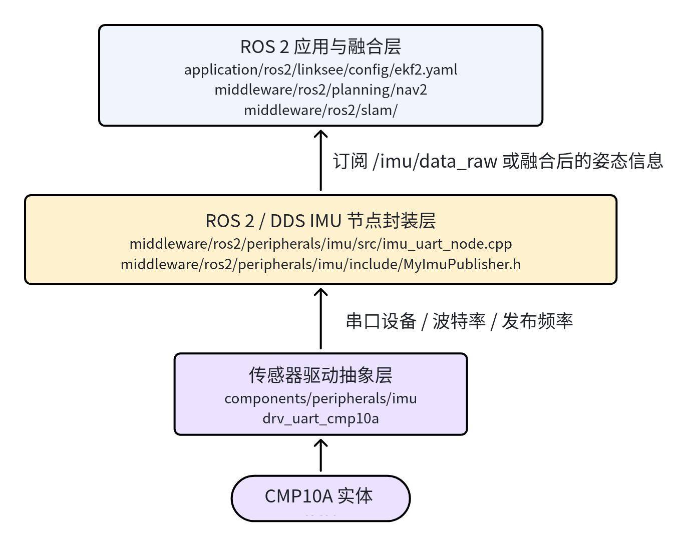
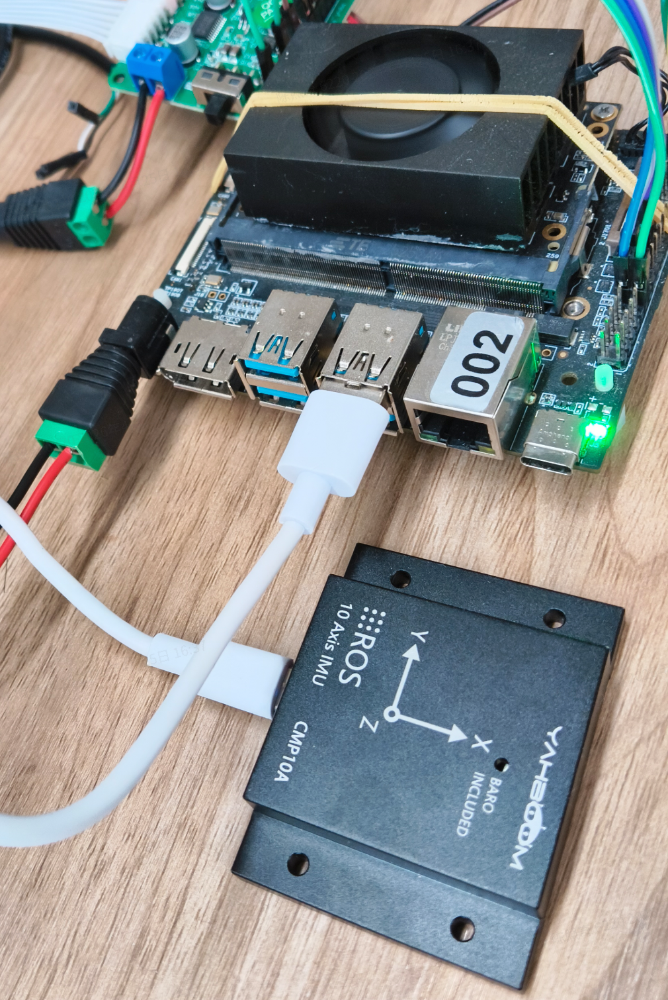
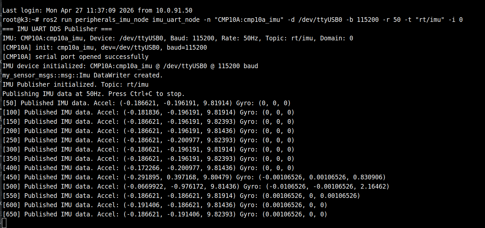
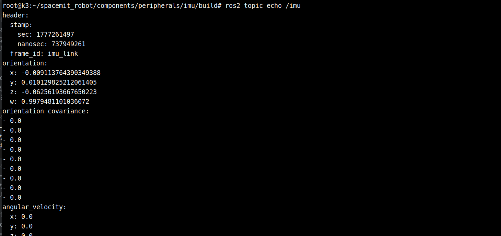

# 基础传感器 · IMU

## 1. 模块概述

- **主要功能**：本模块提供项目内统一的 IMU 接入能力，负责从底层 `CMP10A` 串口 IMU 读取加速度、角速度、姿态等惯性数据，并在 ROS 2 / DDS 链路中发布给上层定位、状态估计与导航模块使用。在当前工程里，IMU 主要服务于 `linksee` 移动机器人方案，用于与底盘里程计配合，给 `robot_localization` 等模块提供航向角与角速度输入。
- **规格或特性**：
	- 当前默认驱动：`drv_uart_cmp10a`；
	- 接口形态：UART 串口 IMU；
	- 底层组件默认示例波特率：`115200`；
	- ROS 2 侧节点：`peripherals_imu_node/imu_uart_node`；
	- 默认 DDS 话题：`rt/imu`；
	- `linksee` EKF 配置中默认订阅 ROS 侧 IMU 话题：`/imu/data_raw`；
	- 组件侧测试程序中 `CMP10A` 典型输出频率为 `50Hz`，ROS 2 节点支持通过参数调整发布频率。
- **软件框图**：当前工程中，IMU 在 ROS 2 使用链路中的位置如下：



- **相关目录结构**：

| 路径 | 职责 |
| --- | --- |
| `components/peripherals/imu/` | IMU 组件抽象层，统一管理不同 IMU 驱动 |
| `components/peripherals/imu/src/drivers/drv_uart_cmp10a.c` | `CMP10A` 串口驱动实现 |
| `components/peripherals/imu/test/test_imu_uart.c` | 组件层串口 IMU 最小化测试程序 |
| `middleware/ros2/peripherals/imu/` | IMU 的 ROS 2 / FastDDS 节点封装 |
| `middleware/ros2/peripherals/imu/src/imu_uart_node.cpp` | IMU 串口读取并发布 DDS 数据的节点 |
| `application/ros2/linksee/config/ekf2.yaml` | `linksee` 方案中的 EKF 融合配置，包含 IMU 融合参数 |
| `target/k3-com260-linksee.json` | `linksee` 目标板配置，默认启用 `components/peripherals/imu` 与 `drv_uart_cmp10a` |

## 2. 环境准备

### 2.1 前置条件

- **代码获取**

  SDK 源码获取和基础编译环境配置统一参考 [Linksee参考方案](../../03-参考方案/3.2-移动机器人Linksee.md)。完成 SDK 初始化后，回到本文继续执行

- **运行环境**：
	- 推荐板端环境：`k3-com260` + 项目支持的系统镜像；
	- ROS2 版本：ROS 2 Humble；
- **依赖与外部资源**：
	- 已安装 ROS 2 Humble 基础环境，`sudo apt install ros-humble-ros-base`
	- IMU 底层库由 `components/peripherals/imu` 提供，ROS 2 节点依赖该库；
- **环境变量与初始化**：

```bash
source ~/spacemit_robot/output/staging/setup.bash
```

- **硬件与连接**：
  - 
  - 板型：`k3-com260` 或兼容板卡；
  - 外设：`CMP10A` 串口 IMU；
  - 连接方式：通过板载串口或 USB 转串口接入，最终映射为 `/dev/ttyUSB*` 或 `/dev/ttyS*`；
  - 使用前需确认供电稳定、接线牢固，并明确 IMU 安装方向与机体坐标系的关系。

- **工具与权限**：
  - 需要具备串口设备访问权限；
  - 常用调试工具包括 `ros2 topic list`、`ros2 topic echo`、`rviz2`、`grep`；
  - 若提示串口权限不足，可将当前用户加入 `dialout` 组，或临时调整设备权限。

### 构建编译

- **本模块编译**：

  ```
  cd ~/spacemit_robot/
  source build/envsetup.sh
  lunch # 选择linksee方案
  m # 全量编译
  ```

- **产物说明**：
	- 整仓构建后的运行环境位于 `output/staging/`；
	- 组件层测试程序会生成 `test_imu_uart`；
	- ROS 2 侧可执行程序为 `imu_uart_node`。
- **常见差异说明**：
	- 组件层 README 中示例波特率通常使用 `115200`，而 ROS 2 节点源码默认参数为 `9600`，实机运行时应以传感器实际配置为准，建议显式传入 `-b 115200`；
	- 当前 `linksee` 工程中未发现单独的 IMU Launch 文件，通常需要手动启动 IMU 节点，并再接入 EKF 或其它上层模块。

## 3. 示例使用

本节偏向当前项目的 ROS 2 侧使用方式，示例命令尽量沿用 `linksee` 方案中的环境准备与运行习惯。

**前置**：IMU 已正确接入板端，已确认实际串口设备节点，例如 `/dev/ttyUSB0`。

**所有终端均需要加载 `linksee` 运行环境**

```bash
source ~/spacemit_robot/output/staging/setup.bash
```

**步骤 1：启动 IMU ROS 2 / DDS 节点**

新开终端执行：

```bash
ros2 run peripherals_imu_node imu_uart_node -n "CMP10A:cmp10a_imu" -d /dev/ttyUSB0 -b 115200 -r 50 -t "rt/imu" -i 0
```

**预期现象**：终端打印 `IMU device initialized`、`IMU Publisher initialized` 等日志，并按设定频率输出发布状态。

终端输出：



**步骤 2：检查 IMU 话题或桥接后的 ROS 侧话题**

```bash
ros2 topic list | grep imu
```

若系统中已存在从 DDS 到 ROS 2 的桥接链路，再执行：

```bash
ros2 topic echo /imu
```

**预期现象**：可以看到 `sensor_msgs/msg/Imu` 类型数据，且 `application/ros2/linksee/config/ekf2.yaml` 中的 `imu0: /imu/data_raw` 可与之对接。

终端输出



### 参数解释

| 选项 | 变量       | 类型          | 默认值                | 说明                                             |
| ---- | ---------- | ------------- | --------------------- | ------------------------------------------------ |
| `-n` | imu_name   | `const char*` | `"CMP10A:cmp10a_imu"` | IMU 设备名称，传给底层 imu_alloc_uart()。        |
| `-d` | dev_path   | `const char*` | `"/dev/ttyUSB1"`      | 串口设备路径。                                   |
| `-b` | baud       | `uint32_t`    | `9600`                | 串口波特率。                                     |
| `-r` | rate       | `uint32_t`    | `50`                  | IMU 采样与发布频率，单位 Hz。有效范围 `1-1000`。 |
| `-t` | topic_name | [std::string] | `"rt/imu"`            | DDS 发布的 IMU 话题名。                          |
| `-i` | domain_id  | `int`         | `0`                   | DDS 域 ID。                                      |
| `-h` | 无         | -             | -                     | 显示帮助信息并退出。                             |


## 4. 应用开发

- **对外 API 或接口形态**：
	- 组件层 C API：`imu_alloc_uart`、`imu_init`、`imu_read`、`imu_free`；
	- ROS 2 侧可执行入口：`ros2 run peripherals_imu_node imu_uart_node`；
	- DDS 默认话题：`rt/imu`；
	- `linksee` 融合配置中的 ROS 话题：`/imu/data_raw`；
	- 关键配置文件：`application/ros2/linksee/config/ekf2.yaml`。
- **调用方式与注意点**：
	- 串口设备、波特率、发布频率建议始终通过命令行显式指定，不要完全依赖默认值；
	- `imu_uart_node` 退出时会自动释放 `imu_dev_`，但异常拔插串口设备时仍需重点关注读失败与重启恢复；
	- 若 IMU 安装方向与机体坐标不一致，应通过底层 `mounting_matrix` 或上层坐标变换做修正；
	- 若用于 `robot_localization`，需确认 IMU 数据满足 REP-103/REP-105 的坐标约定，尤其是航向角方向、角速度单位以及是否移除重力加速度；
	- 当前工程里 `provider_odom.lua` 中 `TRAJECTORY_BUILDER_2D.use_imu_data = false`，说明并非所有 SLAM 链路默认启用 IMU，接入前要先核对具体上层模块配置。
- **参考 demo 或示例路径**：
	- `components/peripherals/imu/README.md`
	- `components/peripherals/imu/test/test_imu_uart.c`
	- `middleware/ros2/peripherals/imu/README.md`
	- `middleware/ros2/peripherals/imu/src/imu_uart_node.cpp`
	- `application/ros2/linksee/config/ekf2.yaml`
	- `3.2-移动机器人linksee.md` 中的底盘与里程计启动命令

## 5. 调试指南

- **先验证串口，再验证 ROS 2**：先跑 `test_imu_uart` 确认硬件链路通，再启动 `imu_uart_node`，避免在底层未通时直接排查 EKF 或导航问题。
- **重点核对串口参数**：`CMP10A` 组件层文档默认示例使用 `115200`，而 ROS 2 节点默认参数是 `9600`。若忘记显式传 `-b 115200`，常见现象是节点能启动但数据异常或读取失败。
- **优先检查话题与配置是否一致**：`linksee` 的 `ekf2.yaml` 默认订阅 `/imu/data_raw`，而 IMU ROS 2 节点 README 中默认发布的是 `rt/imu`。若没有桥接或重映射，EKF 将收不到 IMU 数据。
- **常用检查命令**：
	- `ls -l /dev/ttyUSB0`：确认设备节点是否存在；
	- `ros2 topic list | grep imu`：确认 IMU 相关话题是否出现；
	- `ros2 topic echo /imu/data_raw`：确认 ROS 侧是否已有标准 IMU 消息；
	- `grep -n "imu0" ~/spacemit_robot/application/ros2/linksee/config/ekf2.yaml`：快速核对 EKF 输入配置。
- **与硬件/内核同事联调时建议收集**：
	- IMU 型号、接线方式、设备节点、波特率；
	- 传感器安装方向、是否做过坐标变换；
	- 静止时的加速度 / 角速度原始输出；
	- ROS 2 节点日志、底层测试程序日志；
	- 当前桥接链路或话题重映射方式。

## 6. 常见问题

| 现象 | 可能原因 | 处理 |
| --- | --- | --- |
| `imu_uart_node` 启动后提示 `Failed to allocate IMU device` | 串口设备不存在、权限不足、设备路径写错 | 检查 `/dev/ttyUSB*` 或 `/dev/ttyS*` 是否存在；确认用户有权限访问串口；必要时调整设备权限或加入 `dialout` 组 |
| 节点启动成功但 IMU 数据异常、姿态跳变明显 | 波特率与传感器实际设置不一致 | 不要使用默认值，显式指定 `-b 115200`，并与上位机或传感器配置保持一致 |
| EKF 启动后看不到 IMU 融合效果 | IMU 节点输出话题与 `ekf2.yaml` 配置不一致 | 核对 `rt/imu`、`/imu/data_raw` 之间是否有桥接、重映射或转换；确保 EKF 真正订阅到数据 |
| 静止时航向持续漂移 | 陀螺零偏较大、安装方向不正确、坐标约定不一致 | 先用底层测试程序观察原始数据；必要时做零偏校准；检查安装方向与坐标系转换 |
| 启动导航或建图后仍表现不稳定 | 直接跳过底层验证，IMU、里程计、雷达链路未逐步打通 | 按“IMU 原始读数 → ROS 2 话题 → EKF 融合 → 建图/导航”的顺序逐层验证 |
