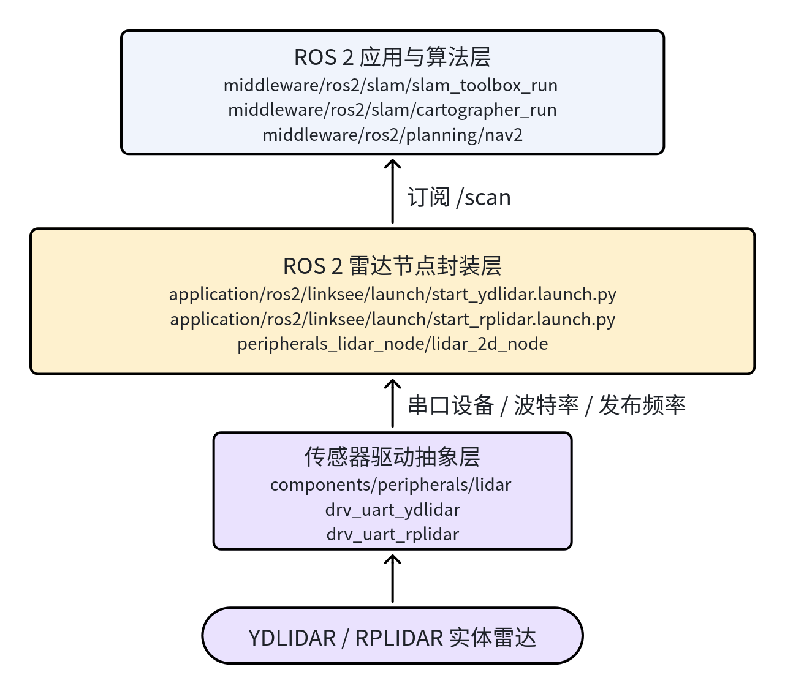
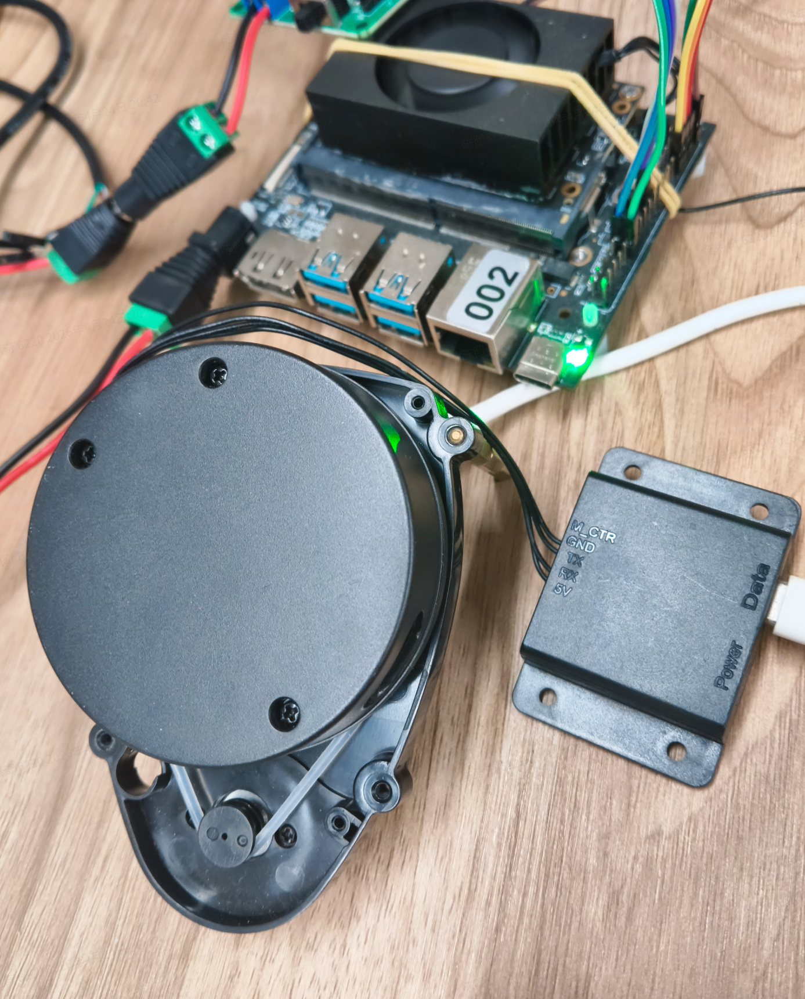
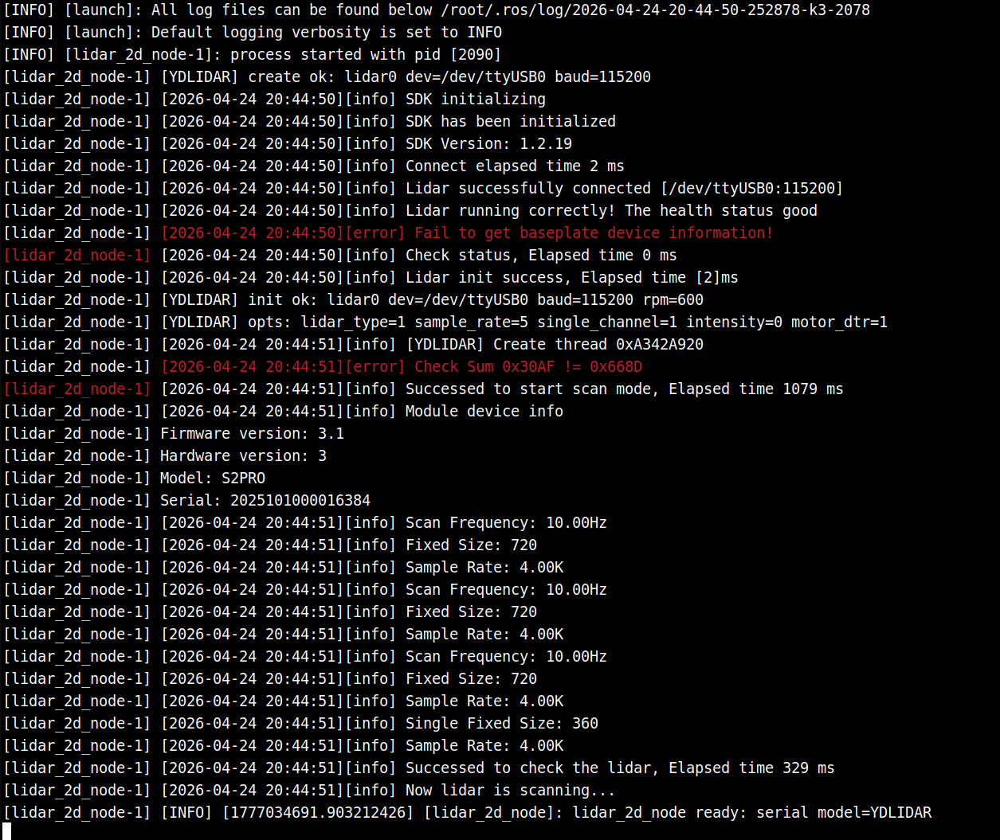
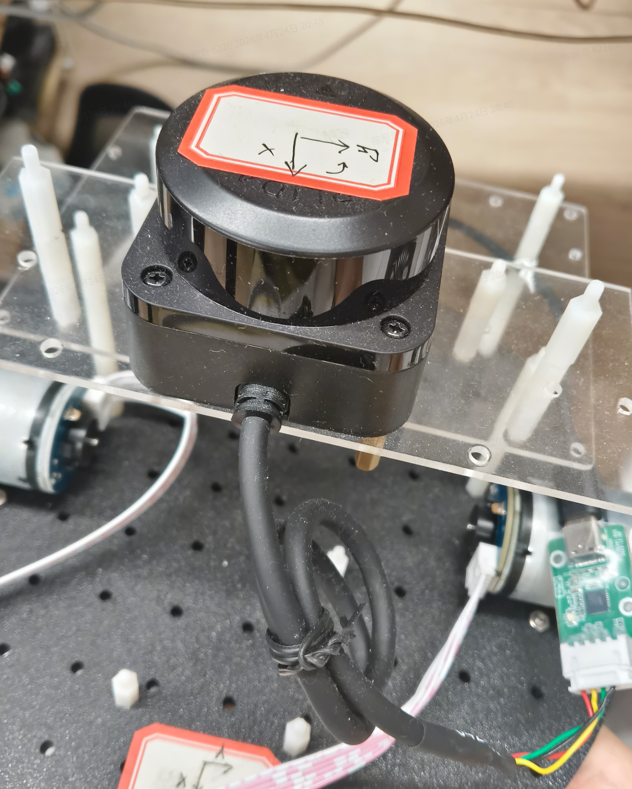
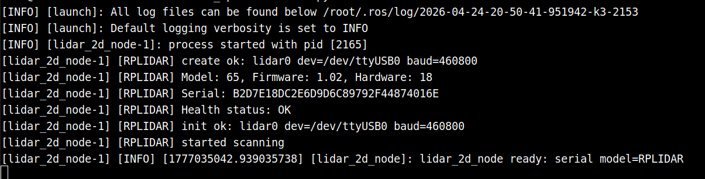

# 基础传感器 · 雷达

## 1. 模块概述

- **主要功能**：本模块提供项目内统一的 2D 激光雷达接入能力，屏蔽不同厂商雷达的驱动差异，为 ROS 2 上层应用稳定发布 `LaserScan` 数据。在当前工程里，雷达通常作为 `linksee` 移动机器人方案中的基础传感器使用，为 `slam_toolbox`、`cartographer`、`nav2` 等模块提供 `/scan` 输入。
- **规格或特性**：
	- 支持驱动：`YDLIDAR`、`RPLIDAR`；
	- 接口形态：串口型 2D 激光雷达，默认设备节点为 `/dev/ttyUSB0`；
	- ROS 2 节点：`peripherals_lidar_node` 包中的 `lidar_2d_node`；
	- 默认输出话题：`/scan`；
	- 默认坐标系：`laser_link`；
	- 典型参数：10Hz 扫描频率、量程 `0.1m ~ 30m`；
	- `YDLIDAR X3 Pro` 默认串口波特率为 `115200`，`RPLIDAR C1` 默认串口波特率为 `460800`。
- **软件框图**：当前工程中，雷达模块在 ROS 2 使用链路中的位置如下：



- **相关目录结构**：

| 路径 | 职责 |
| --- | --- |
| `components/peripherals/lidar/` | 雷达组件抽象层，统一管理不同型号驱动 |
| `components/peripherals/lidar/src/drivers/drv_uart_ydlidar/` | `YDLIDAR` 串口驱动实现 |
| `components/peripherals/lidar/src/drivers/drv_uart_rplidar/` | `RPLIDAR` 串口驱动实现 |
| `application/ros2/linksee/launch/start_ydlidar.launch.py` | `linksee` 方案下 `YDLIDAR` 的 ROS 2 启动入口 |
| `application/ros2/linksee/launch/start_rplidar.launch.py` | `linksee` 方案下 `RPLIDAR` 的 ROS 2 启动入口 |
| `application/ros2/linksee/config/ydlidar_x3_pro.yaml` | `YDLIDAR X3 Pro` 默认 ROS 2 参数配置 |
| `application/ros2/linksee/config/rplidar_c1.yaml` | `RPLIDAR C1` 默认 ROS 2 参数配置 |
| `application/ros2/linksee/README.md` | `linksee` 包中文说明，包含基础启动顺序 |

## 2. 环境准备

### 前置条件

SDK 源码获取和基础编译环境配置统一参考 [Linksee参考方案](../../03-参考方案/3.2-移动机器人Linksee.md)。完成 SDK 初始化后，回到本文继续执行

- **运行环境**：
	- 推荐系统：K3 板端 Bianbu / Ubuntu 兼容运行环境；
	- ROS 版本：ROS 2 Humble；
	- 构建方式：项目顶层 `envsetup.sh + lunch + m/mm`，或标准 ROS 2 `colcon build`；
	- 运行时依赖：`rclcpp`、Launch、Lifecycle Node 运行环境。
- **依赖与外部资源**：
	- 已安装 ROS 2 基础环境；
	- 建议按 `linksee` 文档安装整机依赖；
	- 雷达驱动对应第三方 SDK 在组件层已集成拉取逻辑；
	- 若需联调导航或建图，还需安装 `slam_toolbox`、`cartographer`、`nav2` 等相关 ROS 2 组件。
- **环境变量与初始化**：

```bash
source ~/spacemit_robot/output/staging/setup.bash
```

	若在独立工作区构建，则使用：

```bash
source /opt/ros/humble/setup.bash
source install/setup.bash
```

- **硬件与连接**：
	- 板型：`k3-com260` 或当前项目支持的等效板卡；
	- 外设：串口型 2D 激光雷达，如 `YDLIDAR X3 Pro`、`RPLIDAR C1`；
	- 连接方式：USB 转串口或板载串口映射到 `/dev/ttyUSB*`；
	- 使用前需确认雷达供电稳定、转动正常、安装方向与 `laser_link` 坐标约定一致。
- **工具与权限**：
	- 需要具备串口设备访问权限；
	- 如提示权限不足，可将当前用户加入 `dialout` 组；
	- 建议配合 `rviz2`、`ros2 topic list`、`ros2 topic echo`、`ros2 lifecycle` 等工具联调。

### 构建编译

- **获取代码**：本模块随整仓获取，无需单独拉取。可参考《快速入门》或 `linksee` 方案文档，通过 `repo init` / `repo sync` 获取完整工程。
- **本模块编译**：
	1. 在项目顶层加载环境：

```bash
cd /path/to/spacemit_robot
source build/envsetup.sh
lunch # 选择linksee方案
```

	2. 全量编译：

```bash
m
```

	3. 若仅修改 ROS 2 侧相关包，可进入对应目录后执行：

```bash
cd application/ros2/linksee
mm
```

- **产物说明**：
	- SDK 构建后的 ROS 2 运行环境位于 `output/staging/`；
	- 雷达启动所需的 Launch 和参数文件会被安装到 `linksee` 包共享目录下；
	- 实际运行节点为 `peripherals_lidar_node` 中的 `lidar_2d_node`。
- **常见差异说明**：
	- `YDLIDAR` 与 `RPLIDAR` 的默认波特率不同，切换型号时需同步更换启动文件或参数文件；
	- 上层建图/导航模块统一订阅 `/scan`，因此更换雷达型号时通常无需修改算法节点，只需确保话题和坐标系保持一致。

## 3. 示例使用

本节偏向当前项目的 ROS 2 侧使用方式，示例命令沿用 `linksee` 方案中的实际启动顺序。

### 3.1  `YDLIDAR X3 Pro`

**前置**：见 §2。默认雷达已正确接入板端，设备节点存在，工程已完成构建。

**硬件外观：**



**步骤 1：加载运行环境**

```bash
source ~/spacemit_robot/output/staging/setup.bash
```

**预期现象**：终端无报错，可识别 `linksee` 包与相关 Launch 文件。

**步骤 2：启动雷达**

```bash
ros2 launch linksee start_ydlidar.launch.py
```

**预期现象**：终端中 `lidar_2d_node` 正常拉起，无串口打开失败、无驱动初始化失败日志。



**步骤 3：检查话题输出**

新开终端后执行：

```bash
source ~/spacemit_robot/output/staging/setup.bash
ros2 topic echo /scan
```

**预期现象**：`/scan` 持续输出 `sensor_msgs/msg/LaserScan` 数据，`frame_id` 为 `laser_link`。


**步骤 4：用于建图或导航联调**

在 `linksee` 方案中，雷达通常与底盘和导航模块联调，可按如下顺序继续：

```bash
source ~/spacemit_robot/output/staging/setup.bash
ros2 launch linksee base_control_esos.launch.py
```

新终端：

```bash
source ~/spacemit_robot/output/staging/setup.bash
ros2 launch linksee start_odom.launch.py
```

新终端：

```bash
source ~/spacemit_robot/output/staging/setup.bash
ros2 launch nav2 nav2.launch.py
```

**预期现象**：`nav2` 可订阅 `/scan`，代价地图中的激光观测源正常更新。

### 3.2  `RPLIDAR` C1 验证

**硬件外观**



**步骤 1：加载运行环境**

```bash
source ~/spacemit_robot/output/staging/setup.bash
```

**步骤 2：启动 `RPLIDAR`**

```bash
ros2 launch linksee start_rplidar.launch.py
```

**预期现象**：终端显示 `lidar_2d_node` 已启动，雷达开始稳定发布扫描数据。\



**步骤 3：确认基础参数是否匹配硬件**

如需检查默认配置，可查看：

```bash
grep -n "serial_baudrate\|model\|topic_name\|frame_id" ~/spacemit_robot/application/ros2/linksee/config/rplidar_c1.yaml
```

**预期现象**：可看到 `model: "RPLIDAR"`、`serial_baudrate: 460800`、`topic_name: "scan"`、`frame_id: "rplidar_link"` 等配置。

**步骤 4：检查话题列表**

```bash
source ~/spacemit_robot/output/staging/setup.bash
ros2 topic list | grep scan
```

**预期现象**：输出中包含 `/scan`。

## 4. 应用开发

- **对外 API 或接口形态**：
	- ROS 2 启动入口：`ros2 launch linksee start_ydlidar.launch.py`、`ros2 launch linksee start_rplidar.launch.py`；
	- 运行节点：`peripherals_lidar_node/lidar_2d_node`；
	- 主要输出话题：`/scan`；
	- 关键参数文件：`ydlidar_x3_pro.yaml`、`rplidar_c1.yaml`。
- **调用方式与注意点**：
	- 推荐优先保持话题名固定为 `/scan`，方便与 `slam_toolbox`、`cartographer`、`nav2` 对接；
	- 修改雷达型号时，应同时检查 `model`、`serial_port`、`serial_baudrate`、`inverted`、`angle_compensate` 等参数；
	- 运行顺序建议为“底盘/TF → 雷达 → 建图/导航”，避免在基础链路未打通时直接联调高层算法；
	- 若与导航联动，需确保 `laser_link` 到机器人底盘坐标系的 TF 配置正确。
- **参考 demo 或示例路径**：
	- `application/ros2/linksee/launch/start_ydlidar.launch.py`
	- `application/ros2/linksee/launch/start_rplidar.launch.py`
	- `application/ros2/linksee/config/ydlidar_x3_pro.yaml`
	- `application/ros2/linksee/config/rplidar_c1.yaml`
	- `components/peripherals/lidar/README.md`

## 5. 调试指南

- **优先检查串口链路**：确认 `/dev/ttyUSB0` 是否存在，且当前用户具备访问权限。若启动日志提示串口打开失败，优先排查权限、线缆、供电和波特率。
- **优先检查节点与话题**：启动后先确认 `lidar_2d_node` 是否拉起，再检查 `/scan` 是否持续发布，而不是直接进入建图或导航联调。
- **参数调试重点**：
	- `YDLIDAR` 重点关注：`serial_baudrate`、`inverted`、`angle_compensate`；
	- `RPLIDAR` 重点关注：`serial_baudrate`、`scan_bins`、`angle_compensate`；
	- 若激光方向颠倒、地图镜像或旋转异常，优先检查 `inverted`、`flip_x_axis` 与外参坐标系。
- **与上层模块联调建议**：
	- 若 `slam_toolbox` 或 `cartographer` 无法建图，先确认 `/scan` 正常；
	- 若 `nav2` 代价地图无障碍物更新，先确认其配置中观测源话题是否为 `/scan`；
	- 使用 RViz 时建议同时查看 `LaserScan`、`TF` 与机器人模型。
- **与硬件/内核同事联调时建议收集**：
	- 雷达型号、串口设备节点、实际波特率；
	- 是否能稳定转动、是否偶发断连；
	- 当前使用的参数文件及是否做过修改；
	- 启动日志中是否有初始化失败、扫描启动失败等关键报错。

## 6. 常见问题

| 现象 | 可能原因 | 处理 |
| --- | --- | --- |
| 启动 `ros2 launch linksee start_ydlidar.launch.py` 后无数据输出 | 串口权限不足、雷达未被识别、波特率不匹配 | 先检查 `/dev/ttyUSB0` 是否存在，再检查参数文件中的 `serial_port` 与 `serial_baudrate`，必要时为当前用户补充串口访问权限 |
| `/scan` 存在，但 RViz 中激光方向异常或地图镜像 | `inverted`、`flip_x_axis` 或雷达安装方向配置不正确 | 检查 `ydlidar_x3_pro.yaml` 或 `rplidar_c1.yaml` 中的方向相关参数，并核对 `laser_link` 外参 |
| 切换为 `RPLIDAR` 后启动失败 | 仍在使用 `YDLIDAR` 配置或默认波特率不一致 | 改用 `ros2 launch linksee start_rplidar.launch.py`，并确认配置为 `model: "RPLIDAR"`、波特率为 `460800` |
| 导航中看不到激光障碍物 | `nav2` 未订阅 `/scan`，或雷达数据未正常发布 | 先用 `ros2 topic echo /scan` 验证数据，再检查导航配置中的观测源是否指向 `/scan` |
| 建图效果差、地图扭曲 | 雷达方向不准、底盘里程计误差大、TF 不完整 | 按“雷达 → TF → 里程计 → 建图”顺序逐项验证，不建议在基础链路异常时直接调算法参数 |
