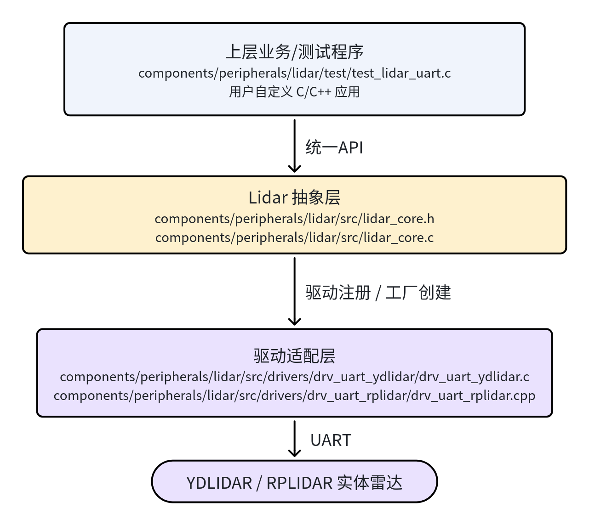
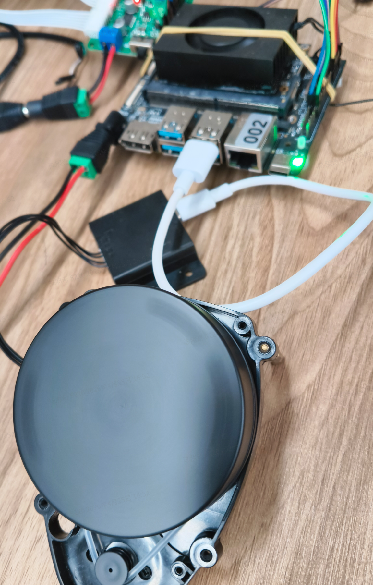
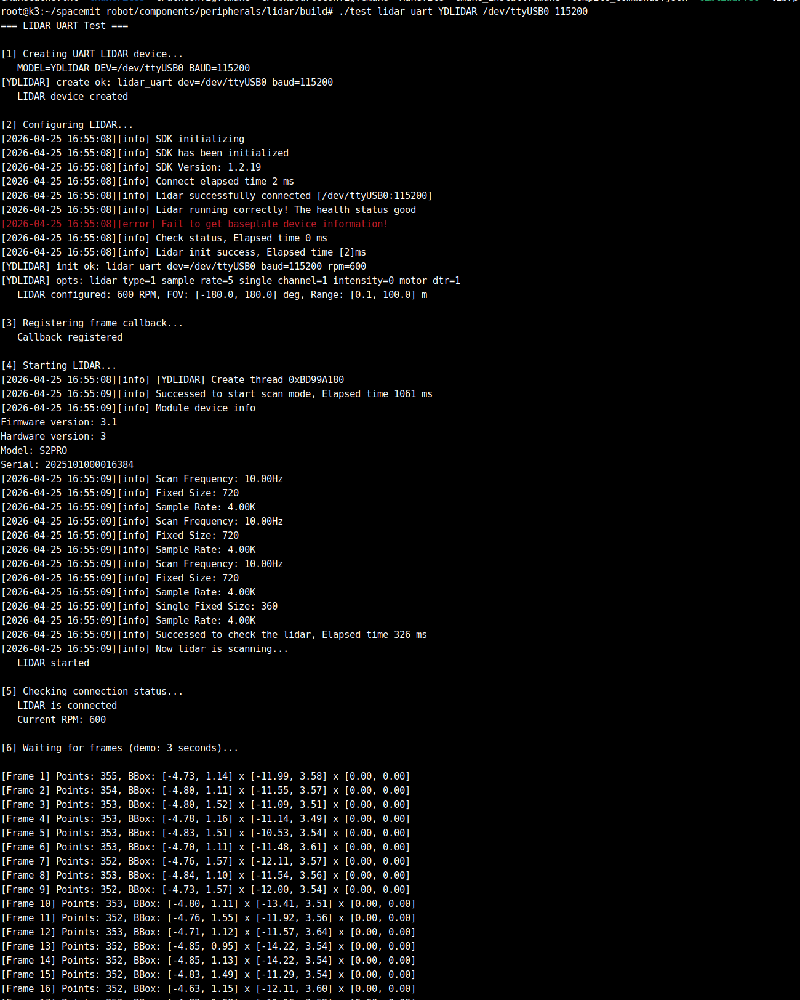
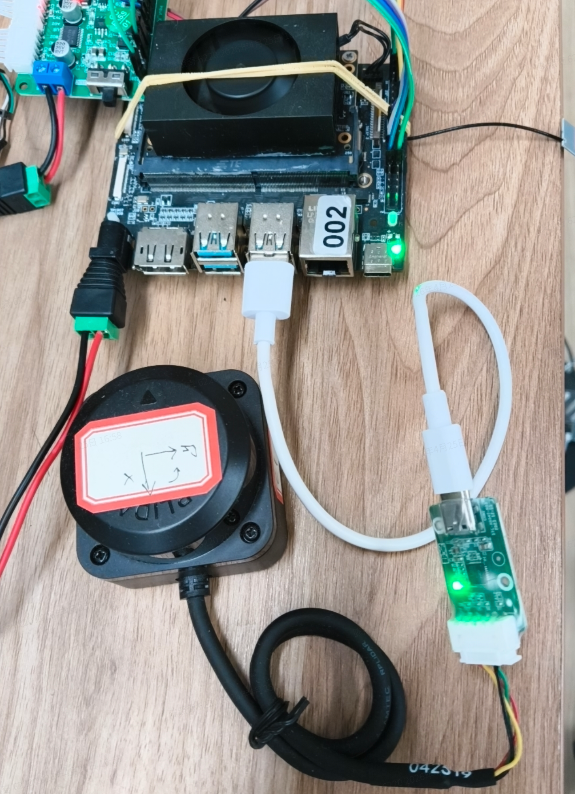
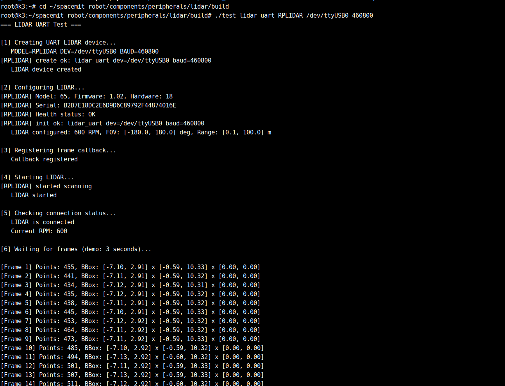

# 外设与驱动 · lidar

## 1. 模块概述

- 主要功能：`lidar` 组件位于 `components/peripherals/lidar/`，提供统一的激光雷达抽象层，屏蔽不同厂商、不同型号 2D 激光雷达的差异，对上层输出一致的点云帧接口。当前项目内已接入 `YDLIDAR` 与 `RPLIDAR` 两类串口雷达，可用于底层采集验证、点云回调处理和上层算法集成。
- 规格或特性（接口形态、速率、分辨率、算法版本等）：
	- 接口形态：当前以 `UART` 串口接入为主，接口已预留 `Ethernet` 与 `Sim`；
	- 支持驱动：`drv_uart_ydlidar`、`drv_uart_rplidar`；
	- 数据形式：统一输出 `struct lidar_frame`，点云点为 `struct lidar_point`，坐标系为 `FLU`；
	- 运行参数：支持配置转速 `rpm`、扫描角范围、量程范围、返回模式、4x4 位姿变换矩阵；
	- 运行方式：支持通过回调 `lidar_set_callback()` 异步接收每帧点云。
- 软件框图：

	
- 相关目录结构：

| 路径 | 职责 |
| --- | --- |
| `components/peripherals/lidar/include/lidar.h` | 对外公开 API 与数据结构定义 |
| `components/peripherals/lidar/src/lidar_core.c` | 统一生命周期封装、驱动工厂与公共逻辑 |
| `components/peripherals/lidar/src/drivers/drv_uart_ydlidar/` | `YDLIDAR` 串口驱动适配 |
| `components/peripherals/lidar/src/drivers/drv_uart_rplidar/` | `RPLIDAR` 串口驱动适配 |
| `components/peripherals/lidar/test/test_lidar_uart.c` | 底层 API 最小化串口测试程序 |
| `components/peripherals/lidar/README.md` | 组件独立构建、快速开始与 FAQ |
| `build/README.md` | SDK 顶层构建、`m` / `mm` / `lunch` 等命令说明 |

## 2. 环境准备

### 2.1 前置条件

- 确保代码拉取

  SDK 源码获取和基础编译环境配置统一参考 [Linksee参考方案](../../03-参考方案/3.2-移动机器人Linksee.md)。完成 SDK 初始化后，回到本文继续执行

- 运行环境：
	- 推荐板端环境：`k3-com260` 配套系统镜像；

- 依赖与外部资源：
	- 基础依赖：`build-essential`、`cmake`、`pkg-config`、`jq`；
	- `YDLIDAR` 与 `RPLIDAR` 第三方 SDK 会在 CMake 配置阶段自动拉取到 `~/.cache/thirdparty/`；首次构建需保证网络可访问。

- 环境变量与初始化：
	- 在仓库根目录执行：

	  ```bash
	  cd ~/spacemit_robot
	  source build/envsetup.sh
	  ```

- 硬件与连接：
	- 雷达可使用 `YDLIDAR X3 Pro` 或兼容的 `RPLIDAR` 型号；
	- 将雷达正确接入 USB 转串口或板载串口，并确认系统侧设备节点如 `/dev/ttyUSB0` 已出现；
	- 保证雷达供电稳定，上电后电机可正常旋转。

- 工具与权限：
	- 需要具备串口访问权限；若权限不足，可将当前用户加入 `dialout` 组；
	- 可使用 `ls /dev/ttyUSB*`、`dmesg | tail` 辅助确认设备枚举；
	- 若需要安装依赖或调整权限，需具备 `sudo` 权限。

### 2.2 构建编译

- 本模块编译：
  - **方式一：通过 SDK 顶层构建当前模块**

    在仓库根目录执行：

    ```bash
    cd ~/spacemit_robot
    source build/envsetup.sh
    lunch # 选择linksee方案
    cd ~/spacemit_robot/components/peripherals/lidar
    mm
    ```

    构建完成后，测试程序会随安装产物进入 `output/staging/`，可通过环境脚本加入 `PATH` 后直接运行。

  - **方式二：通过 SDK 顶层全量构建**

  	```bash
  	source build/envsetup.sh
  	lunch # 选择linksee方案
  	m
  	```

  - **方式三：脱离 SDK 独立构建组件**

  	```bash
  	cd ~/spacemit_robot/components/peripherals/lidar
  	mkdir -p build && cd build
  	cmake .. -DLIDAR_ENABLED_DRIVERS="drv_uart_ydlidar;drv_uart_rplidar"
  	make -j$(nproc)
  	```

  	独立构建后可在构建目录下直接运行 `test_lidar_uart`。
- 常见差异说明：
  - SDK 顶层构建使用 `SROBOTIS_PERIPHERALS_LIDAR_ENABLED_DRIVERS` 控制启用驱动；独立构建默认使用 `LIDAR_ENABLED_DRIVERS`；
  - 切换不同雷达型号时，需同步调整串口设备名、波特率与 `MODEL`；
  - `YDLIDAR` 常见示例波特率为 `115200`，`RPLIDAR` 在项目配置中常见为 `460800`，应以实际设备为准。

## 3. 示例使用

### 3.1 【示例一：使用 SDK 产物直接验证 `YDLIDAR`】

以下示例雷达型号为 `YDLIDAR X3 Pro`，设备节点为 `/dev/ttyUSB0`，波特率为 `115200`。

硬件连接：



**步骤 1**：直接编译组件（执行过则可跳过）

```bash
cd ~/spacemit_robot/components/peripherals/lidar
mkdir -p build && cd build
cmake .. -DLIDAR_ENABLED_DRIVERS="drv_uart_ydlidar;drv_uart_rplidar"
make -j$(nproc)
```

**步骤 2**：运行底层测试程序。

```bash
./test_lidar_uart YDLIDAR /dev/ttyUSB0 115200
```

**预期现象**：终端输出类似以下信息，表示设备创建、初始化、启动成功，并持续收到点云帧：



雷达会加速旋转直达数据采集停止

### 3.2 【示例二：切换为 `RPLIDAR` 做最小化验证】

以下示例雷达型号为 `RPLIDAR-C1`，设备节点为 `/dev/ttyUSB0`，波特率为 `460800`。

**硬件连接**



**步骤 1**：确认设备节点与串口权限。

```bash
ls /dev/ttyUSB*
```

**预期现象**：看到目标串口节点，例如 `/dev/ttyUSB0`。若无设备节点，应先检查接线、供电与 USB 枚举。

**步骤 2**：确保编译已经执行。

```bash
cd ~/spacemit_robot/components/peripherals/lidar
mkdir -p build && cd build
cmake .. -DLIDAR_ENABLED_DRIVERS="drv_uart_ydlidar;drv_uart_rplidar"
make -j$(nproc)
```


**步骤 3**：直接运行测试程序， 只替换设备类型和波特率。

```bash
cd ~/spacemit_robot/components/peripherals/lidar/build
./test_lidar_uart RPLIDAR /dev/ttyUSB0 460800
```

终端预期输出：




## 4. 应用开发

- **对外 API 或接口形态**：
	- 头文件：`components/peripherals/lidar/include/lidar.h`；
	- 工厂接口：`lidar_alloc_uart()`、`lidar_alloc_ethernet()`、`lidar_alloc_sim()`；
	- 生命周期接口：`lidar_init()`、`lidar_start()`、`lidar_stop()`、`lidar_free()`；
	- 数据回调接口：`lidar_set_callback()`；
	- 辅助接口：`lidar_is_connected()`、`lidar_get_rpm()`。
- **调用方式与注意点**：
	- 典型调用顺序为：`alloc -> init -> set_callback -> start -> stop -> free`；
	- `lidar_init()` 需传入完整 `struct lidar_config`，建议至少明确配置 `rpm`、角度范围、量程范围；
	- 数据通过回调异步推送，回调内应避免执行耗时阻塞操作，以免影响采集线程；
	- 程序退出前必须调用 `lidar_stop()` 与 `lidar_free()` 释放串口、线程和驱动私有资源；
	- 串口设备通常需要 `dialout` 权限；若设备被其他进程占用，也会导致初始化或启动失败。
- **参考 demo 或示例路径**：
	- `components/peripherals/lidar/test/test_lidar_uart.c`
	- `components/peripherals/lidar/README.md`

示例代码骨架如下：

```c
#include "lidar.h"

static void on_frame(struct lidar_dev *dev, const struct lidar_frame *frame, void *ctx) {
		(void)dev;
		(void)ctx;
		printf("points=%u\n", frame->point_count);
}

int main(void) {
		struct lidar_dev *dev = lidar_alloc_uart("my_lidar", "/dev/ttyUSB0", 230400, "YDLIDAR", NULL);
		struct lidar_config cfg = {
				.rpm = 600,
				.angle_min_deg = -180.0f,
				.angle_max_deg = 180.0f,
				.range_min_m = 0.1f,
				.range_max_m = 12.0f,
				.return_mode = 0,
				.enable_transform = false,
		};

		lidar_init(dev, &cfg);
		lidar_set_callback(dev, on_frame, NULL);
		lidar_start(dev);

		sleep(3);

		lidar_stop(dev);
		lidar_free(dev);
		return 0;
}
```

## 5. 调试指南

- 若程序启动前即失败，先检查设备节点是否存在：`ls /dev/ttyUSB*`；必要时查看最近枚举日志：`dmesg | tail`。
- 若提示串口权限不足，可执行：`sudo usermod -aG dialout $USER`，重新登录后再试。
- 若构建阶段提示找不到 `ydlidar_sdk` / `rplidar_sdk`，优先检查网络；如怀疑第三方缓存损坏，可清理 `~/.cache/thirdparty/ydlidar` 后重新 `cmake`。
- 如需定位运行期问题，可对测试程序使用 `strace` 观察串口打开、读写与线程行为；对崩溃问题可使用 `gdb` 附加或直接运行。

## 6. 常见问题

| 现象 | 可能原因 | 处理 |
| --- | --- | --- |
| `test_lidar_uart` 启动失败，提示无法创建设备或初始化失败 | 串口节点错误、波特率与设备不匹配、设备被占用 | 检查 `/dev/ttyUSB*` 是否正确，确认型号与波特率是否匹配，关闭其他占用串口的进程后重试 |
| 程序提示权限不足 | 当前用户无串口访问权限 | 将用户加入 `dialout` 组，重新登录后再运行 |
| 程序启动成功但长时间收不到帧 | 雷达未正常上电、设备未转动、型号参数不匹配 | 先观察雷达是否旋转，再核对 `MODEL`、`BAUD` 与实际型号，必要时更换串口线或供电 |
| 独立构建时报找不到第三方 SDK | 首次拉取第三方依赖失败或本地缓存损坏 | 确认网络可用；删除 `~/.cache/thirdparty/ydlidar` 等缓存后重新配置构建 |
| 切换到 `RPLIDAR` 后仍无法通信 | 沿用了 `YDLIDAR` 的默认参数 | 将命令中的 `MODEL` 改为 `RPLIDAR`，并将波特率改为设备实际值，如 `460800` |

