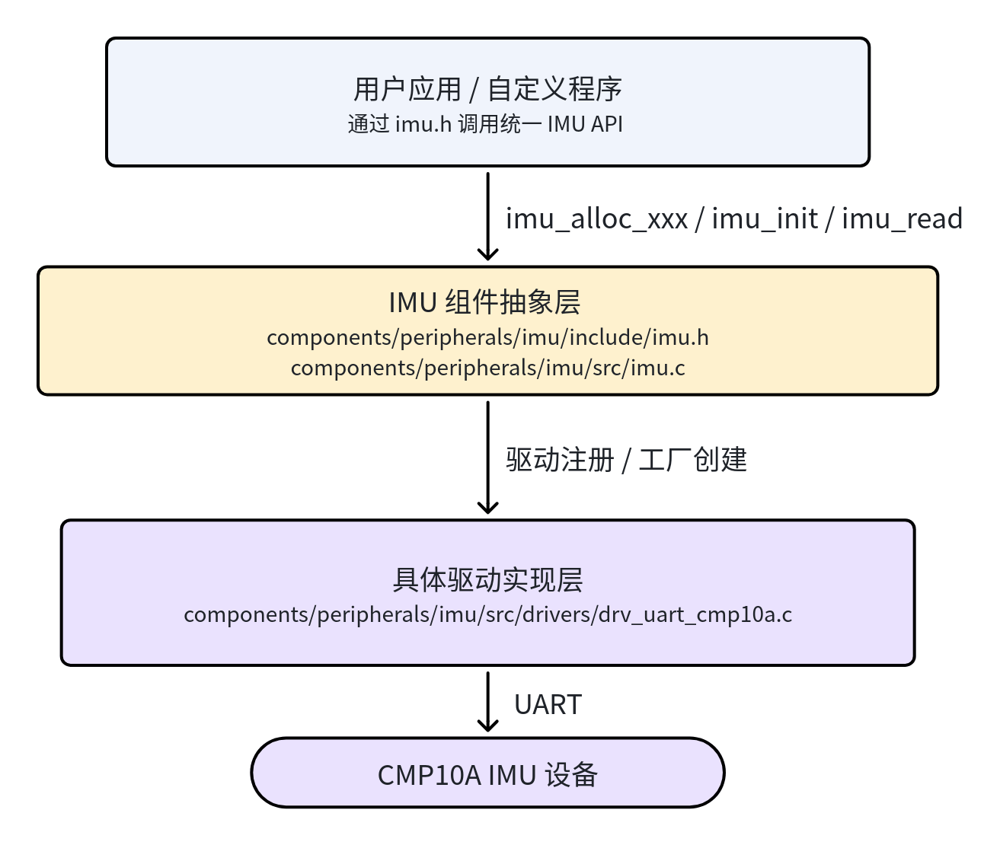
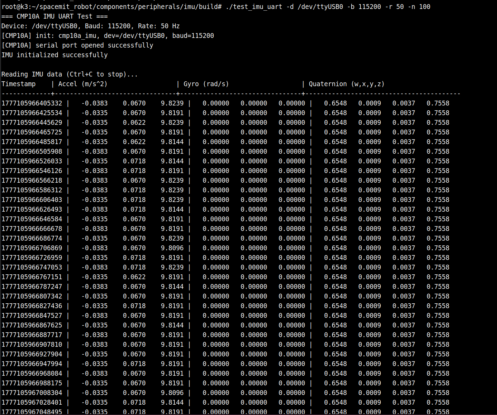

# 外设与驱动 · imu

## 1. 模块概述

- 主要功能：本模块提供项目内统一的 IMU 底层接入能力，负责通过封装后的组件 API 读取惯性传感器数据，屏蔽不同硬件接口差异，为上层应用提供一致的加速度、角速度、磁场、四元数与温度数据访问方式。当前项目默认启用的驱动为 `CMP10A` 串口 IMU，对应 `drv_uart_cmp10a`。
- 规格或特性（接口形态、速率、分辨率、算法版本等）：
	- 支持接口：`I2C`、`SPI`、`UART`，当前工程默认接入方式为 `UART`；
	- 当前支持驱动：`drv_uart_cmp10a`；
	- 典型波特率：`115200`；
	- 典型采样率：`50Hz`；
	- 支持输出数据：加速度、角速度、磁场、四元数、温度；
	- 支持能力：安装矩阵 `mounting_matrix` 坐标变换、陀螺仪零偏校准、回调模式数据推送、采样率和低通滤波参数配置。
- 软件框图：



- 相关目录结构：

| 路径 | 职责 |
| --- | --- |
| `components/peripherals/imu/` | IMU 组件根目录，提供统一抽象与构建入口 |
| `components/peripherals/imu/include/imu.h` | IMU 对外 C API 头文件 |
| `components/peripherals/imu/src/` | 组件公共实现与驱动注册逻辑 |
| `components/peripherals/imu/src/drivers/drv_uart_cmp10a.c` | `CMP10A` 串口 IMU 驱动实现 |
| `components/peripherals/imu/test/test_imu_uart.c` | 基于底层 API 的最小化测试程序 |

## 2. 环境准备

### 2.1 前置条件

- 拉取代码

  SDK 源码获取和基础编译环境配置统一参考 [Linksee参考方案](../../03-参考方案/3.2-移动机器人Linksee.md)。完成 SDK 初始化后，回到本文继续执行

- 运行环境：
	- 推荐板端环境：`k3-com260` 配套系统镜像；

- 硬件与连接：

	

	- 板型：`k3-com260` ；
	- 外设：`CMP10A` 串口 IMU；
	- 连接方式：通过板载串口或 USB 转串口接入，设备节点一般为 `/dev/ttyUSB*` ；
	- 使用前需确认 IMU 供电稳定、接线牢固，且安装方向与机体坐标系关系明确。

- 工具与权限：
	- 需要具备串口设备访问权限；
	- 常用检查命令：`ls -l /dev/ttyUSB0`、`dmesg | tail`；
	- 若设备权限不足，可将当前用户加入 `dialout` 组，或临时调整串口节点权限。

### 2.2 构建编译

**全量编译**

```
cd ~/spacemit_robot/
source build/envsetup.sh
lunch # 选择linksee方案
m # 全量编译
```

**仅编译底层 IMU 组件**

```bash
cd ~/spacemit_robot/components/peripherals/imu
mkdir -p build && cd build
cmake -DBUILD_TESTS=ON -DSROBOTIS_PERIPHERALS_IMU_ENABLED_DRIVERS="drv_uart_cmp10a" ..
make
```

产物包括底层测试程序 `test_imu_uart`。

- 常见差异说明：
	- 若只做底层 API 验证，优先使用组件目录独立构建，避免引入整仓其它模块影响；
	- 组件文档示例常用波特率为 `115200`，运行时建议显式指定；
	- 当前文档仅覆盖底层封装 API，不包含 ROS2 节点或话题使用方式。

## 3. 示例使用

### 3.1 【示例一：`CMP10A` 最小化串口读取验证】

**前置： **IMU 已正确接入板端，已确认实际串口设备节点，例如 `/dev/ttyUSB0`。

**步骤 1**：进入组件构建目录

```bash
cd ~/spacemit_robot/components/peripherals/imu/build
```

**步骤 2**：运行底层测试程序

```bash
./test_imu_uart -d /dev/ttyUSB0 -b 115200 -r 50 -n 100
```

**预期现象**：终端会先打印 `CMP10A IMU UART Test`、设备路径、波特率等启动信息；初始化成功后，会持续输出时间戳、加速度、角速度与四元数数据。

终端输出：



**步骤 3**：确认基础链路稳定

静止状态下观察输出是否稳定，轻微转动 IMU 后再次观察数据变化。

**预期现象**：
- 静止时角速度接近零；
- 重力方向加速度较稳定；
- 旋转设备时 `gyro` 与 `quat` 输出会明显变化；
- 若串口打开失败，通常会提示设备不存在、权限不足或初始化失败。


### 3.2 【示例二：在自定义程序中调用底层 IMU API】

**前置:** 已完成组件编译，头文件与库源码可在本地工程中引用。

**步骤 1**：在应用代码中包含头文件并创建 UART IMU 设备

可参考如下调用流程：

```c
#include "imu.h"

struct imu_dev *dev = imu_alloc_uart("CMP10A:cmp10a_imu", "/dev/ttyUSB0", 115200, NULL);
if (!dev) {
		return -1;
}
```

**步骤 2**：初始化设备并配置采样参数

```c
struct imu_config cfg = {0};
cfg.sample_rate = 50;
cfg.mounting_matrix[0] = 1; cfg.mounting_matrix[1] = 0; cfg.mounting_matrix[2] = 0;
cfg.mounting_matrix[3] = 0; cfg.mounting_matrix[4] = 1; cfg.mounting_matrix[5] = 0;
cfg.mounting_matrix[6] = 0; cfg.mounting_matrix[7] = 0; cfg.mounting_matrix[8] = 1;

if (imu_init(dev, &cfg) != 0) {
		imu_free(dev);
		return -1;
}
```

**步骤 3**：读取数据并在退出前释放资源

```c
struct imu_data data;
if (imu_read(dev, &data) == 0) {
		printf("acc: %.2f %.2f %.2f\n", data.acc[0], data.acc[1], data.acc[2]);
		printf("gyro: %.2f %.2f %.2f\n", data.gyro[0], data.gyro[1], data.gyro[2]);
}

imu_free(dev);
```

**预期现象**：程序初始化成功后可读到 `imu_data` 中的 `acc`、`gyro`、`mag`、`quat`、`temp` 等字段；若初始化失败，优先检查设备节点、波特率和驱动是否已启用。


## 4. 应用开发

- **对外 API 或接口形态**（头文件、库名、服务/话题）：
	- 头文件：`components/peripherals/imu/include/imu.h`；
	- 核心数据结构：`struct imu_dev`、`struct imu_config`、`struct imu_data`；
	- 工厂函数：`imu_alloc_i2c`、`imu_alloc_spi`、`imu_alloc_uart`；
	- 核心 API：`imu_init`、`imu_read`、`imu_set_callback`、`imu_calibrate_gyro_bias`、`imu_free`。
- **调用方式与注意点**（线程、权限、资源释放等）：
	- 推荐调用顺序：`imu_alloc_xxx` → `imu_init` → `imu_read` / `imu_set_callback` → `imu_free`；
	- 串口设备路径与波特率建议显式指定，不要完全依赖默认参数；
	- 若设备安装方向与机体坐标系不一致，应通过 `mounting_matrix` 做旋转修正；
	- 做陀螺仪零偏校准时，调用 `imu_calibrate_gyro_bias()` 期间应保持 IMU 静止；
	- 程序退出前必须调用 `imu_free()` 释放资源；
	- 串口设备异常拔插后，需要在应用层考虑重新初始化与错误恢复。
- **参考 demo 或示例路径**：
	- `components/peripherals/imu/README.md`
	- `components/peripherals/imu/test/test_imu_uart.c`
	- `components/peripherals/imu/include/imu.h`

## 5. 调试指南

- 优先用 `test_imu_uart` 做底层链路验证，确认硬件、串口与驱动正确后，再集成到自定义应用。
- 首先核对串口参数，重点关注设备节点与波特率是否正确，`CMP10A` 常用波特率为 `115200`。
- 常用检查命令：
	- `ls -l /dev/ttyUSB0`：确认设备节点是否存在；
	- `dmesg | tail`：查看串口设备最近识别日志；
	- `stty -F /dev/ttyUSB0 -a`：辅助确认串口配置；
	- `strace ./test_imu_uart -d /dev/ttyUSB0 -b 115200`：定位打开设备或读串口失败原因。
- 与硬件/内核同事联调时，建议至少收集以下信息：
	- IMU 型号、接线方式、供电情况；
	- 实际设备节点名与串口参数；
	- `test_imu_uart` 的完整启动日志；
	- 静止与转动两种状态下的原始输出样例；
	- 若初始化失败，附带 `dmesg` 与权限信息。

## 6. 常见问题

| 现象 | 可能原因 | 处理 |
| --- | --- | --- |
| 运行 `test_imu_uart` 提示设备打开失败 | 串口设备节点错误、设备未识别或权限不足 | 用 `ls /dev/ttyUSB*`、`dmesg | tail` 检查设备是否存在；确认当前用户具备串口访问权限 |
| 程序能启动但数据异常或始终不变化 | 波特率不匹配、 数据读取速率不匹配，或 IMU 未正常输出数据 | 显式指定 `-b 115200` 重试，并检查 IMU 供电与接线，确认上位机对IMU的模式设定 |
| 姿态方向与实际运动方向不一致 | IMU 安装方向与机体坐标系不一致 | 在 `imu_config.mounting_matrix` 中配置正确的安装矩阵 |
| 角速度零点漂移明显 | 陀螺仪零偏未校准或校准时设备在运动 | 调用 `imu_calibrate_gyro_bias()` 重新校准，并确保校准期间设备静止 |
| 应用退出后再次启动异常 | 上次运行未正确释放资源或串口状态异常 | 确保程序退出前调用 `imu_free()`；必要时重新插拔设备后重试 |
